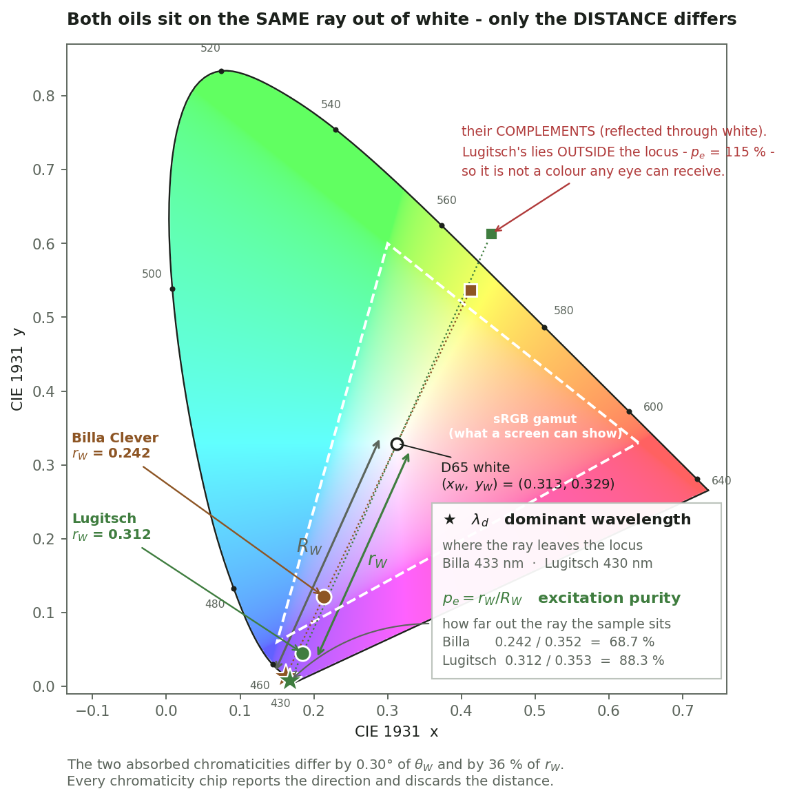
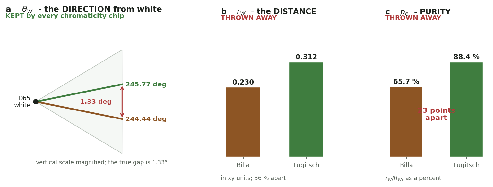
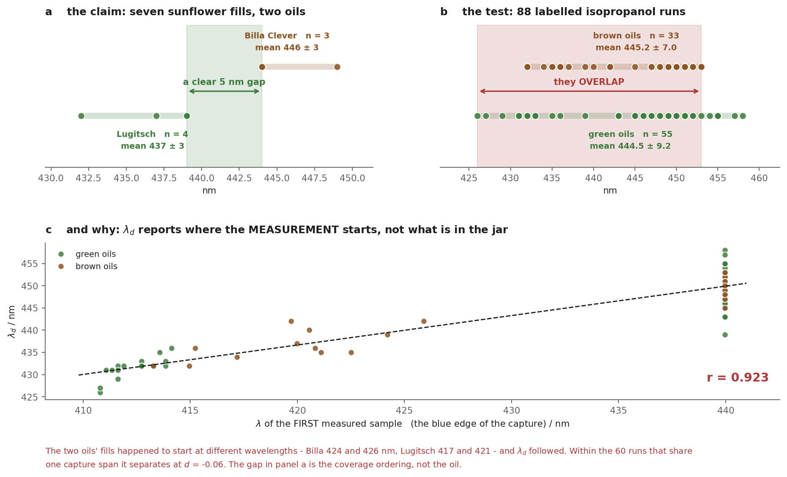
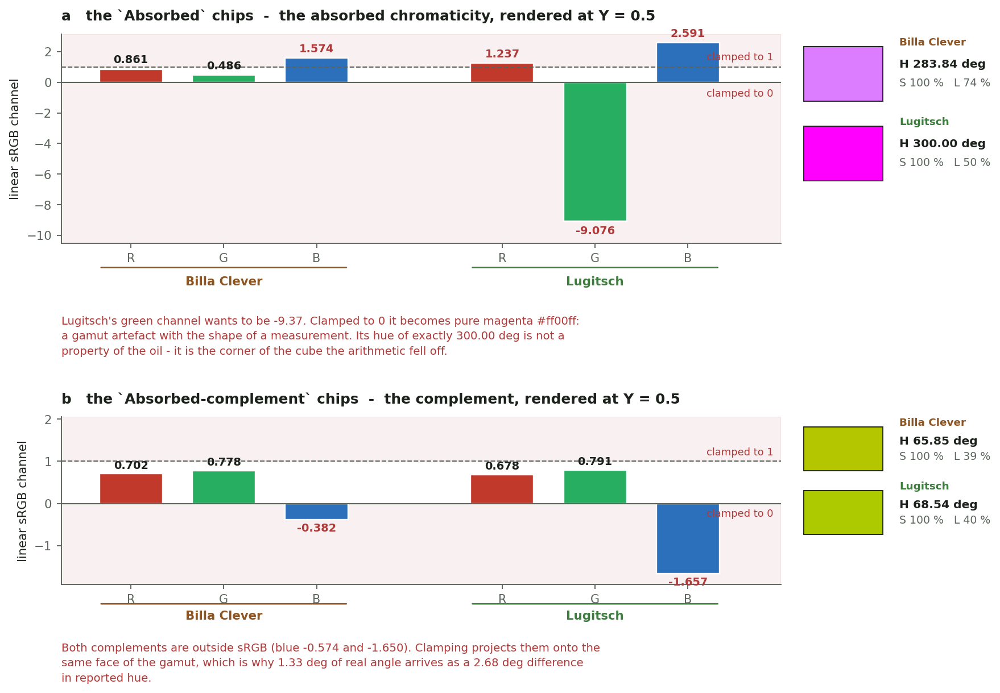
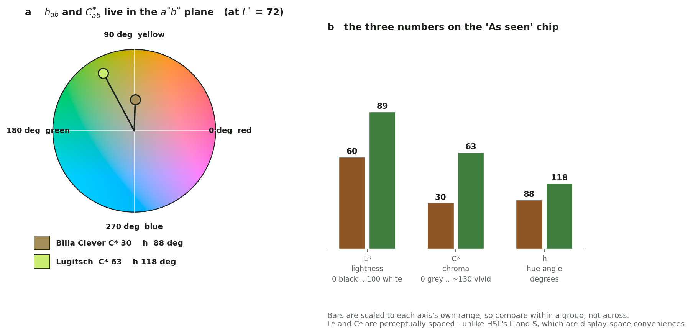
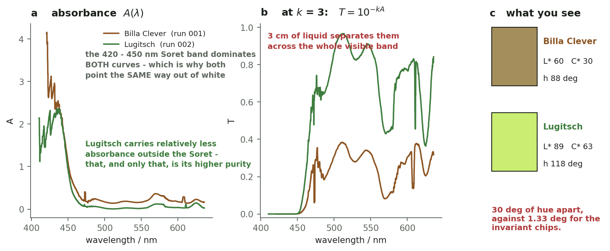
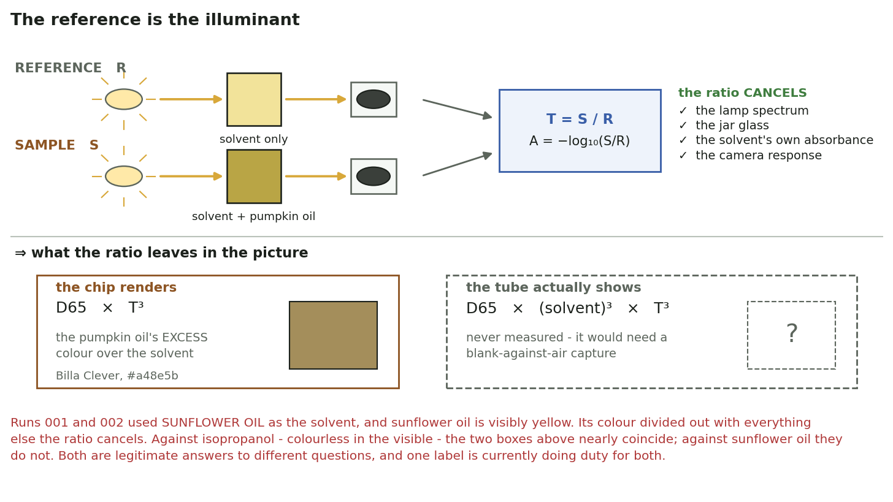
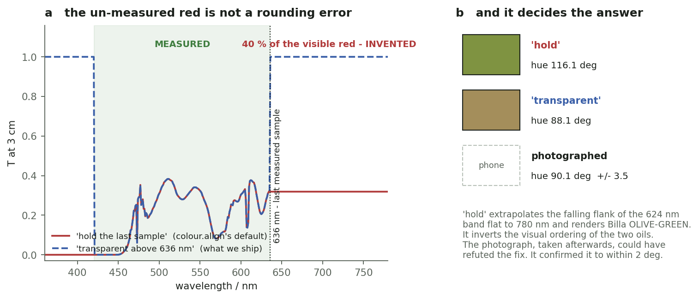
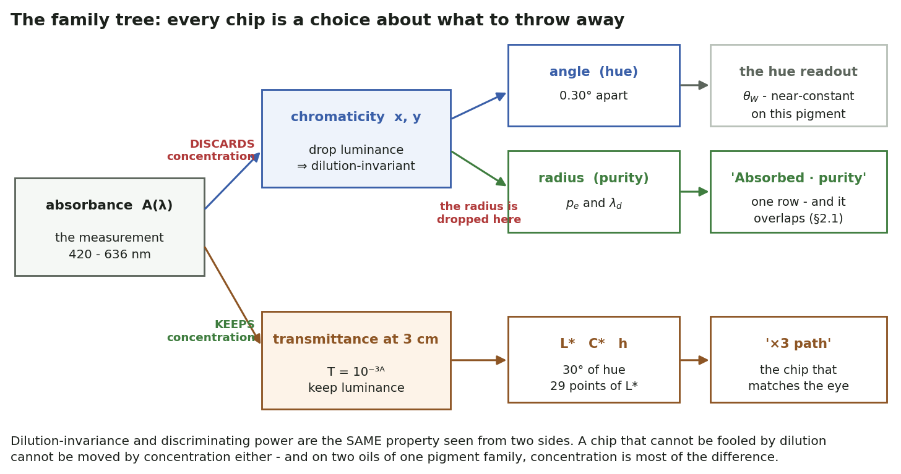

# From Spectrum to Colour

**Internal documentation · 2026-08-24 · measured on runs `001` and `002`, then tested against the
88 labelled archive runs (§15)**

<!--
  SOURCE OF TRUTH: this file. Edit the prose HERE, never the PDF.
  REGENERATE:
    python3 docs/tools/build_colour_geometry_pdf.py
  FIGURES:
    PYTHONPATH=".:../spectracsPy-core:../spectracsPy-model:../spectracsPy-base" \
      ./venv/bin/python diagnostics/colour_geometry_figures.py
-->

How a measured spectrum becomes the colour chips the app shows, what each chip can and cannot tell you,
and why the set looks the way it does. **No colour-science background is assumed** — §§1–6 build the
geometry from the beginning, and §0 fixes the notation the rest of the document uses.

⭐ **The one result everything else follows from.** The chips that are *dilution-invariant* are, for
exactly that reason, blind to what distinguishes two pumpkin oils: invariance and discriminating power
are the same property seen from two sides. §3.1 measures the consequence — the absorbed chromaticity
points the same way, **244.06 ± 1.25°**, on every oil in the archive. That is chemistry, not software,
and no chip can be built around it.

⇒ What the colour chips are *for* is therefore a visual aid, and the one that does that job — the
transmitted colour at a real viewing path — leads the set. The metrics that do discriminate live in
`SPEC_metric_research.md`.

**Map.** §§1–7 the geometry, from the chromaticity diagram to the chip that separates the oils · §8
Beer–Lambert, and what the reference does and does not fix · §9 the five-stage correction chain · §10
the family tree · §§11–12 the design in use · §13 the implementation record · §§14–15 glossary and
provenance.

⚠ Two naming conventions run through the text. The phases **P0–P8** are the implementation steps,
defined in §13. Chips are named as they are **today** everywhere except §11.4's mapping table, which
gives the older names, and the note in §13.4 about reloaded saved runs.

<!--TOC-->

---

## 0. Notation

Symbols are used consistently throughout, with the subscript naming what the quantity is measured
*against*.

| symbol | meaning |
|---|---|
| $S(\lambda)$, $R(\lambda)$ | the **sample** and **reference** captures |
| $T(\lambda) = S/R$ | **transmittance** — the fraction of the reference beam that gets through |
| $A(\lambda) = -\log_{10} T$ | **absorbance** |
| $\epsilon(\lambda)$, $c$, $\ell$ | molar absorptivity, concentration, optical path |
| $k$ | the **path multiplier** — $k = 3$ on the `×3 path` chip |
| $X, Y, Z$ | CIE tristimulus values; $Y$ is **luminance** |
| $(x, y)$ | **chromaticity** — $XYZ$ with luminance divided out |
| $(x_{W}, y_{W})$ | the **white point**; D65 2°, $(0.313,\, 0.329)$ |
| $\theta_{W}$ | the **direction** of a chromaticity from the white point |
| $r_{W}$ | its **distance** from the white point |
| $R_{W}$ | the distance from white to the **spectrum locus** along that same ray |
| $\lambda_{d}$ | **dominant wavelength** — where the ray meets the locus |
| $p_{e} = r_{W} / R_{W}$ | **excitation purity** |
| $p_{c}$ | *colorimetric* purity — a different, luminance-weighted definition |
| $L^{*}$, $C^{*}_{ab}$, $h_{ab}$ | CIE Lab lightness, chroma and hue angle |

⚠ $\theta_{W}$ and $h_{ab}$ are **both** hue angles and they are **not the same quantity**: $\theta_{W}$
lives on the chromaticity diagram, $h_{ab}$ in Lab. §12 turns on the difference.

---

## 1. Colour is a place on a map, not a number

The eye has three cone types. Any light that enters it, however complicated its spectrum, is reduced by
those three cones to **three numbers** — in the standard formalism `X`, `Y`, `Z`. That is the whole of
colour vision: an infinite-dimensional spectrum collapsed onto three numbers. Two completely different
spectra with the same three numbers look identical.

Of those three, `Y` is **luminance** — how bright. The other two carry *which colour*. Divide them out,

```math
x = \frac{X}{X+Y+Z} \qquad y = \frac{Y}{X+Y+Z}
```

and you are left with **chromaticity**: a point `(x, y)` on a two-dimensional map. This is the famous
horseshoe. Its curved edge is the **spectrum locus** — the pure single wavelengths, 430 nm at the bottom
left round to 640 nm at the right. Its straight bottom edge is the purples, which have no wavelength of
their own. Everything a human can see lies inside.

⭐ **The single most important thing about this map:** dividing by `X+Y+Z` **deleted the brightness**.
A dark brown and a pale beige of the same hue land on the *same point*. Remember that — it is the
answer to question 3.

Near the middle sits **white**. We use the D65 white point, `(0.313, 0.329)` — roughly noon daylight.



**Figure 1** — the CIE 1931 chromaticity diagram, with both oils, their complements, and the $\lambda_{d}$ / $p_{e}$ construction drawn on the ray.

Both oils' absorbed colours are on that map. And they sit **on the same line out of white**.

---

## 2. Direction and distance: hue and purity

A point on a map can be given as `x` and `y`, or as **a direction and a distance** from some origin.
Take white as the origin, and the two polar coordinates get names:

- The **direction** $\theta_{W}$ — the compass bearing from white — is essentially **hue**. Follow it
  outward until it meets the spectrum locus and you read off the **dominant wavelength** $\lambda_{d}$:
  the single pure colour this sample most resembles.
- The **distance** $r_{W}$ from white, taken as a fraction of the distance $R_{W}$ to the locus on that
  same ray, is the **excitation purity** $p_{e} = r_{W}/R_{W}$: 0 % at white, 100 % on the locus. It is how
  *strongly* coloured the sample is, independently of how bright it is.

⚠ Both depend on the chosen white point, not on the sample alone: Billa reads $\lambda_{d}$ = 444 nm and
$p_{e}$ = 65.7 % under D65, but **451 nm and 69.6 % under D50**. And "purity" is ambiguous —
*colorimetric* purity $p_{c}$ is luminance-weighted and returns **7.2 %** on the very same chromaticity.

Measured on the two runs:

| | Billa Clever `001` | Lugitsch `002` | difference |
|---|--:|--:|--:|
| absorbed chromaticity `x` | 0.21353 | 0.18484 | |
| absorbed chromaticity `y` | 0.12164 | 0.04485 | |
| **direction** $\theta_{W}$ | **244.44°** | **245.77°** | **1.33°** |
| dominant wavelength $\lambda_{d}$ | 444 nm | 432 nm | 12 nm |
| **distance** $r_{W}$ | **0.2299** | **0.3116** | **36 %** |
| **purity** $p_{e}$ | **65.7 %** | **88.4 %** | **23 points** |



**Figure 2** — the same two points in polar form: $\theta_{W}$ is kept by every invariant chip, $r_{W}$ and $p_{e}$ are thrown away.

Read the table again. The two oils differ by **one and a third degrees** of direction and by
**23 points of purity**. They are two points on one ray, at different distances.

**Why they share a direction is physics, not coincidence.** Both oils carry the same pigment family —
chlorophyll derivatives. Both absorbance curves are dominated by the same enormous Soret band at
420–450 nm. A colour is a weighted integral over the whole spectrum, and when one feature dominates
both curves, both integrals point the same way. What differs between the oils is *how much of the
absorbance sits outside that band* — and that is a distance from white, not a direction.

### ⛔⛔ 2.1 Neither purity nor dominant wavelength separates these oils

The table above is **two runs**, and the 23-point purity gap in it does not survive contact with more
data. Two findings follow, in the order they were established — the second retracts the first.

**First: across all seven archived fills of these two oils, purity does not separate them.**

| oil | fills | $\lambda_{d}$ | $p_{e}$ |
|---|--:|---|---|
| **Billa Clever** | 3 | 445.7 ± 2.9 nm — [444, 449] | 63.4 ± 5.3 % — [57.4, **67.2**] |
| **Lugitsch** | 4 | 436.8 ± 3.3 nm — [432, 439] | 76.0 ± 8.4 % — [**69.8**, 88.4] |

⛔ The $p_{e}$ ranges **nearly touch**, and the 88.4 % in §2's table is Lugitsch's *outlier* — the
highest of its four fills. $\lambda_{d}$, by contrast, looked clean on those seven: a **5 nm gap** with
no overlap — which made it the obvious quantity to lead with instead.

**Second: that is wrong too, and the archive says so.** Seven fills of one oil pair, one solvent, three
days, is not evidence. Re-run over the **88 labelled isopropanol runs** of the report archive
(`diagnostics/dominant_wavelength_archive.py`, same labelling as `SPEC_metric_research.md` §12):

| quantity | green (n=55) | brown (n=33) | Cohen's $d$ | |
|---|---|---|--:|---|
| $\lambda_{d}$ — the pre-2026-08-24 `align` path | 35.1 ± 477.0 nm | 231.6 ± 382.3 nm | −0.44 | ⛔ meaningless, see below |
| $\lambda_{d}$ — **as shipped now** | 444.5 ± 9.2 nm | 445.2 ± 7.0 nm | **−0.08** | OVERLAP |
| $p_{e}$ — the pre-2026-08-24 `align` path | 72.7 ± 5.1 % | 69.7 ± 5.7 % | 0.56 | OVERLAP |
| $p_{e}$ — **as shipped now** | 61.0 ± 10.9 % | 57.0 ± 11.4 % | 0.36 | OVERLAP |



**Figure 3** — the claim, the test, and the confound that produced it.

**$\lambda_{d}$ fails three ways over:**

1. ⛔ **It does not exist on 31 % of the archive.** 27 of the 88 runs return a *negative* value —
   `colour`'s convention for *"the ray exits through the purple line, so there is no dominant
   wavelength"* — across nine different series. A quantity that is undefined on a third of the corpus
   cannot be a reported number. (The shipped padding makes it defined everywhere: 0 of 88.)
2. ⛔ **Where it is defined, it does not separate.** $d$ = −0.08.
3. ⛔⛔ **It is 92 % an artefact of the capture.** $r(\lambda_{d},\, \lambda_{\text{first}})$ =
   **0.923** over 88 runs. The clamped runs (first sample at 440 nm, n = 60) read 449.9 ± 3.6 nm; the
   wide-blue runs (411–426 nm, n = 28) read 433.7 ± 3.9 nm. **$\lambda_{d}$ reports where the
   measurement starts, not what is in the jar.**

⇒ And that is exactly what produced the gap. Billa's fills happened to begin ~5 nm later than
Lugitsch's — Billa at 424 and 426 nm, Lugitsch at 417 and 421 — and $\lambda_{d}$ followed. **Within
the 60 runs that share one capture span, $d$ = −0.06.** The separation was the coverage ordering.

⚠ Why this is physically unsurprising: $\lambda_{d}$ is set by the **Soret**, the sharpest feature in
the spectrum and the one nearest the blue edge. Truncating the blue end truncates exactly the feature
that fixes the ray's direction.

⭐ **One hypothesis died cleanly and usefully:** the RELATIVE ceiling was the other suspected confound —
it clips the Soret when it fires, and $\lambda_{d}$ would move more than anything else in the chip set.
It fired on **0 of 88 runs**. Disposed of, not deferred.

### ⇒ What §2.1 leaves standing

- **Neither half of $(\lambda_{d},\, p_{e})$ discriminates on the archive**, so the app describes a
  chromaticity with them but claims nothing from them (§11.1).
- **The `Absorbed · purity` row is a visual aid, not a discriminator** — $d$ = 0.55, overlapping, on 88
  runs. It is kept because it is the honest replacement for `S ≡ 100`, and because it predicts exactly
  when the complement stops being a colour (§4.1).
- ⭐ **The whole chip family is now measured, not merely suspected, to be non-discriminating**, which is
  §1c of `SPEC_color_retrieval.md` with numbers behind it. That *strengthens* the case for putting
  `Transmitted from absorbance · ×3 path` first (§11.4): the one chip whose job is to look like the
  oil is also the only one carrying anything.
- ⭐ **Checked, in §4.1:** 27 runs whose ray exits the purple line suggested
  `Absorbed-complement` might be an *imaginary* colour on a large slice of the archive. It is: outside the
  locus on 10 % of runs, at or past the edge of vision on 25 %.

---

## 3. What "dilution-invariant" costs

The intrinsic chips exist to answer: *what colour is this oil, regardless of how much we diluted it?*
The mechanism is exactly the one in section 1 — **drop the luminance** and keep only chromaticity.
Double the concentration and `X`, `Y`, `Z` all scale together; `x` and `y` do not move. Invariance
achieved.

But the chips go one step further. The `· hue-norm` variants re-render the colour at a **fixed
saturation and lightness**, so that only the hue can move between chips. That throws away the
*distance* as well.

> ⛔ **So the eight `Absorbed` and `Absorbed-complement` chips report the direction and discard the
> distance — and on these two oils, the distance is where the entire difference lives.** The chip is a
> compass. You asked it which of two towns is bigger.

This is not a defect to be patched. It is the price of the invariance, and it was priced correctly:
a chip that cannot be fooled by dilution cannot be moved by concentration either.

### ⭐⭐ 3.1 And the direction is a constant of the pigment, measured

$\theta_{W}$ over the **88 labelled archive runs** — two oil classes, a year of fills, a mechanical
rebuild, several dilutions and two rigs:

```math
\theta_{W} = 244.06 \pm 1.25° \qquad [\,241.33 \ldots 246.19\,]
```

⭐ **Five degrees of total spread.** Every pumpkin oil absorbance measured on this instrument points
the same way out of white, to within about a degree. Green oils 244.06 ± 1.36°, brown 244.08 ± 1.06° —
Cohen's $d$ = **−0.02**, overlapping. Within the 60 runs that share one capture span: 243.33 ± 0.88
against 243.35 ± 0.45. **Indistinguishable to two decimal places.**

⇒ **This is the physical reason the invariant chips cannot work, and it is not a software problem.**
The direction is fixed by the *chemistry* — it is a constant of the chlorophyll-derivative family, set
by the Soret band that dominates every one of these spectra. What differs between one oil and another
is the **radius**: how strongly, and how purely, that same absorbance sits. And the radius is precisely
what a dilution-invariant chip is built to discard.

⚠ So the eight hue-norm chips are not merely redundant with each other (§2). They are reporting a
quantity that is **very nearly a constant of the pigment class**, and printing it to two decimals.
⇒ §11.3: they left the headline list for a sub-tab.

---

## 4. The complement, and why it cannot help

`Absorbed-complement` is not the absorbed colour — it is its **complement**: the other half of the
light. If the oil absorbs blue-violet, what passes through is the yellow-green that is left over.

We compute it as a **reflection through the white point**:

```math
(x, y) \to (\,2x_{W} - x\,,\quad 2y_{W} - y\,)
```

which is the colorimetric "mixing-to-white" opposite: the chromaticity that, mixed with the original in
equal measure, gives white. The earlier implementation flipped the HSL hue by 180° instead; §4.2 measures
both against the transmitted colour they stand in for.

### ⛔ 4.1 The complement routinely leaves the diagram

Reflecting through white preserves the radius, andnothing constrains the reflected point to stay inside the horseshoe. Measured over the 88 labelled
archive runs (`diagnostics/dominant_wavelength_archive.py`):

| where the complement lands | runs | |
|---|--:|---|
| below 90 % purity — comfortably inside | 66 | 75 % |
| **90–100 % — inside, but at the edge of human vision** | **13** | **15 %** |
| ⛔ **over 100 % — outside the spectrum locus** | **9** | **10 %** |

Mean complement purity is **77.9 ± 14.6 %**, worst 107.7 %. So on **25 % of the archive the
`Absorbed-complement` chip sits at or beyond the boundary of what an eye can receive** — and where it is
beyond it, $C^{*}_{ab}$ and $h_{ab}$ describe an imaginary stimulus. (Lugitsch's 115.3 % on the sunflower fill
is worse than anything in the isopropanol corpus, which is consistent: it also has the highest absorbed
purity.)

⭐ **The failure is exactly predictable, and free to detect.** Absorbed and complement purity correlate
at $r$ = **1.000** — the complement's radius *is* the absorbed radius, only measured against a shorter
locus distance on the opposite ray. The two populations do not overlap:

| | absorbed $p_{e}$ |
|---|---|
| complement **real** (n = 79) | 57.2 ± 9.4 % — [35.1, **75.3**] |
| complement **imaginary** (n = 9) | 79.5 ± 2.2 % — [**76.9**, 82.5] |

⇒ **absorbed $p_{e}$ above ≈ 76 % ⇒ the complement is not a colour.** The predictor is a number the
chip set already computes, so the §11.2 marker costs nothing here.

⚠ **And the failure is asymmetric between the two classes the chip exists to compare** — green oils
79.8 ± 14.2 % complement purity and 13 % imaginary, brown 74.6 ± 14.8 % and 6 %. A chip that degrades
more for one class than the other is a poor instrument for telling them apart.

### ⭐⭐ 4.2 But the hue survives all of it — the "4°" claim, re-measured on 88 runs

`SPEC_capability_proof.md` option (b) chose the white-point complement over the `+180°` HSL flip because
it lands *"~4° from the true perceived hue, versus ~34°"* — measured on **four** runs (K/L/M/N). Given
§4.1, that number needed re-testing where the complement is worst. Reference = the transmitted
chromaticity, derived as $T = 10^{-A}$ from the same trace (exact to $6 \times 10^{-17}$) so both sides
share one wavelength span:

| hue coordinate | error vs the transmitted colour | |
|---|---|---|
| ⭐ $\theta_{W}$ — the chromaticity direction | **2.50 ± 1.90°** — [0.24, 8.68] | |
| $H_{hsl}$ — the retired HSL readout | 4.15 ± 3.30° — [0.01, 14.80] | |
| $h_{ab}$ — CIE Lab | 5.60 ± 4.00° — [0.13, 15.15] | see §12.3 |
| the rejected `+180°` flip | **52.69 ± 4.91°** — [44.59, 62.03] | |

⭐ **"~4°" was right — better than right: 2.50° over 88 runs.** And the `+180°` flip is far worse than
the 34° it was charged with: **52.7°**. Option (b) was the right call by a wide margin.

⭐⭐ **And it does not degrade where the complement is imaginary** — 1.68 ± 0.36° there, against
2.60 ± 1.98° where the complement is real. Slightly *better*. Which is exactly what the geometry
predicts: a point reflection preserves direction whatever the radius, so leaving the locus costs
renderability, not angle.

⇒ **The first positive result for the invariant chips in this document.** `Absorbed-complement` is a
good hue estimator even when it is not a colour. **Its hue is trustworthy; its chroma and its swatch
are not.** Report $\theta_{W}$, suppress or mark the rest.

### 4.3 Why it still cannot separate the oils

⭐ **A point reflection preserves the direction and the distance.** It maps a ray to the exactly
opposite ray and keeps the radius. Measured: the complements come out at **64.44°** and **65.77°** —
the same 1.33° gap, mirrored, and the same radii 0.2299 and 0.3116.

**The complement therefore cannot create an angular difference that was not already there.** That is
half of the answer to question 4.

---

## 5. The gamut wall: where 1.33° becomes 2.68°

The other half is that these colours **cannot be shown on a screen at all.**

A monitor makes colour by mixing three fixed primaries. The set of chromaticities it can reach is the
dashed triangle in figure 1 — the **sRGB gamut**. Everything outside it is real, visible, and
unreachable. Both oils' absorbed chromaticities are far outside; so are both complements.

To draw a swatch anyway, the code converts to R, G, B and **clamps each channel into the range 0 to 1**. That is
like pushing a point onto the nearest wall of a box. Two points far apart *outside* the box can land
close together *on* it.



**Figure 4** — the linear sRGB channels before clamping. Everything shaded red is outside what a screen can produce.

Look at the numbers before the clamp:

| chip | R | G | B | after clamping |
|---|--:|--:|--:|---|
| Billa `Absorbed` | 0.861 | 0.486 | **1.574** | H 283.84° |
| Lugitsch `Absorbed` | **1.237** | **−9.076** | **2.591** | H 300.00° |
| Billa `Absorbed-complement` | 0.702 | 0.778 | **−0.382** | H 65.85° |
| Lugitsch `Absorbed-complement` | 0.678 | 0.791 | **−1.657** | H 68.54° |

⛔ **Lugitsch's green channel wants to be −9.076.** Clamped to zero, its chip comes out as
`H 300.00° · S 100 % · L 50 %` — *exactly* pure magenta, `#ff00ff`. That is not a property of the oil.
It is the corner of the RGB cube the arithmetic fell off. The apparent 283.8° vs 300.0° difference on
the `Absorbed` row is a rendering artefact, not a measurement.

And for the complements: two chromaticities 1.33° apart, both projected onto the same face of the
gamut, arrive as **2.68° of reported hue**. Question 4, answered:

> **1.33° of real difference, compressed by clamping into 2.68° of reported hue. The number is
> arithmetically correct and informationally empty.**

⚠ **`S ≡ 100 %` has the same cause.** The gamut boundary is precisely where `min(R, G, B) = 0`, which
*is* HSL saturation 100. Every real oil read `S = 100 %`. That is why `Absorbed · purity` exists:
purity is defined on the chromaticity map, which has no gamut, so it returns a real number where `S`
returns a wall.

<!--PAGEBREAK-->

---

## 6. LCh — the model the `×3 path` chip reports in

**`L*C*h` is CIE `L*a*b*` written in polar coordinates.** Same colour, different notation. It is
the model the `×3 path` chip reports in, and **§12 describes how Lab came to render every chip.**

`L*a*b*` was designed so that **equal numerical steps look like equal perceptual steps** — unlike `X`,
`Y`, `Z` (physics) or HSL (a 1970s convenience for painting on displays). Its three axes are lightness
`L*`, a green-to-red axis `a*`, and a blue-to-yellow axis `b*`. Because "how much `a*` and how much `b*`" is
awkward to read, the pair is usually given as a length and an angle instead:

| symbol | name | range | reading |
|---|---|---|---|
| $L^{*}$ | lightness | 0 … 100 | 0 = black, 100 = diffuse white |
| $C^{*}_{ab}$ | chroma $= \sqrt{a^{*2} + b^{*2}}$ | 0 … ~130 | 0 = neutral grey; higher = more colourful |
| $h_{ab}$ | hue angle $= \arg(a^{*} + i\,b^{*})$ | 0 … 360° | 0° red, 90° yellow, 180° green, 270° blue |



**Figure 5** — $L^{*}C^{*}_{ab}h_{ab}$: the perceptually spaced model, and the three numbers it reports.

So `L* 60 · C* 30 · h 88°` reads as *a medium-dark, moderately colourful yellow* — khaki brown. And
`L* 89 · C* 63 · h 118°` is *light, strongly colourful, yellow-green*.

⭐ **`C*` is the honest replacement for HSL's `S`.** It has no gamut, so it cannot pin at 100. `L*` is
the honest replacement for HSL's `L`. This is the model to quote whenever a number leaves the app.

---

## 7. The chip that *does* separate them

`Transmitted from absorbance · ×3 path` breaks the invariance on purpose, and that is the whole trick.

Instead of dropping luminance, it renders the absorbance at a **declared viewing path** of 3 cm — a
4 ml eprouvette seen end-on, the geometry in which the two oils are obviously different to the naked
eye. Beer–Lambert says the transmitted fraction at path `k` is

```math
T(\lambda) = 10^{-k \cdot A(\lambda)}
```

and `k = 3` is applied, then luminance is **kept**. §8 takes that formula apart — what it assumes,
what it does not, and why the chip is named `· ×3 path` rather than `· 3 cm`.



**Figure 6** — $A(\lambda)$, the same curves at $k = 3$, and the resulting swatches.

| | Billa Clever `001` | Lugitsch `002` | difference |
|---|--:|--:|--:|
| `L*` lightness | 59.8 | 89.2 | **29 points** |
| `C*` chroma | 30.0 | 62.8 | **33 points** |
| `h` hue angle | 88.1° | 118.2° | **30.1°** |
| swatch | `#a48e5b` khaki | `#caed72` yellow-green | |

**Thirty degrees of hue, against 1.33° for the invariant chips — a factor of twenty.**

Two things produce that. First, keeping luminance restores the coordinate that was thrown away —
*brownness is lightness is concentration*. Second, the exponential: a difference in absorbance *height*
becomes a difference in transmitted *shape* once there is real liquid in the path.

> ⛔ **This chip is deliberately NOT dilution-invariant, and it cannot be.** A chip that shows "browner"
> must move with concentration. The five chips above it stay invariant; this is the one you can hold up
> against a tube. Both are needed. Neither can be the other.

---

## 8. Beer–Lambert: what the law does and does not say

Section 7 applied `T = 10^(−k·A)` without saying where the law's authority ends. It matters, because
`A` in this instrument is measured **against a reference**, and the formula never sees that reference.

### 8.1 The identity

Absorbance and transmittance are defined together:

```math
A \equiv -\log_{10}(S/R) \qquad\Rightarrow\qquad 10^{-A} \equiv S/R
```

That is an **identity, not a physical claim**. Whatever `R` was, the `T` you recover is *"the fraction
of the reference beam that got through"*. The law does not need to know the reference, because it
returns an answer relative to that same reference. Nothing has been lost or assumed.

⭐ So the natural worry — *"the formula can't know what we referenced against, so mustn't the reference
be standardised?"* — dissolves. `A` and `T` are two ways of writing one ratio, and both carry the
reference with them.

### 8.2 Where the physics — and the convention — enter

The physics arrives one step later, when you assert

```math
A(\lambda) = \epsilon(\lambda) \cdot c \cdot \ell
```

⭐ **That** is where a convention is required, and it is not a standardised reference. It is the
**blank**: identical vessel, identical solvent, identical geometry, everything except the analyte.
Under a blank, `A` becomes the analyte's *own* absorbance, and `ε·c·l` describes it with `c` the
analyte's concentration.

Use a different blank and you get a different, equally valid `A` — it simply measures a different
thing. The pinning is a **chemistry convention about how you prepare the reference**, not a property
of the law.

The path multiplier stays consistent with this:

```math
k \cdot A = \epsilon \cdot c \cdot (k \cdot \ell)
```

⇒ multiplying `A` by `k` scales **the analyte only**, which is exactly right for a metric.

### 8.3 ⭐ For a colour chip, the reference is the illuminant

Rendering `T` under D65 says *"shine D65 through this filter"*. But `T` is relative to the blank, so
what is really being drawn is **the reference beam, filtered by the extra pumpkin oil**. Change the
blank and you change the light in the picture.



**Figure 7** — what $T = S/R$ cancels, and what the ratio therefore leaves out of the rendered colour.

For an **isopropanol** blank this is harmless — isopropanol is essentially colourless in the visible,
so *"excess over the blank"* and *"what is in the tube"* nearly coincide.

⛔ **Runs `001` and `002` did not use isopropanol.** They are the sunflower-oil fills (`A_valley`
0.1653 and 0.0181, matching `DOC_solvent_and_hue.md` exactly), and sunflower oil is visibly yellow.
Its colour divided out with everything else the ratio cancels.

| | shows |
|---|---|
| `Transmitted from absorbance · ×3 path` | the pumpkin oil's **excess** colour over sunflower oil |
| holding the tube up to the light | that, **plus** 3× the sunflower oil's own absorbance, plus the glass |

Both are legitimate answers to different questions. Right now one chip is doing duty for both.

⚠ **And this makes §9.1's phone check less comfortable than it looked.** That photograph was of
*these* fills, and the chip predicted it to 2.1° while having divided the solvent's colour out. One
plausible reason, offered as a hypothesis and not a finding: **the phone's auto white balance does to
the photograph roughly what the blank does to the measurement** — it removes a uniform colour cast. If
so, the agreement is real but for a reason nobody designed, and it would not survive a fixed
white-balance photograph with a grey card. Settling it needs one extra capture: **the solvent blank
against air**, which yields the solvent's own `A` and can be added back.

### 8.4 ⛔ "3 cm" is a claim the vessel does not support

`k = 3` triples the absorbance, which Beer–Lambert says is equivalent to tripling either concentration
or path. Calling the result *"3 cm"* additionally asserts that the **measured** path was 1 cm.

It was not. The vessel is a **3 cm × 1.3 cm screw-jar with the beam running vertically**, so the
optical path is the **fill depth** (`SPEC_capture_quality.md` §16.7.4):

| poured | path | vs a full jar |
|---|--:|--:|
| 4 ml | 0.57 cm | 44 % |
| 6 ml | 0.85 cm | 65 % |
| **8 ml** — the standard fill | **1.13 cm** | 87 % |
| 9.2 ml — the brim | 1.30 cm | full |

At 8 ml, `k = 3` renders **3.4 cm**, not 3.0. And nothing in the protocol pins the volume: 1 ml ≈
0.14 cm ≈ **11 % straight onto absorbance**.

⇒ What `path=3.0` honestly means is **"three times whatever was poured"** — which is why the chip is
named `· ×3 path` rather than `· 3 cm`. Once §16.7.4's *fill to the brim and close the lid* pins the
path at the jar's own 1.3 cm, `k` can be re-derived (2.3 for a true 3 cm) and the label can state a
thickness.

⚠ Hue moves fast at that scale — §7.10 of `SPEC_color_retrieval.md` records −32.9° of rotation at 3 cm
against −6.8° at 1 cm — so a 13 % path error is not obviously negligible.

---

## 9. How a chip is corrected — the five stages

Five stages, three of which exist to correct something specific. Stages 1, 3 and 4 are shared by every
chip; stages 2 and 5 belong to the `×3 path` chip alone. ⚠ Stage 3 was **not** always shared — §9.2 is
the record of that, because it is the reason several numbers in this document changed.

| # | stage | what it does | what it corrects |
|---|---|---|---|
| 1 | **sanitize** | non-finite → 0, negatives → 0, cap at the *relative ceiling* = 2 × the spectrum's own 95th percentile | absorbance goes negative where `T > 1`, and negatives corrupt a CIE integral. The ceiling stops a `T → 0` spike in a few bins from dominating. It is *relative* so it survives a change of absorbance scale (gamma linearization moves it ~2.2×) and a sealed-plugin version skew |
| 2 | **path** | `T = min(1, 10^(−3·A))` | the declared viewing geometry — 3× the poured depth (§8.4). The ceiling is applied *before* this: it exists to suppress a spike, not to cap thickness |
| 3 | **dense resample** | linear interpolation onto the 1 nm CIE grid; wavelengths outside 420–636 nm treated as **transparent** | ⭐ **the correction made on 2026-08-23** — see below |
| 4 | **integrate** | CIE 1931 2° observer under D65 | — |
| 5 | **read out** | `XYZ → L*a*b* → L*C*h` for the numbers; `XYZ → sRGB` + clamp for the swatch | — |

### 9.1 Stage 3, the one that mattered

The rig measures **420–636 nm**. Human vision runs to about **780 nm**. Something has to be assumed
about the missing 40 % of the visible red, and the assumption **decides the answer**.

The colour library's default (`align`) fills gaps by **holding the boundary sample** — it takes the
falling flank of the 624 nm band and extrapolates it flat across 636–780 nm, inventing that whole
region from one point where the reference is only ~33 DN.



**Figure 8** — the un-measured 636–780 nm, filled two ways, and the two answers that result.

| red-tail assumption | Billa rendered at 3 cm | hue |
|---|---|--:|
| `align`'s "hold the last sample" | `#7f9341` olive-green | 116.1° |
| **"transparent above 636 nm"** (shipped) | `#a48e5b` khaki brown | **88.1°** |
| photographed, uncalibrated phone | — | **90.1° ± 3.5** |

⛔ **"Hold" renders Billa Clever olive-green and inverts the visual ordering of the two oils.** The
third option tried — sparse `T = 1` anchors plus the library's cubic interpolation — was worse still:
it overshoots across the 1 nm step onto an opaque Soret and returns `L* = 144`, silently.

⭐ The photograph in §7.14 of `SPEC_color_retrieval.md` was taken **after** the fix was chosen, and
could have refuted it. It confirmed Billa to within 2.1° and refuted "hold" by 26°.

⚠ **Still an assumption, and wrong at the blue end** — the Soret core below 420 nm absorbs *more*, not
less. Under linear interpolation the CMF weight there is small, and transparency is the conservative
choice in the red where the discrimination lives. This is a standing argument for extending the
measured range.

### ✅ 9.2 For a year, stage 3 reached ONE chip out of eleven

`__cieXyzDense` was called only from `spectrumToLab`. Every other chip went through `__cieXyz`, which
called `align` — so **the constant-hold red tail stayed live on the ten invariant chips** for a year.
Measured on the absorbed chromaticity, `align`'s hold against the explicit `A = 0` pad:

| | legacy `align`-hold | `A = 0` padded | Δ hue | Δ C* |
|---|--:|--:|--:|--:|
| **`Absorbed` Billa** | h 310.86° · C* 165.9 | h 308.54° · C* 144.5 | **2.31°** | **13 %** |
| `Absorbed` Lugitsch | h 316.49° · C* 348.8 | h 316.28° · C* 346.3 | 0.21° | 0.7 % |

⇒ Billa's absorbed chroma was **13 % inflated by invented red**, and $\lambda_{d}$ moved almost 12 nm.

✅ **Fixed 2026-08-24 (P1).** `__cieXyz` now delegates to `__cieXyzDense`; `align` has no caller left in
the colour path. Every number in §2, §2.1, §3.1 and §4 is post-P1.

⛔ **One caller was deliberately NOT fixed.** The roast verdict runs through `spectrumToRgbAndHue` →
`SpectrumToColorLogicModule`, which calls `align` itself. The constant-hold tail is still live there, on
purpose: you do not move a shipped verdict on a colour argument. Recorded so it is not rediscovered as a
bug.

⚠ **And P1 exposed a second padding trap the same day.** "Un-measured = transparent" is `A = 0` for an
absorbance but `T = 1` for a transmittance. The first cut of `spectrumToChromaticity` padded everything
the absorbance way, which rendered the un-measured red as **opaque** for the transmission chip and
swung its $\theta_{W}$ by ~13°. Caught by §4.2's own check — the 2.50° jumped to 16.58° — and fixed by
making the source kind an explicit argument (`ABSORBANCE` / `TRANSMITTANCE`) rather than a default.

---

## 10. The family tree



**Figure 9** — every chip as one choice about what to discard.

Every chip in the set is one choice about what to discard. Read left to right:

- **Drop luminance** → invariant to dilution, and blind to it.
  - **Keep the angle** → $\theta_{W}$: 1.33° of real signal here, and 5° across the whole archive (§3.1).
  - **Keep the radius** → `Absorbed · purity`: one row — and §2.1 shows it overlaps across the archive ($d$ = 0.55), as does $\lambda_{d}$.
- **Keep luminance** → the `×3 path` chip: 30° of hue and 29 points of $L^{*}$, and it matches a photograph.

---

## 11. Why the chip set looks the way it does

Five design questions came out of §§1–10. Each is answered here by what the app now does, and by the
measurement that settled it. The implementation record is §13.

### 11.1 ⛔ It does not report a dominant wavelength

$(\lambda_{d},\, p_{e})$ is the *honest* way to describe a chromaticity — no gamut, no dead axis — and
for a while it looked like the invariant readout the chips were missing. It is not. The archive refutes
both halves: $p_{e}$ overlaps at $d$ = 0.56, and $\lambda_{d}$ is undefined on 31 % of the corpus,
overlaps at $d$ = −0.08 where it is defined, and correlates with the capture's blue edge at $r$ = 0.923
(§2.1).

⇒ **The polar form describes; it does not discriminate.** `Absorbed` prints $\theta_{W}$ and $p_{e}$
because they are the two coordinates of the thing being measured — not because either one tells you
which oil is in the jar.

### 11.2 Chips whose colour cannot be shown are marked

Lab has no gamut, so the *numbers* are safe. The drawn swatch is still `XYZ → sRGB → clamp`, so on real
oil it is a per-channel clamp of a colour no screen can produce — Lugitsch's `Absorbed` renders as pure
magenta. Numbers and swatch disagreeing is worse than both being wrong together.

⇒ Every chip carries `MetricFieldViewStyle.isOutOfGamut`, drawn as a **dashed amber border** on screen
and on paper. On real oil it is the normal case, not an edge case.

### 11.3 The processing rungs live in a sub-tab

Eight of the eleven original chips reported one quantity, and §3.1 measured that quantity as very nearly
a constant of the pigment class — $\theta_{W}$ = 244.06 ± 1.25° across the whole archive. A rung that
*moves* is still evidence the correction did something, so they are kept; they are shown under
`Colour · processing rungs`, where they cannot be mistaken for the headline.

### 11.4 The names say what each chip is the colour OF

`Intrinsic` carries no meaning for a reader, and `Perceived` / `As seen` were near-synonyms for chips
that mean opposite things (0.4° of separation against 30.1°).

| was | is | family |
|---|---|---|
| `Intrinsic` | **`Absorbed`** | the light the oil **removes** |
| `Intrinsic · purity` | **`Absorbed · purity`** | |
| `Intrinsic-perceived` | **`Absorbed-complement`** | that colour reflected through white |
| `Perceived` | **`Transmitted-measured`** | read off the measured $T$ |
| `As seen · 3 cm` | **`Transmitted from absorbance · ×3 path`** | Beer–Lambert at 3× the poured depth |

Two rules hold throughout: the head is a hyphenated compound, and `·` introduces **exactly one**
qualifier — which is why `measured` sits in the head rather than sharing the `·` slot with a rung.
`Absorbed` also aligns the visible label with the vocabulary already in the code (`colorAbsorbed`).

⛔ `· ×3 path` and not `· 3 cm`, because the beam is vertical and the path is the poured depth — see
§8.4.

### 11.5 Every chip shares one CIE path

The 2026-08-23 red-tail fix reached one chip of eleven; the other ten held the boundary sample across
636–780 nm, inflating Billa's absorbed chroma by 13 % and moving its hue by 2.31° (§9.2). They now all
go through `__cieXyzDense`.

### 11.6 ⚠ None of this makes the invariant chips separate the oils

Nothing can, without giving up the invariance — §3.1 is the reason, and it is chemistry rather than
software. The separation is available: in `L*C*h` at a real viewing path, and in every metric in
`SPEC_metric_research.md`. It is not available from a compass bearing.

---

## 12. ⭐ The colour model in use: Lab, with $\theta_{W}$ as the hue

**HSL left the chip readout on 2026-08-24. Lab renders every swatch; $\theta_{W}$ is the reported hue
on the chromaticity-only chips.** This section is why, and what it costs.

| chip | reported before (HSL) | reports now |
|---|---|---|
| `Absorbed` Billa | H 293.52° · S 100.0 · L 68.8 | **θw 244.4° · purity 66 %** |
| `Absorbed` Lugitsch | **H 300.00°** · S 100.0 · L 50.0 | **θw 245.8° · purity 88 %** |
| `Absorbed-complement` Billa | H 67.35° · S 100.0 · L 39.2 | **θw 64.4°** |
| `Absorbed-complement` Lugitsch | H 68.77° · S 100.0 · L 39.6 | **θw 65.8°** |
| `Transmitted-measured` Billa | H 70.85° · S 100.0 · L 81.6 | **θw 61.5° · purity 43 %** |
| `Transmitted-measured` Lugitsch | H 70.55° · S 100.0 · L 82.2 | **θw 67.2° · purity 41 %** |
| `Transmitted from absorbance · ×3 path` | already `L*C*h` | `L* 60 · C* 30 · h 88°` |

⚠ **Lab does not appear in the readout of the chromaticity-only chips**, only in their swatch. That is
the §12.3 result: $h_{ab}$ is the *worst* of the three hue coordinates on the comparison these chips
exist to make. "Lab everywhere" means Lab everywhere it renders.

**What it buys.** `S ≡ 100 %` is gone: purity separates the two oils 66 % against 88 % where `S` read
100.0 on both. Lugitsch's `H 300.00°` — the corner of the RGB cube, not a property of the oil — is gone
with it. And the hue the chips report is now the *chromaticity* direction, which no gamut can clamp.

### 12.1 What it forces

- ⛔ **The swatch still clamps.** Lab has no gamut, so the *numbers* are safe — but the drawn patch is
  still `XYZ → sRGB → clamp`, and Lugitsch renders as pure magenta whatever the numbers say.
  Numbers and swatch disagreeing is worse than both being wrong together ⇒ every chip is marked (§11.2).
- ⚠ **The achromatic guard had to be re-derived.** `chroma(S, L) = (1 − |2L − 1|)·S < 8.0` has no meaning
  without HSL; it becomes a threshold on `C*`. `SPEC_color_retrieval.md` §7.13 recorded C2 as *"NOT
  NEEDED — the HSL path is byte-for-byte unchanged"*. That premise is now void, and C2 reopens.
- ✅ **`· hue-norm` disappeared entirely.** `__NORM_SATURATION` / `__NORM_LIGHTNESS` were HSL constants
  for re-rendering at a pinned saturation and lightness. The chips now render the chromaticity itself,
  so nothing replaces them.
- ✅ **The verdict path is exempt.** `spectrumToRgbAndHue` — the `rgbxy` entry point — is called by
  `PumpkinOilPlugin.py:55`, and the roast verdict depends on its hue. It is a *different* method from
  the chip API and stays exactly as it is. "Retire HSL" means retire it from the **chip readout**.
- ⚠ **A tripwire was cut deliberately.** §7.13 asserted the `S = 100` defect in a test *"so it
  cannot be fixed by accident without this section being revisited"*. Retiring HSL trips it on purpose — except that
  `spectrumToHsl` was KEPT for the sealed rows, so the test still passes, now guarding a method the
  chips no longer call. This section is the revisiting.

### ✅ 12.2 ⭐ Order of operations — and it was the right order

**The dense CIE path first, then Lab**, because routing the chips through `__cieXyzDense` moves Billa's absorbed `C*`
from 165.9 to 144.5 (**13 %**) and its hue by 2.31° (§9.2). Every threshold the LCh switch needs — the
achromatic cut, and every quoted purity — would otherwise have been derived against invented red and
re-derived immediately.

✅ **It was done in that order (§13): P1 → re-derive → P3/P4.** Vindicated, and by more than expected:
$\lambda_{d}$ moved almost 12 nm, Billa's $p_{e}$ from 68.7 % to 65.7 %, and $h_{ab}$'s penalty in
§12.3 fell from 12.09° to 5.60° — a decision that would have been made on the wrong margin. **Every
number in this document is post-P1**; the pre-P1 values survive only in §13.2's comparison column and
in `tmp/oldPdfs/`.

### ⛔⛔ 12.3 Measured: on the invariant chips, LCh costs hue accuracy

⚠ **This arrived after the decision and it argued against part of it — and it is what shipped.** §4.2 measured how well
`Absorbed-complement` predicts the transmitted colour it stands in for, in each of the three candidate
hue coordinates, over 88 archive runs:

| hue coordinate | error | vs. shipping today |
|---|---|---|
| $\theta_{W}$ — chromaticity direction | **2.50 ± 1.90°** | **1.7× better** |
| $H_{hsl}$ — the retired readout | 4.15 ± 3.30° | — |
| $h_{ab}$ — CIE Lab | **5.60 ± 4.00°** | ⛔ **35 % worse** |

⇒ **Switching the invariant chips to $h_{ab}$ makes their hue number less accurate than the HSL it
replaces**, and it degrades exactly where it matters: where the complement is imaginary, $h_{ab}$ goes
to 13.48 ± 1.31° while $\theta_{W}$ *improves* to 1.68°.

**The mechanism is the one §0 warns about.** $h_{ab}$ depends on chroma — that is what makes it
perceptual — while $\theta_{W}$ does not. The complement sits at $C^{*}_{ab} \approx 100\ldots200$;
the transmitted colour it stands in for sits at $\approx 43$. Two colours can share a chromaticity
direction *exactly* and still report different $h_{ab}$, purely from the chroma gap. **For comparing
colours of very different chroma, Lab's hue angle is the wrong coordinate** — and that comparison is
the entire job of this chip.

⭐ **None of this touches the `×3 path` chip.** There $L^{*}$ is a real measurement, $C^{*}_{ab}$ is 30
and 63 (in range), and no cross-chroma comparison is being made. LCh is right there and stays.

**The shape that keeps both properties:** Lab everywhere for *presentation* — one model, no `S ≡ 100`,
no pure-magenta corner — with **$\theta_{W}$ as the reported hue on the ten invariant chips**. That is
consistency without paying 3.1° for it.

⚠ **Caveat — $\theta_{W}$ is the better COORDINATE, not a better READOUT.** The 3.58° above is a
*within-run* comparison (complement against transmitted), where any bias common to both cancels. As an
absolute printed number $\theta_{W}$ is much weaker:

- it is **near-constant** — 244.06 ± 1.25° over the whole archive (§3.1), so the chip prints
  essentially the same figure on every oil anyone will ever measure;
- it carries the **same capture-edge confound as $\lambda_{d}$** — $r$ = −0.86 with the first measured
  wavelength (against $\lambda_{d}$'s +0.923);
- it does **not** separate the classes — $d$ = −0.02, overlapping.

⭐ Its one structural advantage over $\lambda_{d}$ is that it is **always defined**: 88 of 88 runs,
against 61 of 88, because a ray that exits through the purple line still has an angle.

⇒ Choose $\theta_{W}$ because it represents the chromaticity relationship most faithfully and never
goes undefined — **not** because the printed number will tell anyone which oil is in the jar. Nothing
in the invariant family does that.

---

## 13. ⭐⭐ AS BUILT — 2026-08-24

**All phases implemented. 583 tests green (520 app + 63 plugins), `SDK_VERSION` unchanged at 1.**
**All 203 archived reports regenerated onto the new chips (§13.3).**

| phase | what shipped |
|---|---|
| **P0** | The sealed `DevSpectralPlugin 1.1.0` row deleted from `db_plugin`. The registry falls back to the built-in, so the bench runs the working tree. The two `PumpkinOilPlugin` rows are untouched. |
| **P1** | `__cieXyz` delegates to `__cieXyzDense`. `align` has no caller left in the colour path (§9.2). ⛔ Changed every chromaticity number in this document. |
| **P2** | Sweep and figures re-derived against P1; the sweep keeps an explicit `legacyAlignXy` so the comparison cannot silently collapse to one column. |
| **P3** | Core gained `spectrumToChromaticity`, `complementOf`, `directionFromWhite`, `purityOf`, `lchOf`, `isRenderable`, `ACHROMATIC_CHROMA_LAB = 7`. ⭐ **Purely additive** — `spectrumToHsl` / `rgbFromHsl` / `chroma` all stay, because three sealed rows call that surface through a strict-equality SDK gate. |
| **P4** | The dev plugin reads Lab for presentation and reports $\theta_{W}$ as hue. No `spectrumToHsl` call remains in the plugin; `__NORM_SATURATION` / `__NORM_LIGHTNESS` are gone. |
| **P5** | `MetricFieldViewStyle.isOutOfGamut`, rendered as a dashed amber swatch border in **both** renderers, so paper carries the same warning as the screen. |
| **P6** | ⛔ **Dropped** — §2.1 refuted $\lambda_{d}$. |
| **P7** | Renamed and reordered; the eight hue-norm rungs moved into a `Colour · processing rungs` sub-tab. |
| **P8** | This section, `SPEC_color_retrieval.md` §7.15, and the whole-archive re-render (§13.3). |

### 13.1 The chip set as it now reads

| chip | prints |
|---|---|
| **`Transmitted from absorbance · ×3 path`** | `L* 60 · C* 30 · h 88°` — the full LCh triple, every number a measurement |
| `Absorbed` | `θw 244.4° · purity 66 %` |
| `Absorbed-complement` | `θw 64.4°` — hue only (§4.1) |
| `Transmitted-measured` | `θw 61.5° · purity 43 %` |
| `Absorbed · purity` | `66 %` — demoted, kept as the free predictor for the complement |
| *sub-tab* `Colour · processing rungs` | the de-spiked and baseline recomputations of the two absorbance chips |

*(Billa Clever, run 001. Lugitsch reads `L* 89 · C* 63 · h 118°` / `θw 245.8° · purity 88 %`.)*

### 13.2 What P1 moved, and what it did not

| | before P1 | after P1 |
|---|--:|--:|
| Billa $\theta_{W}$ | 245.67° | **244.44°** |
| Billa $p_{e}$ | 68.7 % | **65.7 %** |
| Billa $\lambda_{d}$ | 433 nm | **444 nm** |
| the two oils' $\theta_{W}$ gap | 0.30° | **1.33°** |
| complement vs transmitted (§4.2) | 3.58° | **2.50°** — *better* |
| complements outside the locus | 13 of 88 | **9 of 88** |
| `×3 path` chip | `L* 60 · C* 30 · h 88°` | **unchanged** |

⭐ The `×3 path` chip not moving is the check that P1 did what it claimed: that chip was already on the
dense path, so it *must* be byte-identical. It is.

⚠ **Every conclusion survived P1; several margins shrank.** $\lambda_{d}$ is still refuted, purity still
overlaps, $\theta_{W}$ is still the best hue coordinate and $h_{ab}$ still the worst — but $h_{ab}$'s
penalty fell from 12.09° to 5.60°, so §12.3's decision is right on a narrower margin than it first
looked.

### ⭐ 13.3 The whole archive regenerated — and the regression it caught

**All 203 archived measurement reports re-rendered onto the new chip set, 0 failures**
(`diagnostics/regenerate_reports.py --write`), each rebuilt from its own embedded `workflow.json` and
re-evaluated by today's plugin. The spectra are the originals — nothing was re-measured. The
pre-2026-08-24 files are at `spectracs-references/tmp/oldPdfs/`, an exact 205-file mirror.

⛔ **`oldPdfs` lives INSIDE the archive root**, which every diagnostic walks. Left alone, each run would
have been counted **twice** and every archive statistic silently corrupted — including the 88-run sweep
this whole document rests on. `EXCLUDED_DIRS = {"oldPdfs", "discussion"}` is now honoured by
`peak_ratio_archive`, `all_metrics_archive`, `regenerate_reports`, `report_reconstruct` and
`settling_sweep`, and `reportPaths()` was re-checked at 203 after the copy existed. ⚠ The earlier
backups (`tmp_backup_*`) sit OUTSIDE `tmp/` for exactly this reason.

⭐⭐ **The bulk run caught a regression 582 unit tests did not.** Two runs of the `20260806A` null series
carry an absorbance that is negative at *every* wavelength, so it sanitizes to nothing. §7.10's F10 and
F13 are different cases, and the rewrite had collapsed them:

| spectrum | before the rewrite | after (wrong) | now |
|---|---|---|---|
| **missing** | no row | no row | no row |
| **present, no positive signal** | grey `achromatic / undefined` | ⛔ **row vanished** | grey `achromatic / undefined` |

⇒ A null run looked like a run whose colour had simply *not been computed*. Fixed, and asserted by
`test_a_spectrum_with_no_positive_signal_still_renders_a_chip`.

⚠ **One deliberate change beyond the phase list.** The `×3 path` chip returned nothing on such a sample
too — pre-existing, and tolerable while it sat *last*. It now **leads** the list, so a silent gap at the
top reads as "not computed" rather than "there is no colour here". It now renders the same grey row as
every other chip. Recorded here and in `SPEC_color_retrieval.md` §7.15.5 so it is a decision rather than
a drift.

⇒ ⭐ **Two of the four checks in this document came from running the code over the whole archive rather
than from reasoning about it** — §2.1's refutation of $\lambda_{d}$, and this regression. The unit
suite is green in both cases.

### 13.4 Owed

- ⏸ **Rig click-through.** Nothing here has been seen on the bench; the evidence is 583 tests and the
  as-built numbers above.
- ✅ **The PDF report path is verified.** The chips render in the new order through
  `MatplotlibWorkflowRenderer`, and the out-of-gamut marker draws as a dashed amber border on paper —
  present on `Absorbed` and `Absorbed-complement`, absent on the `×3 path` chip, whose swatch is honest.
- ⚠ **Old saved runs keep their old labels** — the label is data inside the `DbMeasurement` blob and
  there is no migration. A reloaded pre-2026-08-24 run shows `Intrinsic`, `As seen · 3 cm` and the rest.
  ⭐ The archived *reports* do not have this problem: they were rebuilt from their spectra.
- ⚠ **The android trees** (`android/server/app_src`, `android/spike/app_src`) carry their own stale
  copies of `EvaluationColorUtil` and were deliberately not touched.

---

## 14. Glossary

| term | meaning |
|---|---|
| **chromaticity** `(x, y)` | colour with brightness divided out — a point on the horseshoe map |
| **spectrum locus** | the curved edge of the horseshoe: the pure single wavelengths |
| **white point** | the chromaticity called "white"; we use D65, `(0.313, 0.329)` |
| **dominant wavelength** | the wavelength where the ray from white through a colour leaves the locus |
| **excitation purity** | the fraction of the way from white to the locus along that ray, in percent |
| **gamut** | the set of colours a given device can actually produce |
| **complement** | the chromaticity that mixes with a colour to give white |
| **Soret band** | the very strong 420–450 nm absorption of chlorophyll-type pigments |
| **`L*a*b*` / `L*C*h`** | the perceptually spaced CIE colour space, in Cartesian / polar form |
| **CMF** | colour matching functions: the standard observer's three cone responses |
| **transmittance `T`** | the fraction of the reference beam that gets through: `T = S/R` |
| **absorbance `A`** | `−log₁₀(T)`; additive, and linear in concentration × path |
| **blank** | the reference preparation: same vessel, same solvent, same geometry, no analyte |
| **Beer–Lambert** | `A = ε·c·l` — absorbance is proportional to concentration × path length |
| **`ε`** | molar absorptivity: how strongly the analyte absorbs at each wavelength |

---

## 15. Provenance

Every number in this note is computed by the shipped `EvaluationColorUtil`, never re-derived. Two
corpora feed it, and which one a claim rests on is what decides how much weight it carries:

- **the two runs** of §2 and §5–§9 — read back from their own report PDFs, through the embedded
  `workflow.json`, i.e. the shipped artefact;
- **the 88 labelled isopropanol archive runs** of §2.1, §3.1 and §4 — the same corpus
  `SPEC_metric_research.md` §12 scores, with its labelling, exclusions and diffuser split unchanged.

⭐ Everything in this note that *survived* did so against the second. Everything refuted — the purity
gap, $\lambda_{d}$, the complement's renderability — was proposed on the first.

The one deliberate exception is the "hold" red tail in §9.1, which exists to be refuted.

```
runs     spectracs-references/tmp/20260823_newchips/
             001_BillaClever_newchips.pdf, 002_Lugitsch_newchips.pdf
             ^ REGENERATED 2026-08-24 on the post-P1 plugin: their embedded
               workflow.json now carries the four-chip set, so every number in
               this document reproduces from them directly.
             pre_P1_2026-08-24/   the originals, kept -- the only place the
               "before P1" column of §13.2 can still be reproduced from.
archive  spectracs-references/tmp/            203 reports, 88 labelled
             ^ ALL REGENERATED 2026-08-24 on the post-P1 plugin (§13.3)
             -> dominant_wavelength_archive.csv
         spectracs-references/tmp/oldPdfs/     the 205-file pre-P1 mirror
             ^ EXCLUDED from every archive walker -- it sits inside the root
code     spectracsPy-core  .../plugin_sdk/util/EvaluationColorUtil.py
         spectracs-plugins .../plugins/dev/DevSpectralPlugin.py
                               __colourChips, __asSeenChip
scripts  diagnostics/dominant_wavelength_archive.py   the archive sweep
         diagnostics/peak_ratio_archive.py            its loader and labelling
         diagnostics/regenerate_reports.py            the archive re-render
         diagnostics/colour_geometry_figures.py       -> docs/figures/colour_*.png
spec     docs/SPEC_capture_quality.md
             §16.7.4 the fill level IS the path length
         docs/SPEC_color_retrieval.md
             §7      the pipeline and why it discards the difference
             §7.12   the C1-C7 phases
             §7.13   as built, 2026-08-23
             §7.14   the phone check
             §7.15   as built, 2026-08-24 -- the contract for §§11-13
             §7.16   Appendix A as specification, with E1/E2 as owed work
```

---

## ⭐ Appendix A — Why the SOLVENT changes what the EYE can see

*(2026-08-24 · **argument, not measurement** · `SPEC_color_retrieval.md` §7.16 carries the same content
as the specification, with the experiments as owed work)*

**Two observations, both Edwin's, both from the bench rather than the archive.**

1. After many eprouvettes of pumpkin oil in isopropanol, switching the solvent to sunflower oil made the
   difference between the green and the brown oil obvious **by eye, immediately**.
2. **The red peak became more pronounced** in sunflower oil — and the same had been seen in the
   **white spirit** session.

⚠ The second observation is the more diagnostic of the two, and it is the one that identifies the
mechanism: it happened in *both* solvents. White spirit ($n \approx 1.44$) and sunflower oil
($n = 1.473$) have nothing in common except that both are **nonpolar and index-matched to the oil**, so
both DISSOLVE it where isopropanol only emulsifies it.

That appears to contradict everything in §§2.1, 3.1 and 11 — which measured, over 88 runs, that colour
does *not* separate these oils. It does not contradict it. §A.1 is why.

⛔ **Nothing in this appendix is measured.** It is a mechanism, offered because the archive's silence
needs explaining rather than waving away. §A.5 is what would settle it.

### A.1 ⭐⭐ The instrument cannot see what the eye sees — by construction

$T = S/R$, and $R$ is the **solvent blank** (§8.3). Two consequences, both design rather than defect:

1. **The solvent's own colour divides out exactly.** Sunflower oil is visibly yellow; the measurement
   removes it. Every colour number in this document describes *the pumpkin oil's excess over the
   solvent*. The eye in front of an eprouvette sees **the whole liquid**.
2. **A scattering veil largely divides out too**, because the blank is the same preparation carrying the
   same turbidity.

⇒ **The archive's silence is not evidence against the observation — it is a different quantity.** The
two mechanisms below are invisible to $T = S/R$ on principle. This is the same point §8.3 makes about
the reference being the illuminant, seen from the other side.

### A.2 The dominant mechanism: refractive-index matching

| | $n$ | $m = n_{oil}/n_{medium}$ | scattering factor |
|---|--:|--:|--:|
| pumpkin oil | 1.47 | — | — |
| **isopropanol** | 1.377 | 1.0675 | **1.98 × 10⁻³** |
| **sunflower oil** | 1.473 | 0.9980 | **1.85 × 10⁻⁶** |

where the factor is

```math
\Big( \frac{m^{2}-1}{m^{2}+2} \Big)^{2}
```

⇒ **about 1070× less scattering in sunflower oil.** In isopropanol the oil never dissolves — it emulsifies, and every droplet is a lens.
Like into like, the droplets become optically invisible even where they are physically present.

### A.3 ⭐ Why scattering destroys a colour DIFFERENCE, not just brightness

**Scattering puts a floor under the transmittance, and the floor kills the exponential.**

```math
T_{obs}(\lambda) = T_{direct}(\lambda) + S
```

$S$ is forward-scattered light. It took short, randomised paths through little absorbing material, so it
is **much whiter than the direct beam**.

In a clear liquid at 3 cm, $T = 10^{-kA}$ ranges over orders of magnitude — the deep bands go genuinely
black and the windows stay bright. That dynamic range **is** the saturation, and it is the entire
mechanism §7 rests on. With a veil, $T$ can never fall below $S$: the deep parts of the spectrum are
clamped, the spectrum flattens, and the chromaticity walks toward white.

⇒ Both samples become pale yellow-grey, and pale colours are hard to separate without a side-by-side
reference. **That is a sufficient explanation of observation 1.**

⛔ **It is NOT an explanation of observation 2, and an earlier draft of this appendix claimed it was.**
The contrast reduction is by the factor

```math
\frac{T_{base}}{T_{base} + S}
```

which bites hardest where $T$ is *lowest*. That is the Soret, at $T \approx 0.03$ — not the red bands,
which sit at $T \approx 0.6$ and would barely notice a veil. The floor predicts scattering should
flatten the **blue** and spare the **red**; observation 2 is the opposite. §A.5 is the mechanism that
predicts the right asymmetry.

### A.4 The second mechanism, which also favours sunflower

Transmittances multiply: $T_{total} = T_{solvent} \times T_{pumpkin}$.

Sunflower oil is yellow — it absorbs blue. And **blue is where the two pumpkin oils agree**: the Soret
dominates both, which is why $\theta_{W}$ is near-constant across the archive (§3.1). In the red,
sunflower is transparent, so the pumpkin difference passes undiminished.

⇒ The solvent acts as a **filter that suppresses the band where the oils are identical and passes the
band where they differ.** Isopropanol, being colourless, leaves the uninformative blue residue in the
light reaching the eye, diluting the contrast.

### ⛔⛔ A.5 Observation 2 — a mechanism proposed, tested, and refuted the same day

⚠ **The phenomenon was already established**, on 110 fills, in `SPEC_metric_research.md` §12.6: on
Soret-normalised absorbance the 568 nm band runs 0.087–0.213 across 106 isopropanol fills and
0.235–0.289 across four white-spirit fills — no overlap — with turbidity already ruled out ($r$ = −0.016)
and the cause recorded as **unsettled**. What follows removes one candidate; it does not settle it.

**Proposed:** a grating maps input angle onto wavelength, so an emulsion's ~17° forward lobe broadens
the effective linewidth — narrow features wash out, broad ones survive. It has the right shape.

**Tested.** ⭐ **Convolution conserves area.** Blurring lowers a band's height and widens it, leaving the
integral alone. So measure the 624 nm band's **area** above its local chord as a fraction of the **Soret**
area — dose-free, since both scale with concentration:

| | n | A_Soret (dose check) | 624 area / Soret area |
|---|--:|---|---|
| **index-matched** (white spirit + sunflower) | 7 | 0.877 ± 0.263 | **0.0221 ± 0.0107** |
| **isopropanol** | 72 | 0.762 ± 0.146 | **0.0013 ± 0.0010** |

⇒ **16.6× at matched dose** ($d$ = +6.65, ranges separate; the two A_Soret populations differ by 1.2×).

⛔ **A 16.6× dose-free AREA difference cannot be convolution.** Refuted by its own prediction.

⛔ **And every other optical candidate fails for one shared reason — they all hurt the SORET more**, so
each predicts a *larger* Soret-normalised Q band in the emulsion, not a 16.6× smaller one: veiling glare
scales contrast by $T_{base}/(T_{base}+S)$, severe at the Soret and mild at 624 nm; the package/sieve
effect flattens the strongest bands most, which §12.6 had already noted.

⇒ **Nothing optical survives.** At the same pigment load the 624 nm transition carries 16.6× less area
relative to the Soret in isopropanol — a change in the pigment's own state rather than in how the light
reaches the detector. ⏸ Which is exactly where §12.6 left it.

#### ⚠ A.5.1 What the test could not do

The first cut measured **equivalent width** $W = \text{area}/\text{height}$ and reported isopropanol's
band as 3× *narrower*. ⛔ **Confounded — do not quote it.** Within isopropanol $r(W,\text{height})$ =
**+0.543**, and $W$ rises across height tertiles (1.63 → 2.21 → 2.70 nm): a band near the noise floor has
its peak set by a noise excursion. And the height populations **do not overlap at all** — every
isopropanol band is fainter than the weakest index-matched one — so there is no fair slice to compare on.

⚠ **The diffuser A/B could not validate $W$ either.** It is the archive's one known blurring event, so
$W$ should have risen — but the diffuser erases the band completely (no band above the chord on all five
diffuser-IN runs), leaving $W$ undefined. **$W$ has never been shown to detect blurring on this
instrument.** The conclusion above rests on AREA, which needs no such demonstration.

### A.6 ⚠ Where to hold back, and the experiments

⚠ **All three arguments push the same way, which means none of them is tested by the observation.** And
the observer's own caveat is the right one: a side-by-side pair in one light is far more sensitive than
sequential viewing on different days. The eye adapts, and memory for colour is poor.

**E1 — the premise, ten seconds.** Shine a narrow beam sideways through each eprouvette in a dark room.
The isopropanol emulsion will show a visible **Tyndall beam**; the sunflower solution will show nothing.
Tests *"is it scattering?"* directly, with no colorimetry at all.

**E2 — the claim.** Four eprouvettes at once, same light, same day: green and brown oil × isopropanol
and sunflower, **matched pigment dose**. Judge the *pairs*, not the tubes. If the sunflower pair
separates and the isopropanol pair does not at equal dose, the mechanism is confirmed and the archive's
silence is explained rather than contradicted.

⚠ **Match the dose carefully** — sunflower oil is far more viscous, so a capillary delivers a different
mass into each, and concentration would confound the whole comparison.

⛔ **E3 as first written is unrunnable, and has been replaced.** It said to measure the WIDTH of a narrow
lamp line under two solvents. **There is no such line in this beam** — both candidates are detector
artefacts. 608–610 nm is a Bayer channel crossover; the 473 nm "blue-pump edge" rises in **one or two
samples** (0.15–0.29 nm against a 0.146 nm grid), far below any plausible instrument linewidth, and sits
at **472.5 nm in the REFERENCE and 473.1 nm in the SAMPLE of the same run**. An optical feature cannot
move; a threshold where the dominant Bayer channel switches moves with signal level.

**E3 — ⭐ the split sample.** §A.5 leaves a chemistry hypothesis with every optical explanation removed,
and §12.6 leaves the cause unsettled. Both are limited by the same confound: 7 index-matched fills of one
oil pair against 72 isopropanol runs spanning a year, two rigs and a rebuild.

⇒ **One oil, one dilution, split, half into each solvent, same session, same rig.** Report
`area(624)/area(Soret)` — dose-free, so the split need not be perfect. Two spectra, one evening, and
every confound above disappears at once. ⚠ Use the **green** oil: its 624 band is the taller, so the
isopropanol arm sits furthest from the noise floor where §A.5.1's problems live.

⇒ ⭐ **If E2 and E3 confirm it, the consequence for this document is specific and limited:** none of §§2.1,
3.1 or 11 changes, because they measure the excess over the blank. What changes is the reading of §7 —
the `×3 path` chip would be understood as showing *less* than the eye does, by the whole of the
solvent's contribution, and §8.3's "the reference is the illuminant" becomes the most practically
important paragraph in the document rather than a caveat.
