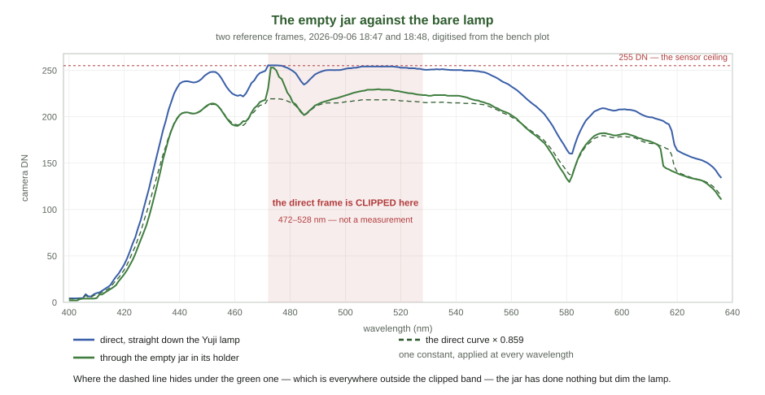
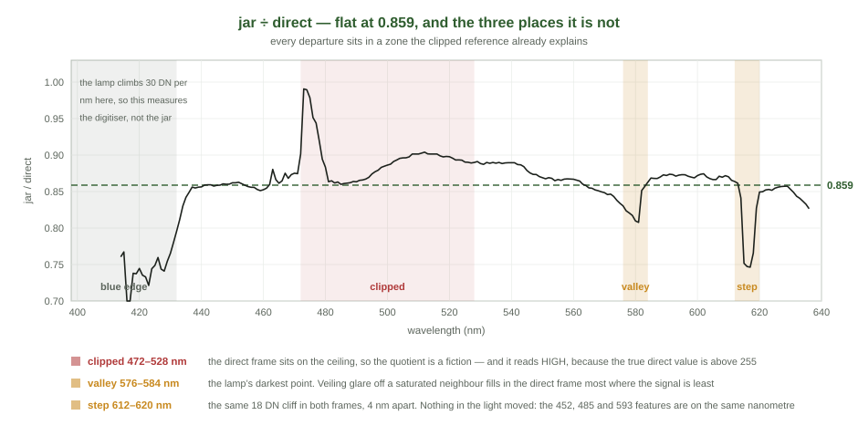
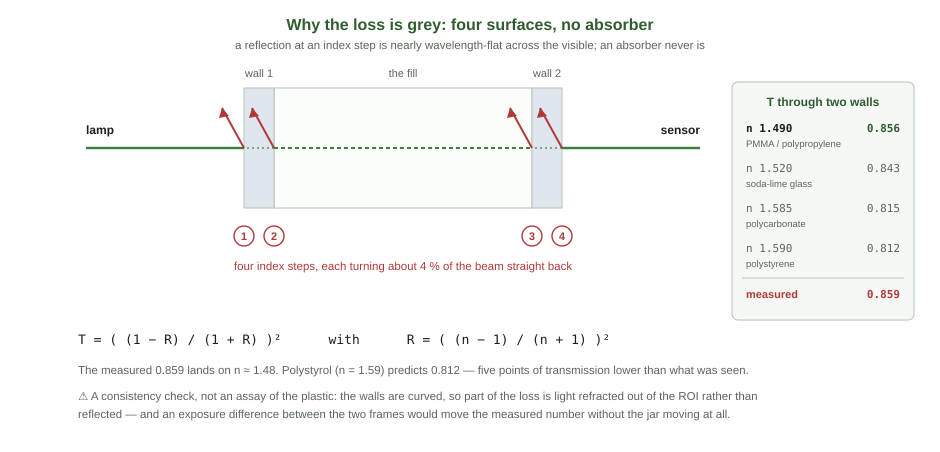

<!--
MASTER DOCUMENT — the jar in the beam.
This markdown file is the SOURCE OF TRUTH. The PDF is generated from it:

    python3 docs/tools/build_jar_transmission_pdf.py
    -> ../spectracs-docs/internal/Spectracs_JarTransmission.pdf

Never hand-edit the PDF. Edit here, re-run, commit both.

Every number and all three figures come from `diagnostics/jar_transmission.py`, which digitises the
two screenshots and writes `diagnostics/data/jar_transmission_20260906.csv`. Re-run it before
regenerating this PDF.

This document is an OBSERVATION with a NEGATIVE result and one live warning. It proposes no change
to shipped code. §7 is the only thing in it that asks for work, and the work it asks for is one
capture pair.

⚠ The renderer's math notation is deliberately small. It supports _{} ^{} \frac \sqrt and the symbol
list in build_capture_fidelity_pdf.py. It does NOT support \; — use plain spaces around operators.
⚠ Tables and formulas must stay OUT of block quotes; the renderer does not typeset them there.
-->

# The Jar in the Beam

*What an empty polymer jar does to the reference — measured against the bare lamp, and why the answer
is duller and more useful than the question.*

> **In one line.** The jar does not change the shape of the spectrum. It multiplies it by a single
> constant, **0.859**, flat to about 1 % from 432 nm to 636 nm. Three places in the pair depart from
> that constant, and all three are explained by the direct frame having been **captured into the
> sensor ceiling**.

**Where this came from.** On 2026-09-06 at 18:47 and 18:48, Edwin captured two `Reference` frames on
the dev bench, minutes apart: one through the empty jar sitting in its holder, one with the jar taken
out and the camera looking straight down the Yuji lamp. His reading of the pair was *"the polystrol jar
itself changes the spectrum"*. That reading is half right, and the half that is wrong is the half that
would have mattered.

<!--TOC-->

---

## 1. What the pair is, and what it can answer

### 1.1 The input is two screenshots, not two runs

No measurement was archived. What exists is a pair of **ksnip PNGs of the bench's Reference plot**,
preserved at `../spectracs-references/probe/jar_20260906/{jar,direct}.png`.

Everything below is therefore **digitised from a rendered plot**: `diagnostics/jar_transmission.py`
finds the anti-aliased curve colour in each pixel column and maps its mean row back through the axis
calibration, which was itself read off the tick labels of those two images (both gave 7.044 px/nm, and
the two agree to a twentieth of a pixel). The result is committed as
`diagnostics/data/jar_transmission_20260906.csv` so the figures regenerate without the PNGs.

That costs roughly **±1 DN of resolution**, which is why nothing here is quoted past three digits, and
why a claim about a 1 nm shift in a feature is treated below as a claim about nothing.

### 1.2 What a two-frame pair can and cannot decide

A single ratio of two frames answers exactly one question — *by what factor, at each wavelength, did
the second frame differ from the first* — and it answers it about **everything that changed between
them**, not about the jar alone. Two things changed: the jar went in, and time passed. §6 is about the
second one, and it is the reason this document does not close.

---

## 2. The finding: a level change, not a shape change



### 2.1 One constant fits the whole window

Restricted to the wavelengths where the pair is evidence at all — 432 nm and up, outside the three
zones of §3, and with the direct frame below 240 DN so that both frames sit on the straight part of the
camera's transfer curve (`SPEC_capture_quality.md` §16.41) — the quotient is

| | |
|---|---|
| **median** | **0.859** |
| spread (sd) | 0.014 |
| samples | 91, spanning 432–636 nm |
| tilt across the window | +3.8 × 10⁻⁵ per nm, i.e. **+0.008 over 204 nm — 0.9 % of the level** |

A tilt of nine parts in a thousand across the whole visible window is not distinguishable from the
digitisation. **There is no measured colour to this loss.**

### 2.2 Band by band

| band | jar / direct | sd | note |
|---|---|---|---|
| 435–470 nm | 0.860 | 0.007 | direct peaks at 248 DN here — on the bend |
| 530–555 nm | 0.881 | 0.009 | direct peaks at 251 DN here — on the bend |
| 560–575 nm | 0.852 | 0.009 | |
| 585–608 nm | 0.871 | 0.002 | the tightest band in the pair |
| 622–636 nm | 0.848 | 0.010 | |

The blue end and the red end differ by about one part in a hundred, in a pair whose own repeatability
is not established. The two bands that read *high* are the two that sit within a few counts of the
ceiling.

### 2.3 Backing away from the ceiling moves the number, and then stops

| direct frame kept below | samples | median ratio | sd |
|---|---|---|---|
| 255 DN (no guard) | 130 | 0.865 | 0.016 |
| 248 DN | 103 | 0.860 | 0.013 |
| 242 DN | 93 | 0.859 | 0.014 |
| **240 DN (adopted)** | **91** | **0.859** | **0.014** |
| 230 DN | 71 | 0.857 | 0.015 |
| 225 DN | 66 | 0.857 | 0.016 |

The estimate falls by six thousandths as the guard comes down from the ceiling, and then stops moving.
That plateau is the reason **0.859** is quoted rather than the unguarded 0.865: the drift is the
camera's compression near saturation, not the jar's.

### 2.4 Nothing in the light moved

A level change cannot move a feature; a shape change must.

| feature | direct | jar | |
|---|---|---|---|
| Soret-side hump | 452 nm | 452 nm | same |
| 485 dip | 485 nm | 485 nm | same |
| 593 hump | 593 nm | 593 nm | same |
| 462 dip | 463 nm | 461 nm | −2 nm |
| 580 valley | 582 nm | 581 nm | −1 nm |

Three sharp features land on the same nanometre. The two that move are both broad, shallow minima
whose position a ±1 DN digitisation error can walk a nanometre on its own — and they move in the
*same* direction as each other but the *opposite* direction to the 615 nm step of §3.3, so they do not
describe a displacement of the spectrum. They describe noise.

---

## 3. The three zones that are not evidence



### 3.1 ⛔ The direct frame is clipped, 472–525 nm

**33 of the 237 sampled wavelengths in the direct frame sit at or above 252 DN, against a ceiling of
255.** The jar frame has two such samples. Over that run the direct curve is not a measurement of the
lamp; it is a flat top, and the true value underneath it is unknown and **higher** than what was
recorded.

The immediate consequence is arithmetic: a quotient whose denominator has been truncated downward reads
**too high**. The measured ratio across the clipped run is **0.894** against the clean 0.859, and that
is the whole of the apparent bulge in the middle of Figure 2. It is not a window in which the jar
transmits better.

The larger consequence is that a clipped frame is not a local problem. Which brings us to the other two
zones.

### 3.2 The 580 nm valley reads 0.831

The lamp's deepest minimum is the darkest point in the frame. Veiling glare — light scattered inside
the optics from the bright parts of the field onto the dark parts — adds an offset that is a fixed
fraction of the *total* flux and therefore proportionally largest exactly where the true signal is
smallest. The direct frame has a saturated plateau 100 nm wide feeding that glare; the jar frame,
dimmed by 14 %, has none. The direct valley is filled in more than the jar valley, the direct
denominator reads high, and the quotient reads low.

That is a hypothesis, not a measurement. What can be said without it is weaker and still sufficient:
**the one wavelength at which the ratio departs from flat by more than 3 % is the one wavelength at
which the two frames are least comparable.** No jar effect need be invoked, and none should be until
§7's re-capture says otherwise.

### 3.3 The 615 nm step sits 4 nm apart in the two frames

Both frames carry the same artefact: an abrupt fall of about 18 DN over one nanometre. In the jar frame
it falls at **614 nm**; in the direct frame at **618 nm**. The size is the same, the shape is the same,
the position is not.

⛔ **This is the one observation in the pair that no explanation here covers.** It cannot be a
displacement of the spectrum on the sensor, because §2.4's three sharp features did not move. It cannot
be a jar transmission feature, because a transmission feature would be a step in the *ratio* and not a
step that exists identically in both frames. A demosaic channel crossover whose switch-over point
depends on the relative channel levels would do it — and the direct frame's green channel is clipped,
which changes exactly those relative levels — but this document has one pair of screenshots and cannot
test that. `KB_cameras.md` and `SPEC_capture_quality.md` §16.31 already record a 581 nm crossover in the
same pipeline, so the mechanism is not exotic; the evidence for it here is simply absent.

### 3.4 Below 432 nm the quotient measures the digitiser

The lamp's blue edge climbs about 30 DN per nanometre. A sub-pixel misalignment between the two
digitised curves is worth tens of counts there, and the ratio swings between 0.73 and 0.99 in
consequence. That excursion is drawn in Figure 2 for honesty and is excluded from every number in this
document.

---

<!--PAGEBREAK-->

## 4. Where 0.859 could come from



A beam crossing an empty jar meets **four index steps** — into wall 1, out of wall 1, into wall 2, out
of wall 2. Each reflects a few percent straight back out of the collected beam. Summing the incoherent
multiple reflections within each wall gives, for two walls,

```math
T = \left( \frac{1 - R}{1 + R} \right)^{2} \qquad R = \left( \frac{n - 1}{n + 1} \right)^{2}
```

| material | n | R per surface | T through two walls |
|---|---|---|---|
| PMMA / polypropylene | 1.490 | 0.0387 | **0.856** |
| soda-lime glass | 1.520 | 0.0426 | 0.843 |
| polycarbonate | 1.585 | 0.0512 | 0.815 |
| polystyrene | 1.590 | 0.0519 | 0.812 |
| | | *measured* | **0.859** |

**Why this matters more than which plastic it is.** A Fresnel reflection at a glass- or plastic-to-air
step varies by well under a percent across the visible, because *n* itself barely varies there. An
*absorber* never behaves that way — it has a band, and a band has edges. The measured loss being flat to
0.9 % across 204 nm is exactly the signature of interface reflection and exactly not the signature of
anything absorbing in the jar wall. **The jar is not tinted. It is merely in the way.**

⚠ **Two reasons not to read the table as an assay of the plastic.** The walls are curved, so part of the
loss is light refracted out of the ROI rather than reflected — which pushes the measurement *down*, away
from the material's true Fresnel value. And an exposure difference between the two frames (§6) would move
the measured number without the jar moving at all. The inverted index, **n ≈ 1.49**, is a consistency
check that the loss is of the right order for four surfaces. It is not evidence that the jar is not
polystyrene.

---

## 5. What a flat factor does to the metrics

Suppose, for this section only, that the 0.859 is entirely the jar's and entirely flat. Two cases follow,
and they are very different.

### 5.1 If the reference goes through the same jar — nothing happens

The whole design of `T = S / R` is that anything common to both paths divides out. An empty jar in the
reference path and a filled jar in the sample path share all four interfaces; the factor cancels exactly,
at every wavelength, with no residue. **This is the normal case and it is why this finding is not a bug.**

### 5.2 If the reference does *not* — a constant is added to every absorbance

A transmission scaled by a constant *k* becomes, in absorbance,

```math
A_{\op{meas}}(\lambda) = A_{\op{true}}(\lambda) + \log_{10}\frac{1}{k}
```

which for *k* = 0.859 is a **constant +0.066 at every wavelength**. What that does depends entirely on
how the metric is built, and the three metrics in the house divide cleanly into two groups.

**A difference over a difference is immune.** `Rv` — the verdict metric as decided on 2026-08-25
(`SPEC_red_ratio_metric.md`) — is

```math
Rv = 100 \frac{A(622 \ldots 627) - A_{valley}}{A(565 \ldots 580) - A_{valley}}
```

Both the numerator and the denominator are differences of two absorbances, so the constant cancels in
each of them **separately and exactly**. `Rv` does not move. The same argument covers `dQ100`, whose
numerator is a difference and whose denominator is a standard deviation — and the sd of a spectrum
shifted by a constant is unchanged:

```math
dQ100 = 100 \frac{A(563 \ldots 573) - A(623 \ldots 626)}{\op{sd} A(448 \ldots 626)}
```

**A difference over a level is not.** `Q%` — which still carries the gauges, the history tracker and the
too-brown verdict — is

```math
Q_{\op{pct}} = 100 \frac{A_{Q} - A_{valley}}{A_{Soret}}
```

Its numerator cancels the constant like the others. Its **denominator is not a difference**, and it gains
the whole +0.066. `Q%` therefore reads **low**, by an amount set by how strong the Soret flank is in that
particular fill:

| $A_{Soret}$ | `Q%` reads low by |
|---|---|
| 0.6 | 9.9 % |
| 0.8 | 7.6 % |
| 1.0 | 6.2 % |
| 1.17 *(the worked example in `DOC_metric_algebra.md`)* | 5.4 % |
| 1.5 | 4.2 % |

⭐ **This is not an argument for or against any metric.** In the normal case of §5.1 the reference already
cancels the factor and all three read the same number; immunity to an error that does not occur buys
nothing. What it is, is a **property worth having written down**: the two metrics built as a ratio of two
*differences* are structurally blind to any wavelength-flat multiplier in the light path — a jar, a window,
a neutral filter, a slightly different exposure — while the one built over a *level* is not. None of the
three was designed for that; it falls out of the same construction that gave `Rv` and `dQ100` their
dilution invariance.

### 5.3 This is what ROADMAP item 1 is worth

The standing top item on `ROADMAP.md` is **the reference method as a header field** — same-jar or two-jar,
recorded nowhere today, *"and it decides whether two runs are comparable at all"*.

This document supplies the size of that decision, in the one direction it can. A reference that does not
share the sample's jar carries a **+0.066 absorbance offset** relative to one that does. On `Rv` and
`dQ100` that offset is worth exactly zero; on `Q%` it is worth **5–10 % of the reading**, which is the same
order as the fill-to-fill spread the whole gauge is calibrated against. ⇒ Two `Q%` values taken under
different reference methods are not comparable, and there is currently no field in which to record which
method either of them used.

⚠ What this does **not** measure is the two-jar case — reference in one jar, sample in another. There the
four interfaces are present on both sides and the factor largely cancels; what is left is the difference
between two jars, which needs two jars and was not measured here.

---

## 6. ⛔ The one thing that would overturn all of it

**A flat ratio is also exactly what a pure exposure difference looks like.**

Two frames captured minutes apart, with no `CAPTURE-SETTINGS` line kept for either, cannot distinguish

- the jar removed 14 % of the light, from
- the two captures ran at different exposure, and the jar removed rather less, or nothing at all.

Both produce a wavelength-flat quotient. §16.39 of `SPEC_capture_quality.md` is the record of exposure
being the last free variable in this rig and of the AE landing on one of two values; §16.41 is the
measured transfer curve that says a level change is a level change and does not tint. Neither helps
here, because both frames' settings are simply not known.

⇒ **Read 0.859 as an upper bound on the jar's loss.** It is the largest factor the jar could account
for; it may be that the jar accounts for a part of it and an exposure step for the rest. Nothing in §5
changes under that reading — a flat factor of *any* size cancels in §5.1 and behaves as §5.2 describes —
but the number itself, and the material inference of §4, would.

---

## 7. What to re-measure

One capture pair settles everything open here, and it takes ten minutes.

1. **Drop the exposure until the direct frame peaks around 200–220 DN.** Nothing above 240 DN is usable
   and the current pair spends a fifth of the window there. This is the whole of the fix for §3.1.
2. **Pin the exposure and do not let AE re-run between the two frames.** `DevSpectralPlugin` already
   pins for the dev bench (§16.39.5); confirm the pin covers both captures, and **keep the
   `CAPTURE-SETTINGS` line for each**. This is the whole of the fix for §6.
3. **Capture four frames, not two** — direct, jar, jar re-seated, direct again. The reseat gives the
   pair's own repeatability, which nothing in this document has; §16.26's null-run series established
   that reseating is the dominant term in the archive's CV, and a jar-transmission number without a
   reseat spread underneath it cannot be compared to anything.
4. **Then look at exactly two wavelengths:** 580 nm, and the step at 614/618 nm. If both come back flat
   at the same constant as their neighbours, §3.2 and §3.3 are closed as clipping artefacts and this
   document reduces to §2 and §4. If either survives an unclipped, exposure-matched pair, it is real and
   §3.3 in particular becomes a camera question rather than a jar question.

**What does *not* need doing.** No shipped code changes on the strength of this. The reference path and
the sample path share the jar, §5.1 applies, and the correction for a factor that cancels is no
correction.

---

## 8. What this document claims, ranked

| | |
|---|---|
| ⭐⭐ **held firmly** | Over 432–636 nm, less the three zones, the two frames differ by a single constant to within about 1 %. Three sharp lamp features are on the same nanometre in both. Whatever separates the frames, **it is not a change of shape** |
| ⭐ **held, with the §6 caveat** | That constant is 0.859, and the jar accounts for at most all of it |
| ⭐ **derived, not measured** | A wavelength-flat multiplier anywhere in the light path cancels exactly in `Rv` and in `dQ100`, and does not cancel in `Q%` (§5.2). This follows from the definitions and needs no measurement to be true |
| **plausible, untested** | The loss is four-surface Fresnel reflection, which is why it is grey (§4) |
| **plausible, untested** | The 580 nm dip is veiling glare from the clipped run (§3.2) |
| ⛔ **unexplained** | The 615 nm step standing 4 nm apart in the two frames (§3.3) |
| ⛔ **not claimed** | That the jar is or is not polystyrene. That the jar tints the beam. That anything in the shipped pipeline is wrong |
