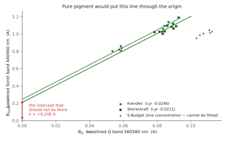
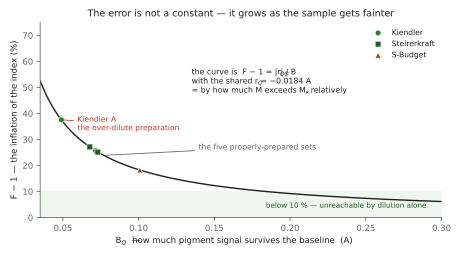

<!--
MASTER DOCUMENT — the pedestal correction.
This markdown file is the SOURCE OF TRUTH. The PDF is generated from it:

    python3 docs/tools/build_pedestal_correction_pdf.py
    -> ../spectracs-docs/internal/Spectracs_PedestalCorrection.pdf

Never hand-edit the PDF. Edit here, re-run, commit both.

Chapters 1-7 and both figures come from `diagnostics/pedestal_correction.py`; chapter 9's
out-of-sample test comes from `diagnostics/all_metrics_archive.py`. Both call the SHIPPED code paths
rather than re-implementing them. Re-run both before regenerating this PDF.

This document is DOCUMENTATION plus ONE PROPOSAL. The proposal (chapter 7) is NOT implemented and
must not be implemented on the strength of this document alone — chapter 12 says what would have to
be true first.

⚠ The renderer's math notation is deliberately small. It supports _{} ^{} \frac \sqrt and the symbol
list in build_capture_fidelity_pdf.py. It does NOT support \; — use plain spaces around operators.
-->

# The Pedestal Correction

*Why the Pigment Index reads about 26 % too high, where the error comes from, and what a single
subtraction would do about it.*

**Why this document exists.** On 2026-08-01 three preparations of the same green oil returned three
different verdict numbers — 17.12, 15.45 and 15.91 — a spread of 10.3 % on an oil that had not
changed. Chasing that down produced a measurement of a quantity the specification had only ever
derived on paper, and with it a correction that would remove most of the spread. This document
explains the whole chain from first principles, so that the proposal can be judged rather than
believed.

**Its companions.** *Capture Fidelity* covers the instrument — how a webcam becomes a spectrum.
*Light, Pigment and Solvent* covers the sample. *From Spectrum to Verdict* covers the arithmetic that
turns an absorbance curve into a verdict. **This document is a correction to that arithmetic**, and
assumes only chapter 5 of it.

**How to read it.** **§1.1 is the whole argument on one page** — start there, and return to it whenever
the thread is lost. §2.1 lists every symbol. Chapters 2–4 build the problem from nothing and contain no
algebra beyond a subtraction; **§3.1 is the one picture that carries all of them.** Chapter 5 is the one
piece of real algebra and is worth the effort — everything after it is consequence. Chapter 8 says what
the corrected number physically IS; chapter 9 is the first real test of it. Chapter 10 lists every
assumption in one place. **Chapter 12 is the chapter that says why this may be wrong**, and should be
read before anybody acts on it.

**Status.** The measurement is real. The correction is a **proposal** — fitted on one oil,
confirmed out-of-sample on a second, and shown by the same test NOT to survive a rig rebuild.

⭐ **Rewritten 2026-08-03 onto the SHIPPED anchor.** The correction now ships in the bench plugin, and the
far baseline window moved from 600–630 nm to **620–630 nm** (`SPEC_capture_quality.md` §16.20). **Every
number in this document is on the 620–630 anchor**, which is what the instrument computes.

⚠ **`r_Q` belongs to its anchor, and the two must never be mixed:**

| far anchor | `r_Q` | |
|---|---|---|
| **620–630 nm** | **−0.0184 ± 0.0043 A** | **the shipped configuration — this document** |
| 600–630 nm | −0.0246 ± 0.0037 A | the older window, kept only in §4.1–4.2 |

⚠ **§4.1 and §4.2 are deliberately still on 600–630.** They are the investigation that *moved* the window,
and on the new anchor the 607 nm lamp line lies **outside** it entirely — so "what is the far anchor
contaminated with" is not a question this anchor can be asked. Those two sections say so where they start.

⚠ **Added 2026-08-02: §4.1 and §4.2.** Checking the mechanism for *size* rather than sign shows that
scattering curvature accounts for **at most a sixth** of the measured residual; the obvious replacement
suspect, a contaminated far anchor, was then tested and **refuted** (§4.2). **Nothing on record explains
`r_Q`'s size.** This leaves the correction itself untouched, since `r_Q` is fitted rather than derived,
but it weakens chapter 8's appeal to a successful prediction, reframes chapter 9's rebuild failure, and
closes one of chapter 13's routes. Read §4.1–4.2 alongside chapter 8.

<!--TOC-->

<!--PAGEBREAK-->

## 1 · The claim, in one page

The instrument produces an absorbance curve. The verdict is a **ratio of two heights** taken off that
curve, after a straight line has been subtracted from it:

```math
M = \frac{B_{Soret}}{B_{Q}}
  read: the verdict number is the blue band divided by the green-yellow band, both baselined.
```

`B_Soret` is the pigment's blue absorption band (440–460 nm); `B_Q` is its much weaker green-yellow
band (560–580 nm), both measured above a straight line fitted through **520–540 and 620–630 nm**. Green
oil scores high, brown oil low.

**On the name.** `M` is the **Pigment Index** — the shipped verdict number, defined in *From Spectrum
to Verdict* §5.2. It is written `M` throughout this document only because it appears inside fractions
on nearly every page. Nothing new is being introduced; §2.1 lists every symbol.

**The problem.** The straight line that gets subtracted is an approximation, and it does not remove
exactly the right amount. What it leaves behind at the Q band we call `r_Q`. Because `B_Q` is a small
number, a small leftover is a large fraction of it — and `B_Q` is the **denominator**, so the whole
ratio inherits that fraction.

**The measurement.** `r_Q` = **−0.0184 ± 0.0043 A**, obtained from ten runs of one oil. A second oil
gives −0.0275 ± 0.0284 A, but that interval contains zero and adds very little — chapter
10 weighs it honestly, and the real confirmation is chapter 9's out-of-sample test. `r_Q` is
**negative**, meaning the correction subtracts slightly too much.

**The size.** At the standard recipe this inflates the verdict number by about **26 %** (an inflation
factor `F` = 1.26, defined in §5.1); on an over-dilute sample it reached **38 %**.

**The proposal.** Put the leftover back before dividing:

```math
M_{\infty} = \frac{B_{Soret}}{B_{Q} - r_{Q}}
  read: add the over-subtracted amount back into the denominator, then divide as before.
```

$M_{\infty}$ is the **pedestal-free Pigment Index** — what the ratio would be if the baseline left
nothing behind. The ∞ is not a limit of anything physical; it is read as *"at infinite concentration"*,
because that is where the residual becomes negligible (§5).

One subtraction, using quantities every run already computes. Applied to the three preparations that
started this, their spread falls from **10.3 % to 3.0 %**.

**What it costs.** The numbers move to a different scale — green lands near 12.4 instead of 15.5–17.1,
brown near 8.6 instead of 10.2 — so **any threshold set on the uncorrected scale must be re-derived.**
⚠ The shipped plugin retains `T` = 10.6 on this metric (`SPEC_capture_quality.md` §16.20.7); it lands
inside the class corridor and classifies every archived run correctly, but it was **inherited, not
derived on this scale**.

**What it assumes.** That `r_Q` is a *constant*. That is the whole risk. Chapter 9 tests it out-of-sample
for the first time, and chapter 12 shows a concrete case where it changes the answer.

<!--PAGEBREAK-->

## 1.1 · ⭐ The whole derivation on one page

Every step from a photograph to the corrected number, with **one real set carried through all of
them** — Kiendler C, two runs, post-rebuild. Nothing on this page is new; it is the rest of the
document compressed, and it is here so that the shape of the argument can be seen before the detail
arrives.

| # | what happens | the step | Kiendler C |
|---|---|---|---|
| **1** | two captures, one with solvent only, one with the sample | $A = \log_{10}(R/S)$ | a curve, ~1.14 A at 450 nm |
| **2** | average the curve over four fixed windows | $A_{X} = \op{mean}$ over window `X` | `A_Soret` 1.1705 · `A_Q` 0.2082 · `A_near` 0.1018 · `A_far` 0.2011 |
| **3** | fit a straight line through the two *anchor* windows | the **chord** | 520–540 and **620–630** *(§3.1)* |
| **4** | subtract that line everywhere | $B_{X} = A_{X} - \op{chord}$ | `B_Soret` **1.1397** · `B_Q` **0.0716** |
| **5** | divide the two remaining heights | $M = B_{Soret} / B_{Q}$ | **15.91** ← *the uncorrected verdict* |
| **6** | but the chord is straight and the pedestal is not, so a leftover stays at Q | $r_{Q}$, from the **intercept** of $B_{Soret}$ vs $B_{Q}$ | **−0.0184 ± 0.0043 A** *(t = 4.43)* |
| **7** | a leftover in the *denominator* inflates the ratio | $F = 1 - r_{Q}/B_{Q}$ | **1.257**, i.e. **+25.7 %** |
| **8** | put the leftover back, then divide again | $M_{\infty} = B_{Soret} / (B_{Q} - r_{Q})$ | **12.66** ← *the corrected verdict* |

**Reading the page as one sentence.** *Steps 1–5 are the shipped metric. Step 6 says the baseline in
step 3 does not do its job exactly. Step 7 says the error lands where it hurts most, because `B_Q` is
small and it is the denominator. Step 8 undoes it.*

**Where each step can go wrong**, with the chapter that examines it:

| step | the risk | where |
|---|---|---|
| 3 | the anchors are not clean — the far one carries pigment, and the older 600–630 window also carried the 607 nm lamp line | **§4.1**, A6 |
| 4 | a straight line cannot follow a curved pedestal — this is the whole problem | ch. 4 |
| 6 | `r_Q` may not be one number for every sample, or may not survive a rig rebuild | ch. 9, A1 |
| 8 | the numbers land on a new scale, so any threshold set on the uncorrected one must be re-derived | ch. 11 |

<!--PAGEBREAK-->

## 2 · What the instrument actually hands us

Everything below starts from one curve: **absorbance against wavelength**, written $A(\lambda)$.

Absorbance is defined from two captures — the reference (pure solvent, no oil) and the sample:

```math
A(\lambda) = \log_{10}\frac{R(\lambda)}{S(\lambda)}
  read: how many factors of ten the sample dims the light, at each wavelength.
```

`A = 0` means the sample passes as much light as the blank. `A = 1` means it passes a tenth of it.
`A = 2`, a hundredth. The scale is logarithmic, so **high absorbance means very little light is
getting through** — and there is a ceiling, because once the transmitted signal falls into the sensor
noise the number stops meaning anything.

From that curve the plugin reads **four wavelength windows**:

| window | range | what lives there |
|---|---|---|
| **Soret band** | 440–460 nm | the pigment's strong blue absorption |
| near anchor | 520–540 nm | chosen to be *quiet* — little pigment |
| **Q band** | 560–580 nm | the pigment's weak second absorption |
| far anchor | **620–630 nm** | chosen to start after the 607 nm lamp line and to sit on the pigment's Qy band *(§16.20)* |

The two **anchors** are not measurements of the pigment. They exist to answer a different question,
which is the subject of the next chapter.

**A note on band values.** Each window's value is the mean absorbance over the points inside it.
Where this document quotes a set's value it is the **mean over that set's runs**. One consequence
worth knowing when checking the arithmetic: the mean of a ratio is not exactly the ratio of the
means, so recomputing `M` from the quoted `B_Soret` and `B_Q` reproduces the quoted `M` to about
0.05 %, not exactly.

### 2.1 Every symbol, in one place

Nothing here is needed yet — this table exists so that no symbol later in the document has to be
looked up by hunting backwards through the prose. **The last column is the one that matters**: it
says of each quantity whether we *measured* it, *derived* it, *fitted* it, or merely *assumed* it.

| symbol | what it is | unit | typical value | where it comes from |
|---|---|---|---|---|
| λ | wavelength | nm | 420–650 | the calibration |
| `R`, `S` | reference and sample intensity | DN | ~88, ~6 at Soret | **measured** |
| $A(\lambda)$ | absorbance, $\log_{10}(R/S)$ | A | 0 – 1.3 | **measured** (ch. 2) |
| `A_X` | raw band mean over window `X` | A | `A_Q` = 0.2082 | **measured** |
| $P(\lambda)$ | the **pedestal** — scattering background | A | ~0.10 at 530 nm | **inferred**, never observed alone |
| $A_{pigment}$ | what the pigment alone would absorb | A | — | **not observable** — the thing we want |
| `B_X` | band mean **after** the linear baseline | A | `B_Soret` = 1.1397, `B_Q` = 0.0716 | **derived** from `A_X` |
| `r_X` | the **residual** — what the baseline fails to remove at band `X` | A | `r_Q` = −0.0184 | **fitted** (ch. 6) |
| `r_Soret` | the same, at the Soret band | A | treated as 0 | **assumed** — A2, not measured |
| `M` | the **Pigment Index** — the uncorrected verdict number | — | 15.91 (green), 10.16 (brown) | **computed**, shipped |
| $M_{\infty}$ | the **pedestal-free** Pigment Index | — | 12.66 (green), 8.59 (brown) | **derived** — the correction |
| `F` | the **inflation factor**, $M / M_{\infty}$ | — | 1.257 | **derived** (§5.1) |
| `T` | the verdict threshold | — | **10.6** | **shipped constant** — invalid after correction (ch. 11) |
| `c` | pigment concentration | — | unknown | **eliminated** by the fit (ch. 6) |
| $\ell$ | optical path length | cm | fixed by the cuvette | constant, cancels |
| `e_X` | extinction coefficient at band `X` | — | unknown | **cancels** — only their ratio survives |
| `k` | intercept of the straight-line test | A | +0.2287 ± 0.0516 | **fitted** (ch. 6) |
| `t` | Student's *t* of that intercept | — | 4.43 | **computed** |
| `s` | dilution slope of the index | — | −0.05 → +0.05 | **computed** (ch. 9) |
| `n` | scattering exponent, $P \propto \lambda^{-n}$ | — | ~4 in theory | **assumed** — not measurable on this rig |

⚠ **Two rows deserve a second look.** `n` is *assumed*, not measured: the λ⁻ⁿ fit was withdrawn as
invalid on this instrument (`SPEC_capture_quality.md` §16.12.11 B), so the pedestal's convexity is a
claim from scattering theory whose only empirical support is the measured **sign** of `r_Q`. And
`r_Soret` is *assumed zero* — chapter 6's fit cannot separate it from $M_{\infty} \cdot r_{Q}$, so if
it is not zero, the quoted `r_Q` has quietly absorbed it.

<!--PAGEBREAK-->

## 3 · The pedestal, and why a baseline is subtracted at all

A cuvette of diluted oil does not only *absorb* light. It also **scatters** it — off undissolved oil
droplets suspended in the alcohol. Scattered light misses the camera just as absorbed light does, so
the instrument cannot tell the two apart. Both arrive as "absorbance".

The result is that the measured curve sits on a **pedestal**: a broad, smooth background that is
present at every wavelength and has nothing to do with the pigment.

```math
A_{measured}(\lambda) = A_{pigment}(\lambda) + P(\lambda)
  read: what we see is what the pigment absorbed PLUS a broad background that has nothing to do with it.
```

The pedestal `P` is a nuisance and it is large. Earlier work measured it at roughly **7 % of the
Soret band but 52–61 % of the Q band** — because the Q band is intrinsically weak, the same
background is a far bigger share of it.

**The standard remedy** is to estimate `P` from places where the pigment is quiet, and subtract it.
That is what the two anchor windows are for: fit a straight line through 520–540 nm and 600–630 nm,
and subtract that line from the whole curve. Everything called `B_...` in this document means a band
value **after** that subtraction.

This works well. It is the reason the shipped metric survives jar-tilt events that send the
uncorrected ratio wandering by 29 %, and nothing here argues against doing it.

**But a straight line is a straight line, and the pedestal is not straight.**

### 3.1 The whole thing, in one picture

Everything above and everything below is contained in this figure. It is one real measurement —
Kiendler C, run 1, on the shipped **520–540 / 620–630** anchors — with nothing idealised:


**Read the left panel first.** The black curve is the absorbance. The four shaded windows are the
regions the plugin reads. The dashed red line is the fitted baseline, drawn through the two anchor
windows. The two green arrows are `B_Soret` and `B_Q` — **the verdict is the ratio of those two
arrows.** That is the entire reading workflow.

**Then the right panel, which is where the trouble is.** Zoomed in, two things are visible that the
left panel is too coarse to show:

- The **fitted line rises toward the red**. Scattering falls off with wavelength; it cannot produce a
  rising background. Whatever this line is tracking, it is not what chapter 3 said it was — §4.1 pursues
  that, and it is the thread that eventually moved the window.
- The far anchor **starts after the 607 nm lamp line** and sits on the pigment's own **Qy band**
  (~623–626 nm). That placement is deliberate (`SPEC_capture_quality.md` §16.20): the older 600–630
  window straddled both, and §4.1–4.2 are the investigation of what that cost.

Chapter 4 develops the consequence of the chord being a chord; §4.1 returns to what this panel shows.

<!--PAGEBREAK-->

## 4 · What a straight line cannot remove — and which way it errs

Scattering does not fall off linearly with wavelength. It falls off roughly as a power law,
$P \propto \lambda^{-n}$, which is a **convex** curve: steep in the blue, flattening toward the red.

Now the geometry that decides everything:

- We fit the line through two windows, at **520–540 nm** and **600–630 nm**.
- A straight line through two points on a convex curve is a **chord**.
- **A chord lies *above* the curve everywhere between its endpoints.**
- The Q band, **560–580 nm, lies exactly between them.**

So at the Q band the fitted line sits **above** the true pedestal, and subtracting it removes the
pedestal **plus a slice of genuine pigment signal**.


**The middle panel is worth dwelling on.** If the pedestal happened to be exactly straight, the fit
would remove it **completely** and there would be no residual at all — no correction needed, no
document. The entire problem is curvature, and nothing else. Note also that the *slope* of the
pedestal is irrelevant to all three panels; only which side of the chord the curve falls on matters.

Write the leftover as `r`, defined as what the line fails to remove — negative where the line
over-subtracts:

```math
B_{X} = A_{pigment,X} + r_{X}
  read: after baselining, band X still carries r_X — negative where the line took away too much.
```

**This predicts the sign before we measure anything: `r_Q` must be negative.** It is a real
prediction and it could have come out wrong. Measured, `r_Q` = −0.0184 A.

**Why the Soret band escapes.** 440–460 nm lies *outside* the two anchors, not between them. There
the chord runs below the curve, and in any case the Soret band is ten to twenty times taller, so a
leftover of 0.025 A is a rounding error against 1.1 A. Throughout this document `r_Soret` is treated
as negligible; chapter 10 lists that as an assumption.

### 4.1 ⚠ The mechanism gets the sign right and the SIZE wrong — by about six times

> **In one line:** scattering can supply at most a sixth of `r_Q`; the obvious replacement suspect has
> since been tested and refuted (§4.2); **nothing on record explains the rest**; and the correction does
> not depend on the answer.
>
> ⚠⚠ **§4.1 AND §4.2 ARE THE ONLY SECTIONS STILL ON THE 600–630 ANCHOR, DELIBERATELY.** They are the
> investigation that *moved* the window, so their subject is that window's contamination — and on the
> shipped 620–630 anchor the 607 nm lamp line lies **outside** it entirely, so the question cannot be put
> to it. Every `r_Q` in these two sections is **−0.0246 A**, the old anchor's value.

*Added 2026-08-02, while drawing §3.1's figure. It does not change the correction, but it changes
what `r_Q` is understood to be, and it supersedes part of chapter 8.*

The argument above is qualitative: convex ⇒ negative. It is worth asking the quantitative question
too, because a mechanism that predicts the right sign and the wrong magnitude is not yet the right
mechanism.

The pedestal at 530 nm is at most 0.1018 A — that is the whole raw absorbance there, and the pigment
takes some of it, so this is an **upper bound**. Ask what residual a pure $\lambda^{-n}$ pedestal of
that size would leave at the Q band:

| scattering law | exponent `n` | residual it leaves at Q |
|---|---|---|
| very shallow | 2 | 0.0015 A |
| **Rayleigh — the steepest real scattering** | **4** | **0.0042 A** |
| unphysically steep | 6 | 0.0077 A |
| unphysically steep | 10 | 0.0155 A |
| | **measured** | **0.0246 A** |

**Rayleigh scattering accounts for about 17 % of the measured residual.** To reach 0.0246 A from a
power law alone would take `n` ≈ 15 — and `n` = 4 is the *ceiling*, not the middle: larger particles
scatter *more* flatly, not more steeply, so no particle size in the sample can do this.

⇒ **Something other than scattering is bending the baseline.** §3.1's right-hand panel says what:

```math
r_{Q} \approx -0.471 \cdot \delta_{far}
  read: an offset on the far anchor lands on the Q band with weight 0.471 — the same interpolation
  weight §5.5 of *From Spectrum to Verdict* quotes. An anchor that reads HIGH pushes r_Q negative.
```

The far window contains the **607 nm artifact** (*From Spectrum to Verdict* §5.9) and the **lamp's red
cliff**, where 620–630 nm sits near 39 DN against 130 at 530 and absorbance runs away
(`SPEC_capture_quality.md` §16.12.11 B). Averaging only the clean stretches of that window — 600–606
and 610–618 nm — estimates what the anchor would have read without them:

| set | `A_far` as used | `A_far` clean | excess $\delta_{far}$ | ⇒ contribution to `r_Q` |
|---|---|---|---|---|
| Kiendler A | 0.0705 | 0.0505 | +0.0200 | −0.0094 |
| Kiendler B | 0.1401 | 0.1050 | +0.0351 | −0.0165 |
| Kiendler C | 0.1462 | 0.1100 | +0.0362 | −0.0171 |
| Steirerkraft B | 0.1322 | 0.0976 | +0.0346 | −0.0163 |
| Steirerkraft C | 0.1591 | 0.1194 | +0.0397 | −0.0187 |
| S-Budget D | 0.1311 | 0.1045 | +0.0266 | −0.0125 |
| | | **mean** | **+0.0320** | *(see below — the mean is the wrong statistic)* |

#### ⚠ Why multiplying that mean would be wrong — and the corrected number

It is tempting to take +0.0320 A, multiply by 0.471, and declare 61 % of `r_Q` explained. **That is
wrong, and an earlier draft of this document said it.** A contamination that grows with the pigment
moves every run *along* the fitted line of chapter 6 and lands in the **slope**. Only a term that does
**not** grow can shift the **intercept** — and `r_Q` is defined as the intercept. This is assumption
A6's own argument, and the draft quoted it approvingly a page earlier and then failed to apply it.

Most of that excess does grow with the pigment. Decomposing it and regressing each part on the Q-band
amplitude across the six sets:

| part of the excess | slope | intercept | R² |
|---|---|---|---|
| the **607 nm** feature | +0.361 | −0.0053 | 0.94 |
| the **rise past 618 nm** | +0.261 | +0.0129 | 0.90 |

Both are dominated by a term proportional to the pigment — which is independently established: the
620–630 nm rise was measured at **5.1 σ** to track the *oil class* under a fixed lamp, making it green
pigment (Qy flank) rather than a lamp artifact (`SPEC_capture_quality.md` §16.12.12).

Taking the **intercept** of the whole excess instead:

```math
\delta_{far,non-scaling} = +0.0169 \pm 0.0177 A \qquad t = 0.96
  read: the part of the contamination that does NOT grow with the pigment — the only part that can
  bias r_Q. On six sets it is not significantly different from zero.
```

| | contribution to `r_Q` | share of −0.0246 A |
|---|---|---|
| far anchor, **non-scaling** part | −0.0079 ± 0.0083 A | **32 % ± 34 %** |
| λ⁻⁴ scattering *(upper bound)* | −0.0042 A | ≤ 17 % |
| **unaccounted** | ~−0.0125 A | **~51 %** |


**⇒ Two conclusions, and they are of very different strengths.**

**Solid: scattering is ruled out as the main term.** That rests only on the pedestal's magnitude, which
is bounded by the raw absorbance, and on n = 4 being a ceiling. At the most generous reading it
supplies a sixth of the residual.

**⚠ Not established: that the far anchor supplies the rest.** The estimate has the right sign and a
plausible size, but on six sets it is 1.0 σ from zero. **A hypothesis with a number attached is not a
result** — so the next section tests it rather than adopting it.

### 4.2 ⛔ The far anchor, tested — and it is not the cause either

The test costs nothing. The red anchor is a *parameter*, every measurement is already on disk, and the
baseline routine already accepts a list of windows. **Excise the 607 nm lamp line — 606–610 nm — from
the red anchor, refit, and see what becomes of `r_Q`.**

> ⛔ **An earlier draft also removed 618–630 nm, calling it "the lamp's red cliff". That was wrong.**
> The lamp does collapse there, but the *rise* in absorbance across 620–630 was measured to track the
> **oil class** under a fixed lamp, at 5.1 σ — so it is the pigment's own **Qy flank**, and
> protochlorophyll's Qy sits at ~623–626 nm, inside that stretch. Removing it does not clean the
> anchor; it **throws away the most information-rich part of the window**. The corrected test excises
> the 607 nm line and nothing else.

⚠ One detail decides whether the comparison is fair: the baseline fit gives **each window equal total
weight**, so splitting the red end in two would hand it twice the influence it had. The near window is
therefore counted twice, restoring the original balance. Exactly one thing then changes: which red
points are used.

**Stated before running:** if the anchor supplies ~32 %, `|r_Q|` should fall from 0.0246 to about
0.017. If it supplies nothing, `r_Q` should not move. If it supplies everything, `r_Q` should collapse.

| oil | anchor | slope $M_{\infty}$ | intercept `k` | *t* | `r_Q` |
|---|---|---|---|---|---|
| **Kiendler** | shipped | 9.998 | 0.2463 | 7.01 | **−0.0246** |
| **Kiendler** | **607 line excised** | 8.748 | **0.2836** | **10.53** | **−0.0324** |
| Steirerkraft | shipped | 9.930 | 0.2103 | 1.13 | −0.0212 |
| Steirerkraft | **607 line excised** | 7.094 | 0.3941 | 2.59 | **−0.0556** |

**Every outcome allowed for was a decrease. The residual got bigger — on both oils — and more
significant** (Kiendler's *t* rises from 7.01 to 10.53, so this is not noise).

#### Exactly which wavelengths, and what the rejected draft cost

**606.0–610.0 nm** is removed — 4 nm, 28 of the window's 212 grid points, 13 %. The red anchor's
centroid moves only **615.1 → 616.1 nm**, so the near-red lever is essentially unchanged and there is
**no geometry confound**.

The two ⛔ rows below also delete 618–630 nm, the pigment's Qy flank. They are not tests of the
artifact; they price the mistake:

| far anchor | centroid | $M_{\infty}$ | `k` | *t* | `r_Q` | dilution `s` |
|---|---|---|---|---|---|---|
| **shipped 600–630** | 615.1 | 9.998 | 0.2463 | 7.01 | **−0.0246** | **−0.12** |
| **607 line excised** *(the valid test)* | **616.1** | 8.748 | 0.2836 | 10.53 | **−0.0324** | **−0.20** |
| ⛔ also deletes the Qy flank 618+ | 609.1 | 8.806 | 0.2549 | 9.16 | −0.0289 | −0.16 |
| ⛔ deletes the 607 line AND the Qy flank | 609.4 | 7.468 | 0.3044 | 13.53 | −0.0408 | −0.22 |

**Removing the one genuine artifact makes the residual bigger and the metric measurably more
dilution-variant** — `s` goes −0.12 → −0.20. That is the practical form of the result: the sensitivity
is `r_Q`/`B_Q` (§5), so a larger residual must show up as worse invariance, and it does.

The ⛔ rows show what deleting the Qy flank costs: $M_{\infty}$ collapses to 7.468 and `s` reaches
−0.22 — the same finding, from another direction, as the measurement that removing the far window's
pigment content makes the two oil classes overlap.

**Reading it properly.** `r_Q` = −`k`/$M_{\infty}$ compounds two separate movements, and they deserve
separate quotation: the **intercept rose 15 %** and the **slope fell 12 %**. The intercept is the claim
— it is the thing that had to vanish if the anchor were the cause — and it went the wrong way. The rest
of the change is the scale shifting, which is expected: those red points carry real pigment
information, so removing them lowers the pedestal-free index. That also means **the clean-anchor number
is on a different scale and must never be compared against the threshold.**

**⇒ Two candidate mechanisms are now dead**: scattering curvature (too small, §4.1) and anchor
contamination (wrong direction, here). **`r_Q` is real, reproducible, transfers between oils within one
rig state, does not survive a rebuild — and is unexplained.**

This *strengthens* chapter 13's recommendation rather than weakening it. A correction that works
empirically and is not understood mechanistically is exactly the kind that should be reported in
parallel and not yet allowed to decide anything.

#### What this changes, and what it does not

**It does not touch the correction.** `r_Q` is *fitted*, not derived. Chapter 6 measures it from the
intercept without assuming any mechanism, and chapter 7 subtracts it. All of that stands regardless of
what causes the residual.

**It does change three readings elsewhere in this document:**

1. **Chapter 8's "prediction that could have failed" is much weaker than claimed.** A too-high far
   anchor drives `r_Q` negative *just as* convex scattering does. The sign therefore does not
   discriminate between the two mechanisms, and getting it right is far less impressive than chapter 8
   presents it.
2. **Chapter 9 becomes the expected result rather than a surprise.** `r_Q` failed to survive the rig
   rebuild. An instrument artifact — a lamp spectrum and an optical path — is exactly the kind of
   thing that changes when the instrument is rebuilt, while a property of the sample would not.
3. **Chapter 13's T3 is aimed at the wrong target.** Filtering the sample or changing the solvent
   attacks *turbidity*, which supplies at most a sixth of `r_Q`. **Filtration cannot remove what is not
   turbidity**, so it can no longer be presented as the strong lever on the residual — even though the
   replacement lever is not yet identified.

It also explains a result this document reaches by a different route: chapter 10 finds that `r_Q`
behaves as a **constant** rather than scaling with turbidity. An instrument artifact does not scale
with how cloudy the sample is. Two independent observations, one explanation.

⚠ **This is an attribution, not a decomposition.** $\delta_{far}$ is not perfectly constant across
sets (+0.0200 to +0.0397), and "clean stretches" is a judgement about which parts of a window to
trust. The claim is that the far anchor is the **leading** term, not that the arithmetic closes
exactly.

<!--PAGEBREAK-->

## 5 · Where the error lands — and why the denominator suffers

This is the one piece of algebra in the document. Take it slowly; everything afterwards follows.
**Every step is carried alongside by one real set — Kiendler C — so that no line is only symbols.**

Write the true pigment absorbance in each band as concentration `c` times path length $\ell$ times
that band's extinction coefficient `e`:

```math
A_{pigment,Soret} = c \cdot \ell \cdot e_{Soret} \qquad A_{pigment,Q} = c \cdot \ell \cdot e_{Q}
  read: Beer-Lambert, once per band. How much pigment there is, times how strongly it absorbs there.
```

Substituting into chapter 4's definition, what we actually measure is:

```math
B_{Soret} = c \cdot \ell \cdot e_{Soret} + r_{Soret} \qquad B_{Q} = c \cdot \ell \cdot e_{Q} + r_{Q}
  read: what we read off the curve is the pigment's true signal PLUS whatever the baseline left behind.
  with numbers: B_Soret = 1.1397 A and B_Q = 0.0716 A — but only the sums are observable, not the parts.
```

The **true** index — the one that depends only on which pigment is present, not how much — is the
ratio of the extinction coefficients:

```math
M_{\infty} = \frac{e_{Soret}}{e_{Q}}
  read: c and l have cancelled. What is left belongs to the molecule, not to the preparation.
```

Now form the index we actually compute, dropping `r_Soret` as negligible:

```math
M = \frac{B_{Soret}}{B_{Q}} = \frac{c \cdot \ell \cdot e_{Soret}}{c \cdot \ell \cdot e_{Q} + r_{Q}}
  read: the numerator is clean; the denominator carries the leftover.
  with numbers: M = 1.1397 / 0.0716 = 15.91
```

Divide top and bottom by $c \cdot \ell \cdot e_{Q}$:

```math
M = M_{\infty} \cdot \frac{1}{1 + \frac{r_{Q}}{c \cdot \ell \cdot e_{Q}}}
  read: the error is not r_Q by itself — it is r_Q measured AGAINST the pigment signal.
```

**Read that denominator.** The error term is not `r_Q` on its own — it is `r_Q` **divided by the
pigment signal**. Three consequences follow immediately, and they are the whole story:

1. **The error is a *fraction*, not an offset.** A fixed leftover does more damage to a weak sample
   than a strong one.
2. **It grows without limit as the sample is diluted.** Halve the concentration and you double the
   error. This is why over-dilute preparations misread — see figure 2.
3. **`r_Q` sits in the denominator, so its sign is inverted in the result.** `r_Q` negative makes the
   whole expression **larger**. The index reads **high**, not low.

**Why the denominator and not the numerator.** The same absolute error `e` shifts a ratio by `e/B` in
each band, so the damage ratio is simply how much bigger one band is than the other:

```math
\frac{B_{Soret}}{B_{Q}} = \frac{1.1397}{0.0716} \approx 16
  read: the two bands differ in height by a factor of 16, so the same absolute error matters 16x more
  in the smaller one.
```

**An error in `B_Q` is about sixteen times more damaging than the same error in `B_Soret`.** That is
the entire reason this document is about the Q band. Drawn to scale, with the leftover shown against
each band on one axis:


**Nothing is exaggerated in that figure** — it is one axis, and the red slab is the same height in
both panels. The asymmetry is entirely because the Q band is small.

### 5.1 The inflation factor `F` — the quantity this document is about

Rearranging the same expression gives the form used from here on:

```math
M = M_{\infty} \cdot F , \qquad F = 1 - \frac{r_{Q}}{B_{Q}}
  read: the number we compute is the true one multiplied by F. F is what the pedestal residual does to it.
```

**`F` is the inflation factor**, and it is the single quantity this whole document measures. It is a
pure number:

- `F` = 1 — no residual, the index is correct.
- `F` > 1 — the index reads **high** by a factor `F`. This is our case: `r_Q` is negative, so
  −`r_Q`/`B_Q` is positive.
- Quoted as a percentage, "the inflation" means **(`F` − 1) × 100 %**. At the standard recipe
  `F` = 1.257, i.e. **+25.7 %**.

```math
F = 1 - \frac{-0.0184}{0.0716} = 1.257
  with Kiendler C's numbers: a 1.8 % leftover on a band that is 7.2 % tall inflates the ratio by 25.7 %.
```

⚠ **Earlier drafts of this document had no symbol for `F`** and called it *the inflation factor*, *the
inflation*, and *inflation of the index* in three different places. If you are comparing against an
older copy, those are all this one number.

#### The same number wears three other hats

`F` − 1 = |`r_Q`| / `B_Q` is not a new invention, and recognising where else it appears is the fastest
route to understanding what it is:

| where it appears | as what | reference |
|---|---|---|
| here | the **inflation** of a single reading | this chapter |
| *From Spectrum to Verdict* §5.7 | the **dilution sensitivity** $d \ln M / d \ln c$ — how much the index moves when concentration does | already derived there, under a different name |
| chapter 6 of this document | the **intercept** of a straight line, $k = -M_{\infty} \cdot r_{Q}$ | how we measure it |

**One quantity, three faces: an inflation, a dilution slope, and an intercept.** They are the same
`r_Q`/`B_Q` seen from three directions, and each is measurable in a different way — which is why the
argument can be checked rather than believed.


**If one thing in this document is worth carrying away, it is that figure.** The middle panel is the
one chapter 6 measures — not because it is the most intuitive, but because it is the only one of the
three that can be read off the data **without knowing the concentration**.

#### ⇒ The sign ledger

Three sign inversions happen in a row here, and they are the easiest thing in the document to get
backwards. In order:

| | |
|---|---|
| 1 | The pedestal is **convex**, so the chord through the anchors runs **above** it at the Q band |
| 2 | Subtracting that chord removes too much ⇒ `r_Q` is **negative** (−0.0184 A) |
| 3 | So `B_Q` reads **too small** — the denominator is understated |
| 4 | A too-small denominator makes the ratio **too big** ⇒ `F` > 1, the index reads **high** |
| 5 | The correction subtracts a negative number, i.e. **adds** |`r_Q`| back to `B_Q` |
| 6 | The denominator grows ⇒ the corrected index comes out **lower**: 15.91 → 12.66 |

**The correction always lowers the number.** If a corrected value comes out *above* its shipped one,
something has gone wrong.

## 6 · Measuring `r_Q` — a test with no free parameters

### ⭐ First: measuring `r_Q` and applying it are two different jobs

Confusing these two is the single most common misreading of this document, so it is worth separating
them before any algebra:

| | **measuring `r_Q`** | **applying the correction** |
|---|---|---|
| what it is | a **calibration**, done once per rig state | one subtraction, on **every** run |
| what it needs | one oil, at **two or more genuinely different concentrations** | nothing but `B_Q` and the stored `r_Q` |
| how often | after every mechanical change to the instrument (ch. 9) | every measurement |
| which oils it works on | only those prepared at more than one strength | **any oil, any sample** |

**The correction applies to every oil.** Chapter 7 corrects the brown oil exactly as it does the
greens. What some oils cannot do is *contribute to measuring* the constant — and that is a statement
about how they happened to be prepared, not about what they are. This chapter is entirely about the
first column.

### Eliminating the concentration

We now need `r_Q` from data. The trick is to avoid needing to know the concentration at all — which
matters, because the session that produced this data proved the concentration was not reliably known.

Return to chapter 5's two measured quantities and eliminate `c`:

```math
B_{Soret} = M_{\infty} \cdot B_{Q} + \Big( r_{Soret} - M_{\infty} \cdot r_{Q} \Big)
  read: a straight line, y = slope*x + intercept. The concentration has vanished — it moves points
  ALONG the line, never off it. The bracket is the intercept, and it is where r_Q hides.
```

That is the equation of a **straight line** relating two things we measure directly. Vary the
concentration however sloppily you like: every run must fall on it.

**And here is the test.** If there were no leftover at all — a perfect baseline — then both `r` terms
are zero, the bracket vanishes, and **the line passes through the origin.** That makes intuitive
sense: with no pedestal left, when one band's pigment signal is zero so is the other's.

So: plot `B_Soret` against `B_Q`, one point per run, and look at where the line crosses. The
intercept is the leftover. **No fitted concentration, no assumed recipe, no free parameters.**



Fitted at run level, so the intercept carries an honest standard error:

| oil | runs | slope = $M_{\infty}$ | **intercept** *k* | *t* | ⇒ $r_Q = -k / M_{\infty}$ |
|---|---|---|---|---|---|
| **Kiendler** | 10 | 12.450 ± 0.874 | **+0.2287 ± 0.0516** | **4.43** | **−0.0184 ± 0.0043 A** |
| **Steirerkraft** | 12 | 11.181 ± 4.189 | +0.3078 ± 0.2953 | 1.04 | −0.0275 ± 0.0284 A |
| S-Budget | 6 | — | — | — | one concentration only — cannot be fitted |

**Reading the table.**

- The intercept is **not zero**, at 4.4 standard errors for Kiendler. The baseline leaves something
  behind, and the amount is what chapter 4 predicted in sign.
- The **slope** is the pedestal-free index $M_{\infty}$, and both green oils give ≈ 11.2–12.5.
- **Steirerkraft's fit proves nothing on its own** (*t* = 1.13). Its `B_Q` values span only
  0.0785–0.0928 — **17 % of the mean against Kiendler's 48 %**, too short a lever to locate an
  intercept — and its 95 % interval on `r_Q`, −0.0590 … +0.0166, **contains zero**. It is quoted
  because its point estimate independently agrees, not because it is significant. Chapter 10's A1
  weighs how little that is worth.
- **The brown oil cannot be used at all.** It exists at one concentration, and you cannot fit a line
  through points that share an x-value. **This is not a statement about brown oil** — see below.

### ⭐ The lever arm — why the three oils differ so much

`r_Q` is an **extrapolation back to `B_Q` = 0**. Everything therefore depends on how far apart the
points are along the x-axis: a short lever locates a distant intercept badly. Here is the actual
spread, and it explains all three rows of the table above at once:

| oil | preparations | `B_Q` range | **span, as % of mean** | *t* on the intercept |
|---|---|---|---|---|
| **Kiendler** | **3**, one accidentally over-dilute | 0.0445 – 0.0725 | **48.3 %** | **4.43** |
| Steirerkraft | 2 fills | 0.0652 – 0.0751 | 14.2 % | 1.04 |
| **S-Budget** *(brown)* | **1 fill, re-seated 6×** | 0.0968 – 0.1050 | 8.0 % | **cannot be fitted** |

**The point about S-Budget is not that its span is small — it is that none of the span is signal.**
Re-seating a cuvette moves the optics, not the concentration, so all six points are draws from the
*same* true `B_Q`. Compare its 8.0 % against Kiendler set A *on its own*, which scatters 12.7 % within
one preparation: its whole pooled spread is smaller than one set's noise.

And noise in x is worse than no spread at all. It supplies no leverage, and it biases the slope
**toward zero** — the regression-attenuation effect that chapter 12 raises under *"the two axes share
a spectrum"*. A fit through it would not be imprecise; it would be wrong in a known direction.

**⇒ What S-Budget lacks is two strengths, not something about being brown.** Prepare it at two and it
fits like any other oil — which is why chapter 13's T1 puts it first.

**Where Kiendler's leverage came from — and the irony in it.** Its 48.3 % span is wide enough to fit
*only because one of its three preparations was accidentally too dilute*. The botched sample is what
made the measurement possible.

<!--PAGEBREAK-->

## 7 · The correction, worked end to end

Start from chapter 5's result and solve for the quantity we actually want:

```math
M_{\infty} = \frac{M}{1 - \frac{r_{Q}}{B_{Q}}} = \frac{B_{Soret}}{B_{Q} - r_{Q}}
  read: divide out the inflation factor F — which is the same as putting the leftover back first.
  with numbers: 15.91 / 1.257 = 12.66, and 1.1397 / (0.0716 + 0.0184) = 12.66. The same thing twice.
```

**It collapses to a single subtraction.** `B_Q − r_Q` is nothing other than the pigment part of the Q
band with the baseline's over-subtraction put back. Then divide as before.

### Worked example — Kiendler set A, the over-dilute one

| step | | |
|---|---|---|
| 1 | read the baselined Soret band | `B_Soret` = 0.8366 A |
| 2 | read the baselined Q band | `B_Q` = 0.0490 A |
| 3 | the uncorrected index | 0.8366 / 0.0490 = **17.12** |
| 4 | put the leftover back | `B_Q − r_Q` = 0.0490 − (−0.0184) = **0.0674** A |
| 5 | divide again | 0.8366 / 0.0674 = **12.45** |
| 6 | the inflation factor | `F` = 17.12 / 12.45 = **1.38**, i.e. **+38 %** |

Step 4 is the whole correction. Everything else was already being computed.

### The same, for every set on record

| set | `B_Q` | inflation (`F` − 1) | M shipped | **M corrected** |
|---|---|---|---|---|
| **Kiendler A** *(over-dilute)* | 0.0490 | **+37.5 %** | 17.115 | **12.45** |
| Kiendler B | 0.0715 | +25.7 % | 15.452 | **12.29** |
| Kiendler C | 0.0716 | +25.7 % | 15.911 | **12.66** |
| Steirerkraft B | 0.0678 | +27.1 % | 15.619 | 12.29 |
| Steirerkraft C | 0.0731 | +25.1 % | 15.499 | 12.39 |
| S-Budget D *(brown)* | 0.1008 | +18.2 % | 10.160 | **8.59** |

**The three Kiendler preparations spread 10.3 % before and 3.0 % after.** That is the result the
correction rests on.



### Why one cannot simply concentrate the problem away

The inflation `F` − 1 is `|r_Q| / B_Q`, so working at higher concentration shrinks it. How much higher?

| target inflation (`F` − 1) | needs `B_Q` ≥ | relative to today's 0.0716 |
|---|---|---|
| 30 % | 0.061 | 0.9× — *this is where we are* |
| 20 % | 0.092 | 1.3× |
| 10 % | 0.184 | **2.6×** |
| 5 % | 0.368 | **5.1×** |

**There is no room.** At today's recipe the 440–447 nm bins already read 2.0–2.6 DN against a
reference near 88 — they are dark, and previous work established they are not measurements. Working
1.3× stronger pushes more of the Soret band into that floor; 2.6× is out of the question.

**⇒ The concentration route is closed. Either correct the number arithmetically, or reduce `r_Q`
itself by making the sample physically clearer — filtration, or a solvent that dissolves rather than
suspends.**

<!--PAGEBREAK-->

## 8 · What the corrected number IS, physically

Chapter 7 produced a quantity that is more stable than the one we had. **Stability is not meaning.**
A number can be beautifully reproducible and still measure nothing in particular, so this chapter asks
what $M_{\infty}$ corresponds to in the sample — and, just as importantly, where that correspondence
stops being established.

### 8.1 Three layers of grounding

**Beer-Lambert — the derivation itself.** Every step of chapter 5 is `A = ε · c · ℓ` plus algebra.
$M_{\infty} = e_{Soret}/e_{Q}$ is a ratio of **extinction coefficients**: quantities belonging to the
molecule, not to the sample, the operator or the instrument.

**Porphyrin spectroscopy — why those two bands exist at all.** The Soret and Q bands are not windows
we invented; they are the standard electronic structure of a porphyrin macrocycle. In the four-orbital
picture the Soret transition is intensely allowed and the Q transitions are weak — which is precisely
*why* the denominator of this metric is small and fragile, and therefore why this whole document is
about the Q band rather than the Soret one.

It also supplies the chemistry the verdict depends on. The pigment is **protochlorophyll**, a
porphyrin. Losing its central magnesium — which is what ageing and roasting do, giving
**protopheophytin** — lowers the macrocycle's symmetry from D4h to D2h, splits the Q bands and
redistributes intensity among them. **A Soret-to-Q ratio therefore probes metallation state**, which
is the chemical difference between a fresh oil and a degraded one.

**Scattering — and a prediction that could have failed.** Chapter 4 did not *fit* the sign of `r_Q`;
it **predicted** it, from λ⁻ⁿ scattering being convex and the Q band lying between the two anchors.
Measured, `r_Q` = −0.0184. Had it come out positive the model would have been dead.

⚠ **This paragraph is worth much less than it first appears, and §4.1 says why.** The prediction was of
a *sign*, and the sign has more than one possible cause: a far anchor reading too high drives `r_Q`
negative exactly as convex scattering does. **A prediction that two rival mechanisms both satisfy does
not discriminate between them** — and §4.1 shows that scattering, the mechanism actually claimed here,
can supply at most ~17 % of the magnitude. What survives is that the residual
is real and its sign is understood; what does not survive is the claim that this confirms *scattering
curvature* as the mechanism.

### 8.2 ⭐ Why invariance and sensitivity arrive together

The oil is not one pigment. It is a **mixture** of intact protochlorophyll and its degradation
products, and the entire point of the verdict is that their proportions differ between a fresh oil and
an old one. For a mixture the corrected index becomes

```math
M_{\infty} = \frac{\sum_{i} c_{i} \cdot e_{Soret,i}}{\sum_{i} c_{i} \cdot e_{Q,i}}
```

Now apply the two operations that matter, one after the other:

**Dilute the sample** — multiply every $c_{i}$ by the same factor `k`:

```math
\frac{\sum_{i} k \cdot c_{i} \cdot e_{Soret,i}}{\sum_{i} k \cdot c_{i} \cdot e_{Q,i}} = \frac{\sum_{i} c_{i} \cdot e_{Soret,i}}{\sum_{i} c_{i} \cdot e_{Q,i}}
```

`k` cancels. **Dilution-invariant — whatever the composition is.**

**Degrade the sample** — change the *proportions* between species. The sums no longer scale together,
because the species have different ε at the two bands, so the ratio moves. **Speciation-sensitive.**

**Both properties fall out of the same three lines.** Neither was tuned in, and they are exactly the
pair the application needs: blind to how much oil went into the alcohol, sensitive to what the pigment
has become. It is also the measured result — `SPEC_capture_quality.md` §16.13.9 refuted
single-species scaling at *d* = 10.26, so the mixture reading is not an assumption but an observation.

### 8.3 ⚠ Three places the physics is NOT settled

**(a) The 560–580 nm assignment is open — and it is the denominator of the verdict.** Two candidates,
which are not equivalent:

| candidate | what the metric would then be |
|---|---|
| **Q(1,0)** — vibronic satellite of the intact, Mg-bearing pigment | a comparison of two bands of the *same* molecule |
| **Qx of protopheophytin** — the metal-free degradation product | a literal **intact ÷ degraded** ratio, with a far stronger justification |

Evidence gathered 2026-07-31 leans to the second: `A_Q` is *equal* across the classes while `A_Soret`
differs by 9 %, and the 572 nm feature is *stronger in the brown oil* — a band that grows as the oil
degrades is hard to attribute to the intact molecule. **Not proven.** No source we hold assigns this
band, and the comparison is between two different bottles rather than one oil before and after
demetallation. The **acid test** — split one oil, demetallate half, re-measure — settles it in an
afternoon (`SPEC_capture_quality.md` §16.13.8).

**(b) Our windows are not the bands, so the number is not literature-comparable.** 440–460 nm is the
right-hand *slope* of the Soret band; its peak may lie below the 440 nm edge of the ROI entirely. So
$M_{\infty} \approx 10.0$ is **our windows' number**, not a molar ratio anyone could look up or
reproduce on another instrument. **It is dilution-invariant but not absolutely calibrated** — a
relative index. Putting it on the published scale would mean measuring in 80 % acetone, the literature
standard for protochlorophyll; recorded, not scheduled.

**(c) Beer-Lambert is strained exactly where the numerator lives.** At the Soret band the sample
transmits ~6.5 % and the blue edge is already dark, so linearity is weakest at the very band the
numerator is built from. This is assumption A4 in the next chapter, and it is not a small print item.

### 8.4 What may therefore be claimed

**Defensible today:** that the *invariance* is a consequence of Beer-Lambert and not of tuning; that
the *sensitivity to degradation* reflects real macrocycle chemistry; and that the sign of the pedestal
residual was predicted from scattering physics before it was measured.

**Not defensible today:** that $M_{\infty}$ is a molecular constant, that it can be compared with a
published figure, or that the metric is a proven intact-to-degraded ratio. **The first two are matters
of calibration convention; the third is one afternoon's experiment away.**

<!--PAGEBREAK-->

## 9 · ⭐ The out-of-sample test — the first real evidence, and the limit it finds

Everything so far was fitted. This chapter tests the result against data that had no part in
producing it.

**The setup.** `r_Q` was fitted on **one oil, Kiendler, on the post-rebuild rig**. The archive holds
several *within-oil dilution pairs* — the same oil measured at two deliberate strengths. Each is an
independent test with an unambiguous prediction:

> If the correction is right, it must push each pair's dilution slope **toward zero.** If it pushes
> any of them away, something is wrong with it.

No fitting is involved. `r_Q` is simply carried over and applied.

| pair | rig state | span | uncorrected *s* | **corrected *s*** | |
|---|---|---|---|---|---|
| green `oilK → oilL` | pre-rebuild | 1.50× | −0.01 | **+0.20** | ✗ worse |
| brown `oilN → oilM` | pre-rebuild | 1.50× | +0.09 | **+0.20** | ✗ worse |
| green `0729B → 0729C` | **post-rebuild** | 1.17× | **−0.05** | **+0.05** | ⚠ **no better** |

### ⛔ On this anchor the good row is GONE — and that is the important finding

**On the 600–630 anchor this test was the strongest single result in the document**: the correction took
the post-rebuild pair's dilution slope from −0.12 to −0.00. **On the 620–630 anchor it takes it from −0.05
to +0.05** — the same magnitude, opposite sign. **The correction no longer improves invariance; it
overshoots.**

The reason is not mysterious, and it is not a failure of the correction. **The anchor move already did the
work.** Moving the far window to 620–630 cut the dilution slope from −0.12 to −0.05 on its own
(`SPEC_capture_quality.md` §16.20.2), leaving the pedestal correction little to fix — and `r_Q`, fitted on
Kiendler, then carries it past zero.

⇒ **On the shipped anchor the case for the pedestal correction is materially weaker than it was on the old
one.** That is the honest reading, and it is exactly the trade §16.20.4a described: the two are alternative
routes to the same fix, and applying both can overcorrect.

### What the two bad rows are worth

**On both pre-rebuild pairs the correction makes invariance markedly worse** — and those pairs are
the archive's principal evidence that the shipped metric is dilution-invariant at all. A correction
that destroys that is not a small matter.

### The reading that fits all three rows

**`r_Q` transfers between oils, but not across a rig rebuild.** That is physically sensible: the
residual is a property of the instrument rather than of the sample, and the 2026-07-29 rebuild changed
the instrument.

⭐ **§4.1 upgrades this from "sensible" to "expected".** If most of `r_Q` comes from a corrupted far
anchor — a lamp spectrum and an optical path — then it *must* move when the rig is rebuilt, and it
*must* be shared between oils measured on the same rig. **That is exactly the pattern chapter 9
found**, and it was found before the mechanism was understood. Three consequences follow, and they are
now part of the proposal:

1. **`r_Q` is a per-rig-state calibration constant**, not a constant of nature. It must be
   **re-measured after any mechanical change** to the instrument.
2. **It must never be applied retroactively.** Correcting archived pre-rebuild results with today's
   `r_Q` produces worse numbers than leaving them alone.
3. **Assumption A1 splits in two.** "Same for every sample" is now supported *within one rig state*
   and refuted *across rig states*. The next chapter reflects that.

⚠ **This does not rescue the proposal, and it is not meant to.** One good row is one good row. But it
is the first test the correction could have failed outright and did not, and it converts A1 from an
untested hope into a bounded, testable claim.

<!--PAGEBREAK-->

## 10 · Every assumption, in one place

The correction is one subtraction, but it rests on six statements. They are listed in descending
order of how much damage they would do if false.

**A1 — `r_Q` is the same for every sample *within one rig state*.** *This is the load-bearing one, and
chapter 9 has now split it in two.* ⚠ **And on the shipped anchor its best supporting evidence has
evaporated** — see item 1 below.

`r_Q` describes the curvature of a particular sample's pedestal, and pedestals come from suspended
droplets, which differ between preparations. If `r_Q` varied sample to sample, subtracting one fixed
number would not be a correction but a new error.

#### ⚠ What the two-oil agreement is worth — considerably less than it looks

The two fitted values are −0.0184 and −0.0275, **49 % apart**, and on the older 600–630 anchor they were
16 % apart — an agreement that looked like confirmation and was not. On this anchor it does not even look
like one:

| | Kiendler | Steirerkraft |
|---|---|---|
| `B_Q` span, as % of its mean | **48 %** | 14 % |
| `r_Q` | −0.0184 ± 0.0043 | −0.0275 ± 0.0284 |
| 95 % interval | −0.0269 … −0.0099 | **−0.0832 … +0.0282** |

**Steirerkraft's interval contains zero.** That oil on its own cannot establish that a residual exists
at all, let alone that it matches. And the formal comparison — difference +0.0091 ± 0.0287, *t* = 0.32 —
is close to vacuous: **the smallest difference it could detect is about 0.057, which is over three times
`r_Q` itself. It would miss a tripling.**

The cause is the **lever arm**. `r_Q` is an extrapolation back to `B_Q` = 0, and Steirerkraft's `B_Q`
span is barely a third of Kiendler's. Same rig, same protocol, same operator — only the concentration
range differs, and that alone makes the interval five times wider.

⚠ **A tempting shortcut that does not work, recorded so nobody re-derives it.** One can instead ask
*"what `r_Q` would make Steirerkraft's two fills read the same?"* That gives **−0.0242 — a striking
2 % from Kiendler's value.** Bootstrapped over its runs, its 95 % interval is **−0.114 … +0.010 —
wider than the regression it was meant to improve on.** The apparent precision was entirely an
artefact of quoting a point estimate without an error bar.

#### What the evidence actually is, in descending order of weight

1. ⛔ **The consequence test (chapter 9) no longer supports it on this anchor.** On 600–630 it was the
   strongest evidence there was — Kiendler's `r_Q` drove Steirerkraft's dilution slope from −0.12 to
   −0.00 and its two fills from a −1.85 % gap to +0.02 %. **On 620–630 the slope goes −0.05 → +0.05 and
   the fill gap −0.77 % → +0.81 %**: no improvement in either, only a sign flip. The anchor move had
   already removed most of what the correction used to fix.
2. **Reproducibility within one oil.** Kiendler's two independent preparation contrasts give
   **−0.0232** and **−0.0155**, bracketing the pooled −0.0184. So `r_Q` still reproduces across
   independent preparations of one oil — this is now the **strongest** evidence left, item 1 having
   gone.
3. **The two-oil point-estimate agreement.** Real, and nearly weightless, for the reasons above.

#### Should `r_Q` be a constant at all, or should it scale with turbidity?

A1 assumes `r_Q` is a fixed number. But the mechanism argues otherwise: `r_Q` is the *curvature of the
pedestal*, the pedestal comes from scattering, and a cloudier sample scatters more. On that reading
`r_Q` should be **proportional to turbidity**, not constant — and the sets differ enormously in
turbidity, Kiendler A at 0.0378 A against Kiendler C at 0.1018 A, a factor of 2.7 given one `r_Q`.

The two models are distinguishable on data already in hand. Writing τ for the 520–540 nm turbidity:

```math
B_{Soret} = M_{\infty} \cdot B_{Q} + k \qquad \op{versus} \qquad B_{Soret} = M_{\infty} \cdot B_{Q} - M_{\infty} \cdot \rho \cdot \tau
  left: a constant residual, so a constant intercept. right: a residual proportional to turbidity, so no intercept at all.
```

| oil | **constant `r_Q`** | `r_Q` ∝ turbidity |
|---|---|---|
| **Kiendler** | R² = **0.9620**, intercept *t* = 4.43 | R² = 0.9281, τ coefficient **−1.97** |
| **Steirerkraft** | R² = 0.4160 | R² = **0.4837**, τ coefficient +1.57 |

⚠ **On this anchor the result is weaker than it was on 600–630, and it is no longer unanimous.** The
constant model wins clearly on **Kiendler** — and the proportional one there wants a *negative* τ
coefficient, implying a **positive** `r_Q`, contradicting both chapter 4's sign prediction and the direct
measurement. But on **Steirerkraft the proportional model now fits slightly better** (R² 0.4837 against
0.4160), where on the old anchor the constant model won both.

⇒ **The honest statement is that the constant form is supported by the oil with a real lever and is not
distinguishable on the oil without one.** Steirerkraft's fit explains under half the variance either way
(R² ≈ 0.4), so it is not evidence for the proportional model so much as an absence of evidence for
anything.

⚠ **This is a check, not a proof, and it has a real weakness.** τ is measured as the raw 520–540 nm
absorbance, which is not pure turbidity — assumption A6 concedes the anchors carry some pigment. So τ
is strongly correlated with `B_Q` across these sets, and two collinear regressors cannot be cleanly
separated on six sets. What can fairly be said is that **the data gives no encouragement to the
turbidity-scaled model**, and that A1's constant form is the better-supported of the two on the
evidence available.

#### ⇒ The verdict splits

- **Across OILS, within one rig state: supported** — on items 1 and 2, not on item 3.
- **Across RIG STATES: refuted.** The same constant applied to pre-rebuild pairs makes invariance
  *worse*, −0.01 → +0.20 and +0.09 → +0.20.

**⇒ `r_Q` is a per-rig-state calibration constant.** It must be re-measured after any mechanical
change and never applied retroactively. Chapter 12 shows the assumption still changing an answer
*within* a rig state, so "supported" is not "settled".

**A2 — `r_Soret` is negligible.** The leftover at the Soret band is treated as zero. Justification:
the Soret band lies outside the anchors and is 13× taller, so the same leftover is 13× less
important. **Not separately measured** — the fit cannot distinguish `r_Soret` from
$M_{\infty} \cdot r_{Q}$, because only the combination appears in the intercept. If `r_Soret` is not
zero, the quoted `r_Q` absorbs it and is biased.

**A3 — the pedestal is convex.** Chapter 4's sign prediction depends on it. Scattering theory says
convex; the measured sign agrees. If some sample's pedestal were concave, the correction would push
the wrong way. ⚠ **§4.1 shows this assumption is doing less work than it looks:** the residual is
mostly *not* scattering curvature, so "convex" is not what is actually producing `r_Q`. The
correction does not depend on it — `r_Q` is fitted — but the *explanation* does, and the explanation
is now the weaker part.

**A4 — Beer-Lambert holds in both bands.** That absorbance is proportional to concentration, with no
saturation. At the Soret band the transmitted signal is already at ~6.5 % and the blue edge is dark,
so this is **weakest exactly where the numerator lives**. Stray light in a saturated band compresses
absorbance, which would appear as a concentration-dependent error of its own.

**A5 — one pigment species dominates each band.** The model has a single `e_Soret` and a single
`e_Q`. The oil actually contains protochlorophyll *and* its degradation product, and the whole point
of the verdict is that their proportion changes. The index is therefore already a mixture ratio; the
correction does not change that, but $M_{\infty}$ should be read as "the pedestal-free index", not as
a physical extinction ratio.

**A6 — the two anchor windows are quiet.** They are not, and this assumption has been **overtaken by
§4.1 — it is now the most interesting one in the list, not the dullest.**

The original argument was: the far anchor sits on the pigment's Qy flank, but *pigment* contamination
scales with concentration, so it cannot produce a concentration-independent intercept and is therefore
harmless. **That argument is still correct, and it is beside the point.** The far window also carries
two contaminations that are **not** pigment and do **not** scale with concentration:

⚠ **But §4.1 also shows the far window's contamination is mostly of the harmless, scaling kind** — the
620–630 rise is the pigment's own Qy flank at 5.1 σ. Only its **non-scaling** remainder can bias `r_Q`,
and that remainder is +0.0169 ± 0.0177 A: the right sign, a plausible size, and **not significantly
different from zero on six sets.**

| contaminant | scales with concentration? | can it produce an intercept? |
|---|---|---|
| the pigment's Qy flank | yes | **no** — the original argument holds |
| the **607 nm artifact** | no — it is an instrument feature | **yes** |
| the **lamp's red cliff** past 618 nm | no — it is the lamp's spectrum | **yes** |

**⇒ A6 fails as written — but §4.2 shows the failure does NOT explain `r_Q`.** Removing the
contamination entirely makes the residual larger, so the anchor's uncleanliness is a real defect of the
construction and *not* the source of the residual this document is about.

<!--PAGEBREAK-->

## 11 · What the correction buys, and what it costs

**Buys — the spread collapses.** Three preparations of one oil: 10.3 % → 3.0 %.

**Buys — the number stops depending on preparation quality.** Today an unusually clear or unusually
cloudy sample shifts the verdict by ~10 % with nothing to warn the operator. That is the property
that makes a measurement **transferable between operators and sites** — which matters more for a
laboratory partner than precision does.

**Costs — the threshold must be re-derived.** Everything moves down: greens from 15.5–17.1 to ≈ 12.3–12.7,
brown from 10.2 to ≈ 8.6. ⚠ The shipped plugin **retains `T` = 10.6** on the corrected metric: it lands
inside the class corridor (8.77 … 11.61) and classifies every archived run correctly, but it was
**inherited from the older 600–630 scale, not derived on this one** — the corridor's own midpoint is 10.2
(`SPEC_capture_quality.md` §16.20.7).

**Costs — one more constant to maintain.** `r_Q` becomes a calibration parameter with a provenance,
an uncertainty and a review schedule.

**Does not buy — better discrimination.** Between green and brown the correction changes very little,
because both classes are inflated by similar amounts. **It is an accuracy and transferability fix,
not a sensitivity fix.** Anyone hoping it will sharpen the green/brown call should not expect it to.

**A caution about `T` that applies whether or not the correction is adopted.** The present threshold
was calibrated on inflated numbers. If the sample is ever made physically cleaner — a filter, a
better solvent — `r_Q` shrinks toward zero, every reading falls by up to 29 %, and **`T` = 10.6 stops
being valid with no error message and no visible symptom.** That risk exists today.

<!--PAGEBREAK-->

## 12 · ⚠ The chapter that argues against the proposal

**Read this before acting on the document.**

### The ranking test, and how it fails

The correction appears to bear on something independent: the operator's own visual judgement that the
Kiendler oil is slightly greener than the Steirerkraft one.

**⚠ On this anchor the argument INVERTS relative to the 600–630 version of this document, and that is
itself the point.** Using the shared `r_Q` the two oils come out nearly identical; using each oil's
**own** measured `r_Q` Kiendler pulls well ahead:

| | corrected with shared $r_{Q}$ | corrected with each oil's own $r_{Q}$ |
|---|---|---|
| Kiendler | 12.45 | 12.45 |
| Steirerkraft | 12.33 | **11.18** |
| S-Budget | 8.59 | **—** *no own `r_Q` exists — see below* |
| **Kiendler vs Steirerkraft** | **+0.9 %** | **+11.4 %** |

*(On the 600–630 anchor the same table read +3.9 % shared against +0.7 % own — the opposite way round.)*

**So on one reading the two green oils are indistinguishable and on the other Kiendler is markedly
greener, and which you get depends entirely on an assumption the data cannot settle** — Steirerkraft's
own `r_Q` is known only to ±0.028, an error bar wide enough to contain both. ⚠ **That the swing reverses
direction when the anchor moves is the strongest possible demonstration that this comparison is not
measuring the oils.**

**⇒ The correction must not be judged by whether it agrees with the eye. On this evidence, whether it
agrees with the eye is a free parameter — and one that changes sign with the choice of window.**

### ⚠ The brown oil is the one class where nothing has been tested

The dash in the table above is not a small print item, and an earlier draft of this document got it
wrong: it repeated the same number in both columns, which reads as *"the brown oil is insensitive to
the choice"* when it in fact means *"we cannot compute the comparison at all."* S-Budget exists at one
concentration, so it has no `r_Q` of its own to compare against the shared one (chapter 6 says why).

Line up what is known per oil, and the gap is stark:

| oil | own `r_Q`? | tested out-of-sample? | evidence that the shared `r_Q` applies to it |
|---|---|---|---|
| **Kiendler** | yes, *t* = 4.43 | it *is* the fit | — |
| **Steirerkraft** | yes, but *t* = 1.04 | ✓ chapter 9's post-rebuild pair | ⚠ **and it shows no gain** |
| **S-Budget** *(brown)* | **no** | **no** | **none** |

**And the brown oil is the class on the other side of the threshold.** The correction moves it by
18.2 %, on a constant that has never been checked against it, and any re-derived `T` is fixed by
exactly where the green and brown classes land. So the untested oil is load-bearing for the decision
the metric exists to make.

The one thing that can be said in its favour is indirect: `r_Q` is a property of the *pedestal*, not
of the pigment, and S-Budget's turbidity (0.1038 A at 520–540 nm) sits squarely inside the greens'
range (0.0981–0.1231). On the quantity that should drive `r_Q`, the brown oil looks like the oils the
constant was measured on. That is an argument for plausibility, **not evidence** — and it is the whole
of the case.

**⇒ T1 must include the brown oil at two strengths.** Until then the corrected brown number is an
extrapolation, and the threshold derived from it inherits that.

### Three other ways this could be wrong

- **The fit is dominated by one contrast.** Kiendler's intercept is driven by set A sitting apart
  from sets B and C. That is one comparison with n = 6 against n = 4, not ten independent points.
- **The two axes share a spectrum.** `B_Soret` and `B_Q` come from the same measurement, so noise
  common to both inflates the *slope*. The **intercept** is the claim and is more robust — but the
  concern is real and unquantified.
- **Set A was changing while it was measured.** Its bands drifted 8–37 % over 32 minutes. The fit
  treats its six runs as six samples of one state; they are not.

<!--PAGEBREAK-->

## 13 · What would settle it

Four tests. **T0 has been done — chapter 9. The rest have not.**

**T0 — carry `r_Q` onto a pair it was not fitted on. ✅ DONE (chapter 9), and it passed once and
failed twice.**
Within a rig state the correction did exactly what it promised; across a rebuild it did the opposite.
That result is what makes T1 worth doing and T1b necessary.

**T1 — measure `r_Q` on every oil in the campaign, and the brown oil first.** Each oil needs at least
two preparations of genuinely different strength, ideally spanning more than Steirerkraft's narrow
17 %. Then ask the only question that remains: **within one rig state, is `r_Q` one constant, or does
each sample have its own?** If the four values agree within their errors, A1 is supported well enough
to adopt. If they scatter, the correction is dead in this form. **This costs nothing beyond what the
campaign is already scheduled to do**, provided each oil is prepared at two strengths rather than one.

**The brown oil is the priority within T1**, because it is the only class with no `r_Q` of its own and
no out-of-sample check (chapter 12), and because the threshold is set by where the brown class lands.
It is also the cheapest of the four to fix: one extra fill at a different strength.

**T1b — re-measure `r_Q` after the next mechanical change, and check it moved.** Chapter 9 says it
should. If it does not move when the optics change, the whole physical story is wrong and the value
is fitting something else. This is a cheap and unusually sharp test, because it predicts a *change*
rather than a constancy — and a prediction of change is much harder to satisfy by accident.

**T2 — report both numbers in parallel.** Compute `M` and $M_{\infty}$ on every run and record both.
The corrected number changes no decision while it is only being recorded, and after a dozen samples
its behaviour is known rather than argued about.

**T3 — attack `r_Q` physically instead — but at the RIGHT target.** If `r_Q` can be driven toward zero
at source, no arithmetic correction is needed at all. **This is the better outcome.** But §4.1 changes
where to aim:

| route | attacks | effect on `r_Q` |
|---|---|---|
| ~~refit with the far window's contaminated stretches excluded~~ | the anchor's non-scaling part | ⛔ **DONE, §4.2 — it made `r_Q` WORSE.** The route is closed |
| 0.22 µm filtration, or a dissolving solvent | turbidity, ~17 % of it | real but modest — it cannot touch an instrument artifact |

**⇒ The filtration work is no longer the strongest lever on `r_Q`.** It remains worth doing for other
reasons, but the cheap, sharp move is to fix the far window — a change to the instrument and the
window definition, not to the sample. `SPEC_capture_quality.md` §16.12.11 B reached the same
conclusion from the other direction and is the place to do it.

**The recommendation of this document is T2 immediately, T1 during the campaign, T1b at the next rig
change — and explicitly not to change the shipped verdict.**

<!--PAGEBREAK-->

## Appendix A — every number

Produced by `diagnostics/pedestal_correction.py`. Set values are means over runs.

| set | n | A_Soret raw | A_Q raw | turbidity 520–540 | `B_Soret` | `B_Q` | M uncorrected |
|---|---|---|---|---|---|---|---|
| Kiendler A | 6 | 0.8263 | 0.1108 | 0.0378 | 0.8366 | 0.0490 | 17.115 |
| Kiendler B | 2 | 1.1231 | 0.1994 | 0.0919 | 1.1045 | 0.0715 | 15.452 |
| Kiendler C | 2 | 1.1705 | 0.2082 | 0.1018 | 1.1397 | 0.0716 | 15.911 |
| Steirerkraft B | 6 | 1.0931 | 0.1968 | 0.0981 | 1.0580 | 0.0678 | 15.619 |
| Steirerkraft C | 6 | 1.1864 | 0.2300 | 0.1231 | 1.1323 | 0.0731 | 15.499 |
| S-Budget D | 6 | 1.0855 | 0.2251 | 0.1038 | 1.0237 | 0.1008 | 10.160 |

**Provenance.** Kiendler = `spectracs-references/tmp/20260801A|B|C/`, one evening, three
preparations of one oil. Steirerkraft = `20270729B/C`, two fills. S-Budget = `20260731A`, six
re-seats of one fill ("series D"). All post-rebuild, same instrument and protocol.

**Constants used.** `r_Q` = **−0.0184 A** (Kiendler, run-level fit on this anchor). Bands: Soret
440–460, Q 560–580, anchors **520–540 and 620–630 nm** — the shipped configuration (§16.20).
⚠ §4.1–4.2 alone use the older 600–630 anchor and its `r_Q` = −0.0246 A; they are the investigation that
moved the window.

**Chapter 9's dilution pairs.** `oilK`/`oilL` = one green oil at 2 and 3 drops; `oilN`/`oilM` = one
brown oil at 2 and 3 drops (both 2026-07-21, PRE-rebuild); `20270729B`/`C` = Steirerkraft at two
strengths, post-rebuild. Produced by `diagnostics/all_metrics_archive.py`, which also emits the
whole archive — 122 measurements across 40 series — as a single CSV.

## Appendix B — reproduction

```
export PYTHONPATH="./diagnostics:.:../spectracsPy-core:../spectracsPy-model:../spectracsPy-base:../spectracsPy-server:../spectracs-plugins"

./venv/bin/python diagnostics/pedestal_correction.py    # chapters 1-7: numbers + both figures
./venv/bin/python diagnostics/all_metrics_archive.py    # chapter 9: the out-of-sample test

python3 docs/tools/build_pedestal_correction_pdf.py     # rebuild this PDF
```

The first prints every table in chapters 1–7 and writes both figures into `docs/figures/`. The second
prints chapter 9's dilution-pair table, plus the whole-archive metric matrix it is drawn from. The
third rebuilds this PDF from the markdown master.

## References

Only sources the project actually holds are listed. Where a claim in this document rests on no source,
it says so rather than borrowing authority from a neighbouring one.

### The two bands, and the molecule they belong to

1. **Gouterman, M. (1961).** *Spectra of porphyrins.* J. Mol. Spectrosc. **6**, 138. The four-orbital
   model that names the Soret and Q bands, and that explains **why the Q transitions are weak while the
   Soret is intensely allowed** — which is the whole reason this document's denominator is fragile
   (ch. 8.1).
2. **Fruhwirth, G. O. & Hermetter, A. (2007).** *Seeds and oil of the Styrian oil pumpkin: components
   and biological activities.* Eur. J. Lipid Sci. Technol. **109**(11), 1128–1140.
   DOI [10.1002/ejlt.200700105](https://doi.org/10.1002/ejlt.200700105). Identifies protochlorophyll
   a/b and protopheophytin a/b in this oil. Local copy in `spectracs-references/articles/`.
3. **Protochlorophyllide spectral forms.** Pak. J. Biol. Sci. (2010),
   [scialert.net](https://scialert.net/fulltext/?doi=pjbs.2010.563.576). Band positions and the
   **80 % acetone convention** that ch. 8.3(b) names as the route to a literature-comparable number.
4. **Histolocalisation of the oil and pigments in the pumpkin seed** —
   [ResearchGate](https://www.researchgate.net/publication/227928192_Histolocalisation_of_the_oil_and_pigments_in_the_pumpkin_seed).
   Protopheophytins run 1.1–35.5 % of protochlorophylls and **rise with storage** — the mixture that
   ch. 8.2's speciation argument depends on.
5. **The four porphyrin spectral types and their Q-band ordering** — *The Use of Spectrophotometry
   UV-Vis for the Study of Porphyrins*,
   [InTech](https://cdn.intechopen.com/pdfs/37656/InTech-The_use_of_spectrophotometry_uv_vis_for_the_study_of_porphyrins.pdf).
   Textbook support for demetallation rearranging Q-band intensity (ch. 8.1).

⚠ **Not sourced, and load-bearing:** no reference we hold **assigns the 560–580 nm band**. Chapter
8.3(a) states this openly; it is the denominator of the metric, and the acid test is one afternoon's
work.

### Scattering, baselines and Beer–Lambert

6. **Rayleigh and Mie scattering** — any optics text. What matters here is only the bound: the
   exponent in $P \propto \lambda^{-n}$ reaches **n = 4** for particles much smaller than the
   wavelength and **falls toward 0** as they grow. n = 4 is therefore a *ceiling*, which is the step
   §4.1 uses to rule out a pure scattering explanation of `r_Q`'s size.
7. **Two-point baseline subtraction** — the standard turbidity remedy in analytical spectrophotometry:
   estimate the background from wavelengths where the analyte is quiet, interpolate, subtract. Chapter 3
   applies it; chapter 4 is about its one unavoidable error.
8. **Beer–Lambert** — any physical-chemistry text. Assumption A4, and the reason chapter 5's algebra is
   three lines rather than a model.

### Our own measurements and their owning specifications

| topic | where |
|---|---|
| the derivation this document corrects | `SPEC_capture_quality.md` §16.14.4–6 |
| the session that measured `r_Q` | §16.15, and the lab diary for 2026-08-01/02 |
| **the far anchor's corruption — the 607 nm artifact** | `DOC_metric_algebra.md` §5.9 |
| **the withdrawn λ⁻ⁿ fit, and the lamp's red cliff** | `SPEC_capture_quality.md` §16.12.11 B |
| the interpolation weights 0.529 / 0.471 | `DOC_metric_algebra.md` §5.5 |
| the dilution sensitivity — `F` − 1 under another name | `DOC_metric_algebra.md` §5.7 |
| speciation vs concentration, refuted at *d* = 10.26 | `SPEC_capture_quality.md` §16.13.9 |
| the threshold at risk | §16.10.17d, §16.15.7 |
| the instrument, end to end | `DOC_capture_fidelity.md` |
| the sample, end to end | `DOC_sample_physics.md` |

## Appendix C — where this sits in the specifications

| | |
|---|---|
| the derivation this confirms | `SPEC_capture_quality.md` §16.14.4–6 — pedestal curvature as the *only* mechanism that can break dilution invariance |
| the session that measured it | §16.15, and the lab diary entry for 2026-08-01/02 |
| the bound this supersedes | §16.14.7 asserted a bound of 0.008 A on the residual from pooled archive data; the measured value is ~3× that |
| the threshold at risk | §16.10.17d, and §16.15.7 for what the pedestal-free scale does to it |
| the open question | §16.10.8, dilution invariance, which the 2026-08-01 session did **not** close |
