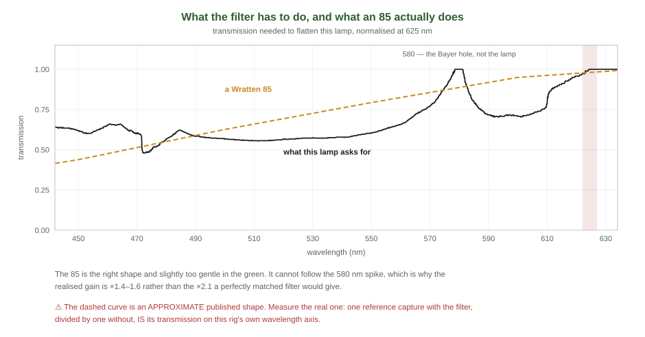

<!--
MASTER DOCUMENT — the DN budget of the red band.
This markdown file is the SOURCE OF TRUTH. The PDF is generated from it:

    python3 docs/tools/build_red_band_budget_pdf.py
    -> ../spectracs-docs/internal/Spectracs_RedBandBudget.pdf

Never hand-edit the PDF. Edit here, re-run, commit both.

Every number and both figures come from `diagnostics/red_band_budget.py`. Re-run it first.

This document answers ONE question that was asked at the bench and answers it NO, and it corrects an
earlier draft of its own analysis in §3. Its useful output is §4, which was not what it set out to find.

⚠ The renderer's math notation is deliberately small. It supports _{} ^{} \frac \sqrt and the symbol
list in build_capture_fidelity_pdf.py. ⚠ Tables and formulas must stay OUT of block quotes.
-->

# The DN Budget of the Red Band

*How many camera counts the verdict rests on, what one count is worth, and why a filter that doubles them
is still the fourth thing to do.*

> **In one line.** `Rv`'s verdict rests on a gap of **15 to 23 camera counts** at 622–627 nm, where one
> count is worth **6 to 10 Rv**. A blue-attenuating filter would raise that gap by about half — and improve
> `σ_fill` by **2 %**, because the instrument is only a twentieth of the variance. The finding worth
> keeping is the other one: **a 1 % error in the reference at 622–627 is worth 5.7 to 9.2 Rv.**

**Where this came from.** Edwin, 2026-09-06, of two fills that read low on the suite row: *"think the two
runs marked by the arrows differ from the according runs of the same day/session by something — check this
and try to find the reason"*. Chasing that produced a measurement of the instrument's own repeatability,
which turned out to answer a different and larger question.

<!--TOC-->

---

## 1. Where the counts are


The instrument does not measure absorbance. It measures two numbers of camera counts and divides them, and
the four windows the metrics read sit at wildly different signal levels. Over the suite's first reads:

| oil | red-band gap, reference − sample | **1 DN worth** |
|---|---|---|
| Lugitsch | 23.1 counts | 8.0 Rv |
| Ja Natuerlich | 20.9 counts | 9.6 Rv |
| Steirerkraft | 17.9 counts | 8.4 Rv |
| **Spar S-Budget** | **15.1 counts** | 5.8 Rv |

⭐ `SPEC_capture_quality.md` §16.40 put it as *"the whole metric lives in 5 to 13 camera counts"*. On the
same-jar suite it is 15 to 23, and the brown oil is the poorest — which is `ROADMAP.md` item 7's *"the brown
band is 5 DN; it caps brown-oil precision permanently"*, measured.

**The sensitivity, for reference.** With the `pow2.2` capture decode that every header records,

```math
\frac{dRv}{dS} = \frac{100}{A_{Q} - A_{valley}} \cdot \frac{2.2 \log_{10} e}{S}
```

⛔ **And the 580 nm dip in Figure 1 is not the lamp.** It is the green/red Bayer crossover — a hole in the
*sensor*. Nothing placed in front of the lamp can fill it, which is §5's ceiling on the whole filter idea.

---

## 2. The variance split — the measurement that decides everything below

The suite makes two reads of each fill, and **those two reads share one reference capture and one aliquot**.
Their difference therefore contains the instrument and whatever the sample did in the gap, and **nothing of
the preparation**. Independent fills of one oil in one sitting contain all of it.

| | |
|---|---|
| same aliquot, same reference, two reads | median \|ΔRv\| **1.42** ⇒ instrument ≈ **1.0 Rv** |
| independent fills, same oil and sitting | pooled sd **4.10 Rv** on 13 df |
| ⇒ | **the instrument is about 6 % of the variance** |

⚠ The instrument figure is an **over-estimate**, and deliberately so: the 08-28 Steirerkraft pair is left in
although its two reads differ by 5–7 Rv, which is the sample browning under the lamp (§16.36), not the
instrument. Over-stating the instrument is the safe direction for a document that concludes the instrument
is not the problem.

⇒ **Roughly 4.0 Rv of fill-to-fill scatter, of which about 1.0 is the instrument.** Everything else is made
before the light reaches the sensor.

---

## 3. ⛔ Where an earlier draft of this analysis went wrong

The first version of this arithmetic did not measure the instrument term. It **modelled** it, from the number
of distinct integer DN levels present in the 622–627 window — 4 to 9 of them across 36 samples — and arrived
at 2.2 to 3.4 Rv. On that basis the filter of §5 was quoted as worth **15 %** on `σ_fill` and **6 %** on the
tracker.

The model was too pessimistic by a factor of two to three: 36 samples and 60 averaged frames dither the
quantisation far better than a crude `√(distinct levels)` allows. The repeat-read measurement of §2 replaced
it, and the filter's value fell to **2 %**.

⭐ **The lesson is the file's own rule arriving from a new direction**: a number that can be measured must not
be modelled. The distinct-level count was a plausible construction with no data under it, and it survived one
evening of being quoted before the data that contradicted it was two commands away the whole time.

---

## 4. ⭐⭐ What a 1 % reference error costs — the finding worth keeping

`Rv` reads the red band against the reference captured for that same fill. A reference that is 1 % low at
622–627, relative to its own valley window, moves the answer by:

| oil | dRv for a 1 % reference error at 622–627 |
|---|---|
| Ja Natuerlich | **9.2 Rv** |
| Steirerkraft | 8.1 Rv |
| Lugitsch | 6.5 Rv |
| Spar S-Budget | 5.7 Rv |

That is the entire scale of every difference argued over on 2026-09-06 — the Steirerkraft between-night drop
(−7.8 Rv), the Ja Natuerlich within-sitting spread (9.9 Rv), both "outlier" fills.

### 4.1 And it is not hypothetical

Of the two fills that read low on the suite row, `20260906BillaJaNatuerlichD` and `20260831SparSBudgetD`,
the reference legs were compared by **substitution** — recompute each with its session-mates' reference shape,
rescaled to its own level:

| fill | with its own reference | with the mates' reference shape | difference |
|---|---|---|---|
| Spar S-Budget D | 17.81 | 17.97 | **+0.16** |
| **Ja Natuerlich D** | 109.05 | 113.62 | **+4.57** |

Spar D's reference is clean and its deviation is in the sample. **Ja Natuerlich D's reference is 0.6 % low in
the red band relative to its own valley** — where C and E agree with each other to 0.02 % — and that single
0.6 % accounts for **about 40 % of its 10.9 Rv deviation**.

⇒ ⭐⭐⭐ **`ROADMAP.md` item 3 asks for a red reference channel at 622–627 in `monitorRecord` and prices it at
"≈5 Rv, the size of σ_fill itself". This is a measured instance of exactly that, and it was invisible to every
field the report records.** `monitorRecord`'s columns are `qPercent · soret · valley · qBand` — there is no
red channel, so the one leg that moved could not be seen at the bench, in the report, or in any diagnostic
until it was reconstructed from the attached frames.

---

<!--PAGEBREAK-->

## 5. The blue-attenuating filter



**The idea.** The lamp plus the Bayer response is bright in the blue-green and dim in the red — peak-to-red is
**2.08** — and the reference peaks within **2–5 %** of the 255 ceiling, so there is no exposure headroom at
all. A filter that attenuates the blue lets the exposure rise, and the red gains everything the blue gives up.

⭐ **It costs nothing in accuracy.** The filter sits in both legs, so it cancels in `T = S/R` exactly — the
same argument as the jar's 0.859 in `DOC_jar_transmission.md` §5.1. It changes the DN distribution and nothing
else.

### 5.1 What it buys, modelled on a Wratten 85

| oil | counts now | with an 85 | gain | 1 DN now | 1 DN after |
|---|---|---|---|---|---|
| Lugitsch | 23.1 | 35.7 | ×1.55 | 8.0 | 5.2 |
| Ja Natuerlich | 20.9 | 30.0 | ×1.43 | 9.6 | 6.7 |
| Steirerkraft | 17.9 | 26.1 | ×1.46 | 8.4 | 5.8 |
| Spar S-Budget | 15.1 | 21.8 | ×1.44 | 5.8 | 4.0 |

The required exposure multiplier comes out at **×1.57**, against an 85's published filter factor of ≈1.5 — an
independent check that the model is not nonsense.

### 5.2 ⛔ And what that is worth

```math
\sigma_{fill} : 4.10 \to 4.03 \qquad 2 \%
```

Because the instrument is 6 % of the variance (§2), scaling it by 0.68 moves almost nothing. ⚠ For the history
tracker, where a between-session term of ≈4.8 Rv dominates, it is smaller still.

⇒ **Three fills spread over three evenings is worth roughly twenty times this filter, and costs nothing.**

### 5.3 What it is still worth having

| | |
|---|---|
| ⭐ **the brown-oil floor** | Spar's 15 counts is the poorest signal in the archive and ROADMAP item 7 calls it a permanent cap. 15 → 22 counts is a real change to a hard limit, whatever it does to today's σ |
| ⭐ **the DN guard** | the Soret sample level moves 44 → ≈28 DN, into the guard's 20–50 target. Every Steirerkraft fill has been flagged `too-dilute`; that stops |
| ⭐ **it is permanent and free thereafter** | one screw-on, no recalibration, no metric change, no archive break |

### 5.4 Choosing and mounting one

**The type** is a colour-conversion "warming" filter — Wratten **85** (not 85B, which costs five more counts
off the Soret for no extra red), sold as an ordinary screw-in camera filter. **Glass, not gel:** resin and gel
can fluoresce, and fluorescence is the one failure that would corrupt the measurement rather than announce
itself.

⛔ **Do not buy on the datasheet. The rig measures its own filter**: one reference capture with it and one
without, and the ratio *is* `T(λ)` on this rig's own wavelength axis. Acceptance: smooth and monotonic through
500–620, **≤ 1.00 everywhere** (above 1 means fluorescence), and `T(510)/T(625)` between 0.55 and 0.65.

**Mounting at the camera rather than the lamp** — which is the only option on the current rig — keeps the whole
counts argument intact, because the filter cancels wherever it sits in the beam. It loses one secondary benefit
and carries two extra checks:

- ⛔ **lost:** at the lamp exit it would also cut the blue dose reaching the sample, and §16.36 measured that
  light browns the fill. At the camera it does not.
- ⚠ **in front of the lens, never between lens and sensor.** A plane-parallel plate in a converging beam shifts
  the focal plane by about a third of its thickness, which would defocus the spectrum and broaden every band.
- ⚠ **check the wavelength axis.** Adding glass can displace the spectral image; cross-correlate a reference
  with and without, as `diagnostics/d2r_all_runs.py` does for fills. Uncoated glass close to the optics can
  also ripple; look for that in the measured `T(λ)`.

**The test, one evening.** One fill, two captures — filter off at the pinned exposure, filter on at ≈1.6×.
Three things must hold: `A(λ)` agrees within σ_fill across the window, the wavelength axis has not moved, and
the red-band gap has grown. ⚠ `DevSpectralPlugin` pins the exposure at 90 (§16.39.5); that constant changes
with the filter.

---

## 6. What this document claims, ranked

| | |
|---|---|
| ⭐⭐ **measured** | the red band carries 15–23 counts and one count is worth 5.8–9.6 Rv |
| ⭐⭐ **measured** | the instrument is ≈1.0 Rv of a 4.10 Rv fill-to-fill scatter — about 6 % |
| ⭐⭐ **measured** | a 1 % reference error at 622–627 is worth 5.7–9.2 Rv, and one fill on 2026-09-06 carried 0.6 % of it |
| ⭐ **modelled** | a Wratten 85 would raise the red gap by ×1.4–1.6 and `σ_fill` by 2 %. The filter's own curve is assumed, not measured |
| ⛔ **retracted** | the 15 % figure of §3, and with it the claim that quantisation is a major term |
| ⛔ **not claimed** | that more counts would fix any invariance observed on 2026-09-06. They would not; §2 is why |
