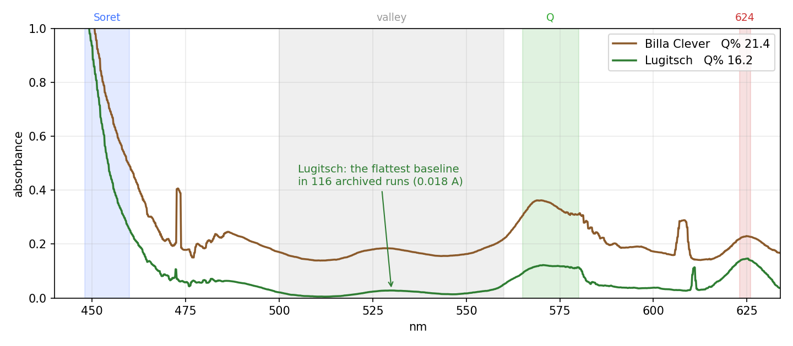
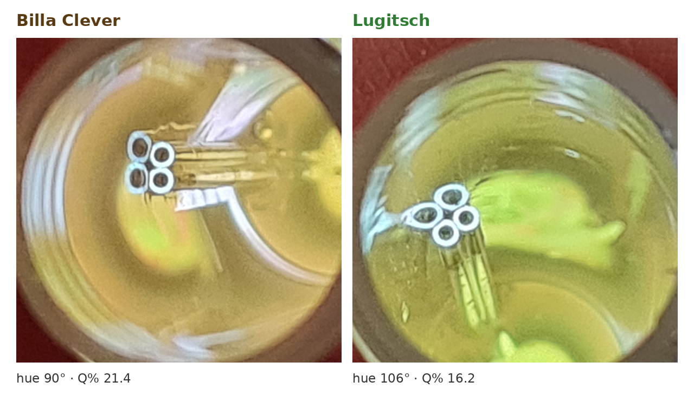
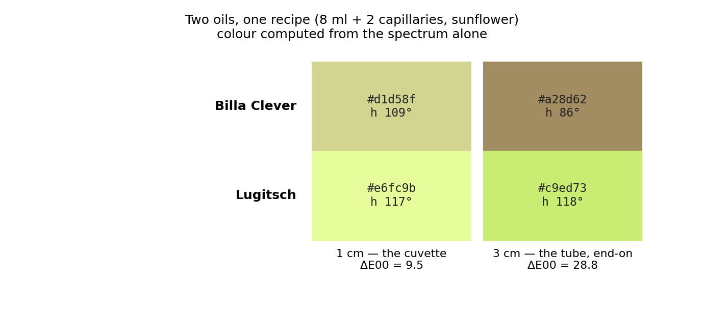

# The solvent that made the colour visible

**Internal note · 2026-08-23 · one evening's result**

> ⚠ **INTEGRATED 2026-08-24.** This note is the account of one evening and is kept as it was written.
> Its findings now live in the internal document set, where they sit next to the physics that explains
> them: **`DOC_sample_physics.md` §4.10** — *"Sunflower oil — the row §4.9's table does not have"* —
> which is §4 of `Spectracs_LightPigmentSolvent.pdf`. The decision record is
> `SPEC_capture_quality.md` §16.12.7g. **Edit those; this note is not maintained.**

## ⭐⭐⭐ WHAT CHANGED SINCE — read this before the table below  *(2026-08-25)*

The body below is deliberately left as written on 23 August. Two of its statements have since been
**overtaken**, and one line in it is now known to be **confounded**.

### 1 · `Q%` is no longer the verdict metric

§1's table calls it *"the shipped verdict metric"*; that was true when written. The verdict metric is now
**`Rv`**:

```math
R_{v} = 100\,\frac{A_{624} - A_{valley}}{A_{Q} - A_{valley}}
\qquad
T = 52 \quad \text{(higher = greener)}
```

On this note's own two fills: **Billa Clever `Rv` = 34, Lugitsch `Rv` = 125** — the same separation the
table reports, read on a metric that also survives the solvent change. ⛔ `Q%` does not: the same Lugitsch
oil reads **13.5–15.5 in isopropanol and 20.6–20.8 in white spirit**. Contract:
`SPEC_red_ratio_metric.md`; decision record `SPEC_metric_research.md` §15.

### 2 · ⛔ §2's `A_valley` = 0.018 headline is DOSE-CONFOUNDED

That fill carried the **lowest pigment load of the sunflower set** (`A_Soret` 0.596). Normalised —
`A_valley / A_Soret` — it reads **0.030** against 0.092 for the sibling fill and 0.103–0.145 for the three
fresh-bottle fills of 2026-08-24. It was one exceptionally lean fill, **not a property of sunflower**.
`SPEC_red_ratio_metric.md` §6.6.

### ⭐⭐⭐ 3 · AND SUNFLOWER IS NOW THE SOLVENT

Decided 2026-08-25. This note's feasibility test became the recipe. `DOC_sample_physics.md` §4A is the
case; the short form is that `Rv`'s threshold `T = 52` transfers across solvents **unchanged with zero
errors**, and its margin is **widest here** — **+67.9** against isopropanol's +52.0.

⛔ **Chosen, not migrated** — the E3 gate has not run in full, and §4A.4 lists what is still open.

### 4 · ⭐ What this note got RIGHT, and it turned out to be the important part

Resolving the 624 nm band in an index-matched solvent is what made a 624-based metric possible at all. The
band is a **whole peak only in an index-matched solvent** — maximum at 623–625 nm falling 81–99 % by
633 nm, where isopropanol merely rises to 629–630 and plateaus (4–14 %). **Every metric that beats `Q%`
reads that band.**

<!--
  SOURCE OF TRUTH: this file. Edit the prose HERE, never the PDF.
  REGENERATE:
    python3 docs/tools/build_capture_fidelity_pdf.py \
      --source docs/DOC_solvent_and_hue.md \
      --out ../spectracs-references/business/internal/commmunication/Spectracs_SolventAndHue_2026-08-23.pdf \
      --title "The solvent that made the colour visible"
  FIGURES: docs/tools/... none — built ad hoc; the three PNGs live in docs/figures/solvent_hue_*.png
-->

On the evening of 22 August we diluted pumpkin seed oil in **sunflower oil** instead of isopropanol — a
feasibility test for MCT oil, nothing more. Two oils, one recipe, two runs.

It produced the cleanest measurement in the archive, and for the first time the difference between two
pumpkin oils was **visible to the naked eye**.

<!--TOC-->

---

## 1. Two oils, one recipe

Both fills are the standard preparation: **8 ml of solvent, 2 capillaries of oil**. Same session, same
reference, one after the other.

| | Billa Clever `001` | Lugitsch `002` |
|---|---|---|
| `Q%` — the shipped verdict metric | **21.44** | **16.21** |
| `dQ100 v2` | **+63.8** | **−21.7** |
| `R` = A(624) / A(568) | **0.673** | **1.321** |
| A_Soret 448–460 nm | 0.797 | 0.596 |
| **A_valley 500–560 nm** — the baseline | 0.165 | **0.018** |

Every metric separates them, and not narrowly. `Q%` by 5.2 units against a fill-to-fill scatter of ~0.5.
`dQ100` by 85 units. `R` by a factor of two.



---

## 2. ⭐ The number that matters most: 0.018

**A_valley = 0.018 on the Lugitsch fill.** That window sits between the two pigment bands and should
contain almost nothing. In the archive it usually reads 0.09 and has been as high as 0.28 — undissolved
oil, scattering light across the whole visible range and burying everything underneath it.

**0.018 is the second lowest of 116 archived runs, and the lowest at a usable pigment load.**

The reason is refractive index. Isopropanol is n ≈ 1.377; pumpkin oil is n ≈ 1.47. The oil never truly
dissolved — it dispersed, and the droplets scattered. Sunflower oil is n ≈ 1.473. Like into like: a real
solution, and the baseline simply goes away.

> **What that fill also did:** it settled **immediately**. `SETTLED_IMMEDIATE` at 106 s, `Q%` moving
> 16.213 → 16.200 across the entire run — a span of **0.03 units**, against a fill-to-fill benchmark of
> 0.38. Seven consecutive reads, flat.

That is the prize hiding behind the solvent question. The drawdown rule, the D2 coach, the twenty-minute
clock, TEST B and TEST C — the whole settling apparatus exists to wait out a clearing transient. **A fill
that has no transient does not need any of it.**

---

## 3. ⭐⭐ And you can see it

Two eprouvettes, ~3 cm of liquid, viewed end-on against a phone light table. No instrument.



Measured off the photograph, five patches per tube:

| | hue, photographed | hue, predicted from the spectrum |
|---|---|---|
| Billa Clever | **90.1° ± 3.5** | **88.0°** |
| Lugitsch | **106.2° ± 2.0** | 118.2° |

**16.1° apart, against a combined scatter of ±4.0° — a four-sigma separation, by eye, with no instrument
in the loop.**

And the first row is the one to notice. An uncalibrated phone photograph, automatic white balance, no
grey card — and the spectrometer predicted Billa's hue to **within two degrees**.



---

## 4. Why this matters beyond one evening

**A second, independent channel.** Every threshold we own — `Q%`'s T = 18.6, `dQ100`'s T = 30.0 — is a
constant fitted on the corpus it is scored on. That is the honest worry behind the pre-registration work.
A naked-eye colour difference depends on **no window, no threshold and no corpus**. It is the one thing in
the project that cannot be accused of circularity.

**And it agrees with the metric.** Across the 26 archived fills at the default recipe, chroma and `Q%`
correlate at **r = −0.79** — and **−0.77** once turbidity is regressed out of both sides. They are two
views of one axis, not two unrelated numbers.

**The colour pipeline now renders what the eye sees.** The fix shipped on 23 August: a sixth chip that
keeps luminance and renders at a declared 3 cm viewing path, plus excitation purity replacing a saturation
field that read 100 % on every sample ever measured. 579 tests green.

**A free out-of-sample result.** The colour code extrapolates the un-measured 636–780 nm region. We had
been holding the last measured sample across it; that would have predicted Billa at 115°. The photograph
says 90°. The conservative assumption gives 86°. **The photograph arrived after the choice was made and
could have refuted it — instead it settled a question the spectra alone could not.**

---

## 5. Next: MCT oil

Sunflower was only ever the stand-in. It proved the two things that transfer:

- a **triglyceride solvent dissolves pumpkin oil out of the capillaries** — the thing we actually set out to test
- and an **RI-matched solvent removes the baseline**

MCT (medium-chain triglyceride, C8/C10) should be better on all three counts where sunflower is weak:

| | sunflower | **MCT** |
|---|---|---|
| double bonds | ~60 % linoleic — photo-oxidises under the lamp | **saturated — none.** That is why it is sold as a shelf-stable carrier oil |
| own colour | +0.035 A at 450 nm (a carotenoid tail we must reference out) | **water-clear** |
| refractive index vs pumpkin ≈ 1.47 | 1.473 | 1.449 — still far closer than IPA's 1.377 |
| viscosity | ~50 mPa·s | ~25–30 — mixes more easily |
| evaporation | none | none. *IPA evaporates, and a 20-minute run concentrates the sample* |

There is even a number to aim at. The baseline grows with loading as `F ∝ c^p`: **p ≈ 4.3–6.2 in
isopropanol, p ≈ 2.0 in sunflower.** A true solution is **p = 1**. Two fills at different loadings measure
it in one evening, and MCT should land at or near 1.

---

## 6. What this is not — read before quoting any of it

> This note is written to be honest as well as encouraging. Five things it does **not** establish:

1. **n = 1 per oil.** Two runs. Everything above is a single comparison, not a distribution.
2. **The Billa run is the weakest in the set** — flagged `DEGRADING_FILL`, answer taken at the first look,
   with a reference 14 % dimmer than its neighbours and a dropout at 610 nm.
3. **No threshold survives a solvent change.** `T = 18.6` and `T = 30.0` were fitted in isopropanol and
   would both need re-deriving in MCT. The *separation* travels; the *numbers* do not.
4. **The colour gap is mostly the baseline, not the pigment.** With the baselines matched, the residual
   pigment-only difference is ΔE00 ≈ 3.5 — noticeable side by side, not obvious across a room. What makes
   the tubes look so different is the 0.165-versus-0.018 baseline. That is real and reproducible, but it
   is a statement about how the oil disperses, not yet about how green it is.
5. **MCT itself is untested.** Everything in §5 is a prediction.

---

## 7. The honest summary

One evening, two runs, one solvent swap:

- the **cleanest baseline in 116 runs** (0.018 A), and a fill that **settled in 106 seconds** with a 0.03-unit spread
- **all three metrics separating the two oils** by wide margins
- a **four-sigma colour difference visible by eye**, with the spectrometer predicting one of the two hues to two degrees
- a **shipped fix** so the report renders what the tube looks like
- and a **measured target** — `p = 1` — for the MCT run that comes next

⭐ The measurement is not the bottleneck any more. The preparation was, and we now know what to do about it.

---

## ⭐⭐ 8. What sunflower oil buys — the case, in plain terms  *(added 2026-08-24)*

Six advantages, each with the number behind it.

**1. The oil actually dissolves.** Sunflower oil bends light almost exactly like pumpkin oil — n = 1.473
against 1.47. In isopropanol (n = 1.377) the oil never dissolves; it breaks into droplets and makes a
cloudy emulsion. Like into like, and the cloudiness goes away.

**2. The red peak is 13.6× bigger.** Measured dose-free as `area(624 nm) / area(Soret)`, so different
pigment loads cannot explain it:

| | n | 624 area / Soret area | vs isopropanol |
|---|--:|---|--:|
| **sunflower** | 3 | 0.01808 ± 0.00561 — [0.01161, 0.02157] | **13.6×**, no overlap |
| white spirit | 4 | 0.02514 ± 0.01333 | 18.9×, no overlap |
| isopropanol | 72 | 0.00133 ± 0.00100 — [0.00011, 0.00364] | — |

Sunflower's **weakest** fill is still 3.2× isopropanol's **strongest**. This is the band the `R` metric
is built on, and in isopropanol it barely exists.

**3. The 568 nm peak roughly doubles too** — and that is the band the **shipped verdict** reads
(`A_Q`, 563–573 nm). §12.6 of `SPEC_metric_research.md` measured it on 110 fills: 0.087–0.213 across 106
isopropanol fills against 0.235–0.289 across four white-spirit fills, no overlap. So `Q%` is currently
running on roughly half the signal available to it.

**4. The baseline goes away.** §2 above: **0.018 A**, the second lowest of 116 archived runs and the
lowest at a usable pigment load, against a typical 0.09 and a worst 0.28. That is the flat murk every
metric has to subtract before it can read anything.

**5. It settles immediately.** §2's call-out: `SETTLED_IMMEDIATE` at 106 s, `Q%` moving 16.213 → 16.200
across the whole run — a span of **0.03** against a fill-to-fill benchmark of 0.38. ⭐ The entire
"one fill, one wait" apparatus (`SPEC_settled_measurement.md`) exists because isopropanol fills drift
for twenty minutes. This one did not drift at all.

**6. It is food-safe.** White spirit shows the same effects more strongly and can never enter a product.
Sunflower oil can.

⭐ And one that matters commercially: **the difference is visible to the naked eye** (§3). A device whose
answer a miller can confirm by looking is a much easier device to sell than one that must be believed.

### ⭐⭐ 8.1 And the ORDERING survives the solvent change

This is the question that decides whether a solvent migration is a gain or a hazard — does the change
merely make the numbers bigger, or does it move the two oils differently?

```
                 green                     brown
  isopropanol    0.00157 +/- 0.00105       0.00069 +/- 0.00040     d = +0.96  (n = 72)
  sunflower      0.02106, 0.02157          0.01161
  white spirit   0.03627, 0.03677          0.01650, 0.01103
```

Green sits above brown in **all three** solvents. The solvent scales the quantity up **without flipping
the oils**, and widens the gap between them from 0.0009 to 0.0095.

⭐ **A validation that arrived by accident.** The two green sunflower fills read **0.02106 and 0.02157 —
2 % apart — at pigment loads differing 2.4×** (A_Soret 0.596 against 1.405). The dose-free ratio really
does cancel dose, demonstrated rather than assumed. That matters here because sunflower is viscous and a
capillary will not deliver a repeatable mass.

### ⚠ 8.2 What it costs, and what is still missing

- **It is thick.** A capillary delivers a different mass than into isopropanol. Tolerable only because
  the measurement above cancels dose.
- **Cleaning is worse.** Oil leaves a film; isopropanol evaporates.
- ⛔ **Every threshold would need re-deriving.** `Q%`'s 18.6, the roast gauge's 4.4 — all fitted on
  isopropanol spectra. And `SPEC_capture_quality.md` §16.12.7f already found `Q%` **not
  solvent-portable** (+6.7 vs +2.1 for the two oils). §8.1's ordering result concerns the `624/Soret`
  ratio, a different quantity — it neither contradicts that nor rescues it.
- ⛔ **The evidence is three fills, one of them the only brown one.** Good enough to justify an evening;
  not good enough to switch on.

⇒ ⏸ **The gate is E3** (`SPEC_color_retrieval.md` §7.16.5): four fills in one evening on one rig — green
and brown oil × isopropanol and sunflower — reported as `area(624)/area(Soret)`. Two fills answer *does
the band really grow when only the solvent changes*; four also answer *do the oils keep their order*, at
n bigger than one.

⚠ **And sunflower may be the proof of concept rather than the destination.** §5 above already flags MCT
oil as better on the counts where sunflower is weak.
