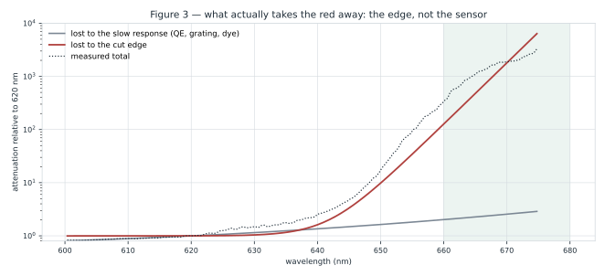

# KB — Lamps

*What the light source has to do for this instrument, how to judge one, and what the roster actually
measures. Written 2026-09-04 around the Yuji-vs-halogen comparison, which is the first measurement able
to separate the lamp from the instrument.*

Companions: `DOC_lamp_410_680.md` (which Avonec LED combination to buy), `SPEC_lamp_rebuild.md` (the
7-emitter board), `KB_led_and_oil_spectra.md` (Avonec SPD sources), `KB_spectroscopy_physics.md` §7 (the
instrument), `SPEC_capture_quality.md` §16 (the error budget). This note is the **general** one: it holds
what is true of *any* lamp on this bench, so the three lamp-specific documents do not each re-derive it.

<!--TOC-->

---

## 1 · What a lamp is for here, and why "bright" is the wrong word

The instrument measures **transmittance**, `T = S/R` — a sample burst divided by a reference burst
through the same optics. Two consequences run through everything below.

**The lamp cancels — until it doesn't.** Any wavelength-dependent factor common to `S` and `R` divides
out: the lamp's own spectral shape, the grating efficiency, the sensor QE. So a lamp does **not** need to
be flat, or white, or high-CRI. This is the single most common wrong instinct about the light source, and
`SPEC_capture_quality.md` §16.26 measured what actually does *not* cancel — re-seating the jar between
the two bursts, at 1.7 % median against a 0.42 % instrument floor.

**What a lamp must supply is DYNAMIC RANGE, per band, at the wavelengths the metric reads.** The
quantity that matters is not radiance but the digital number the camera lands on after the sample has
absorbed. `T = S/R` is a ratio of two 8-bit numbers, so:

| where the reference sits | what happens to `T` |
|---|---|
| near 255 DN | the reference clips; `T` reads high and the band is silently dead |
| ~50–200 DN | the working window |
| ~16–50 DN | usable; one code step is 1–4 % of the level (`SPEC_capture_quality.md` §16.23.10f) |
| below ~16 DN | one code is >4 % **before** the gamma decode and ~2× that after; absorbance saturates as `S` hits 0 |

⭐ **The lamp's job is to put every band the metric reads into the middle of that table, simultaneously.**
A lamp that is superb at 550 nm and dead at 630 nm is a bad lamp for this instrument even if it is
brighter overall than one that is mediocre everywhere.

⚠ **And the bands are not equally forgiving.** `SPEC_capture_quality.md` §16.24 measured the error budget
as **17× asymmetric**: a given relative error in the Q band moves the metric ~17× more than the same
error at the Soret. So deficiency in 560–630 nm costs far more than the same deficiency at 450 nm.

## 2 · The lamp families, and what each one is good for

| family | continuum? | strength | ⛔ the catch |
|---|---|---|---|
| **Phosphor white LED** (Yuji, Sansi) | yes, but a blue pump spike + phosphor hump | efficient, cool, cheap, stable | falls away past ~620 nm; the cyan dip at 470–510 is structural |
| **Discrete LED board** (Avonec 3 W) | no — a sum of narrow emitters | put light exactly where the bands are | ripple between emitters; `DOC_lamp_410_680.md` is the whole study |
| **Halogen / incandescent** | ⭐ yes, and *analytically* — a Planck continuum | smooth, gap-free, rises monotonically into the red | hot, power-hungry, blue-poor, ages |
| **CFL / fluorescent** | ⛔ no — narrow lines on a weak continuum | ⭐ the wavelength **standard** (Hg 404.66 / 435.83 / 546.07 / 576.96 / 579.07, Eu³⁺ 611.6 / 626.6 / 650.7) | ⛔ ~17× dimmer per unit exposure than the Sansi — cannot be the measurement lamp (`KB_spectroscopy_physics.md` §4.1) |

⭐ **Two different jobs, and they do not have to be the same lamp.** The **measurement** lamp needs
dynamic range in the bands. The **calibration** lamp needs known, resolvable lines. The CFL is disastrous
at the first and unbeatable at the second; the project already uses it that way.

### 2.1 ⭐ The property that made this document possible: a halogen is *analytically known*

A tungsten filament is a **grey body**. Its emission is Planck's law times an emissivity that falls from
about 0.45 at 450 nm to about 0.42 at 700 nm — a few percent across the entire visible range. So its
spectral power distribution is **known in closed form from one number** (the colour temperature), and
even that number barely matters in the red.

⭐ That is a capability no other lamp on the roster has, and §4 spends it: **dividing a measured halogen
frame by Planck leaves the instrument response.** Every previous attempt to characterise the red end was
blocked precisely because the lamp's own SPD was unknown exactly where the question was —
`KB_spectroscopy_physics.md` §7.2 states the block outright: *"IR-cut filter + sensor QE + the source's
own decline — one lamp cannot separate the three."*

## 3 · The measurement: Yuji SunWave LED vs a 60 W halogen

Two frames from *Settings > Development > Capture images* (2026-09-04), same session, same optics, same
ROI box, camera ELP `32e4:8830`. Neither frame saturates (peaks 217 and 234 DN), so each lamp is exposed
to fill the sensor at its own maximum — a like-for-like comparison, not an exposure artefact.


### 3.1 The red edge, as measured

| level | Yuji SunWave LED | 60 W halogen |
|---|---|---|
| ≥ 50 DN | 640.5 nm | **651.6 nm** |
| ≥ 20 DN | 648.4 nm | **658.8 nm** |
| ≥ 16 DN (the guard) | 649.7 nm | **660.2 nm** |
| ≥ 10 DN | 652.9 nm | **665.1 nm** |
| ≥ 5 DN | 657.9 nm | **679.5 nm** |
| ≥ 2 DN | 661.1 nm | **690.1 nm** (the raster edge) |
| exactly 0 | 668 nm | never, inside the raster |

⇒ **The halogen buys about 10 nm at the working floor and reaches the raster edge at 2 DN.** Both lamps
are dead well before 700 nm.

### 3.2 ⚠ Two notches that belong to the camera, not to either lamp

The pipeline reduces each column by **max-channel** (`SpectralColorUtil.toGrayMaximum`, chosen in
§15 because `qGray` suppresses blue). Where two Bayer channels hand over, the maximum of the three is at
its lowest, so max-channel imprints a **notch at every crossover**. Measured here, on both lamps:

| crossover | Yuji | halogen |
|---|---|---|
| **B = G** | 486.2 nm | 486.2 nm |
| **G = R** | 581.0 nm | 581.5 nm |

⭐ **These double as a wavelength-scale check that needs no calibration lamp.** The crossovers are a
property of the sensor's colour filters; two lamps of entirely different families agreeing on both, to
0.5 nm, pins the scale used throughout this note. The 581 figure is the one already on record — it is why
`KB_spectroscopy_physics.md` §4.1a reads the Q band at 568 nm rather than 574.

⚠ **Do not read a notch at 486 or 581 nm as a lamp feature or a pigment feature.** It is the reduction.

## 4 · ⭐⭐ Dividing out the source: the ELP has a hard edge at 642 nm

Divide the measured halogen by Planck and what is left is the instrument — grating, lens, IR-cut filter,
Bayer dye and silicon QE, all together. Normalised at 600 nm:

⚠ **"The instrument" here means the ELP path specifically** — the bench/dev unit, and the one the whole
98-run archive was captured through. §6.1 shows the production camera does **not** share its edge.

| nm | 2700 K | 2900 K | 3100 K |
|---|---|---|---|
| 550 | 1.0921 | 1.0333 | 0.9846 |
| 600 | 1.0000 | 1.0000 | 1.0000 |
| 620 | 0.8158 | 0.8323 | 0.8470 |
| 630 | 0.5455 | 0.5618 | 0.5764 |
| 640 | 0.3134 | 0.3256 | 0.3367 |
| 650 | 0.0423 | **0.0444** | 0.0463 |
| 655 | 0.0079 | 0.0083 | 0.0087 |
| 660 | 0.0022 | **0.0024** | 0.0025 |
| 670 | 0.0004 | 0.0004 | 0.0005 |

⭐ **Colour temperature is irrelevant to the conclusion** — under 10 % spread across 2700–3100 K in the
red, because Planck is smooth and slowly varying there. (It matters in the blue: the 450 nm entry moves
46 % across the same range. Nothing here depends on the blue.)


### 4.1 The steepness is the whole argument — stated without a model

| span | response lost | pace |
|---|---|---|
| 450 → 550 nm | *rising* | — |
| 550 → 620 nm | 0.09 decades | 10× every **745 nm** |
| 620 → 640 nm | 0.41 decades | 10× every 49 nm |
| 630 → 650 nm | 1.10 decades | 10× every **18 nm** |
| 640 → 660 nm | 2.14 decades | 10× every **9 nm** |

⭐ **The red edge is about 50× steeper per nm than anything else in the response.** Silicon quantum
efficiency, Bayer dye transmission and grating efficiency all vary over *hundreds* of nanometres; none of
the three can lose a factor of ten in nine. A **dielectric interference filter** — an IR-cut / hot mirror
— is the only component in the chain with an edge of that shape.

Fitting `response = exp(quadratic) × 1/(1+exp((λ−λ₅₀)/w))` puts the edge at:

> **λ₅₀ = 641.8 nm, w = 3.76 nm — 10 % to 90 % over 16.5 nm.**

⭐ And it does not move: **641 ± 1 nm** under `pow1.8` / `pow2.2` / `pow2.4` / sRGB decoding and across
2700–3100 K. The 10→90 width ranges 15–22 nm over the same set. The one number the fit is sensitive to
is the decode exponent, and it moves the *width*, not the position.

### 4.2 So what exactly is owed to the IR-cut filter?

Splitting the total into the slow part and the edge, relative to 620 nm:

| nm | total attenuation | of which slow | of which the **edge** | the edge's share |
|---|---|---|---|---|
| 630 | ×1.5 | ×1.15 | ×1.0 | 23 % |
| 640 | ×2.6 | ×1.36 | ×1.6 | 61 % |
| 650 | ×18.8 | ×1.64 | **×10.3** | **82 %** |
| 655 | ×100.4 | ×1.82 | ×36.1 | 86 % |
| 660 | ×353.2 | ×2.03 | **×132.5** | **87 %** |
| 670 | ×1875 | ×2.55 | ×1771 | 89 % |



⇒ **The answer, in one line: at 650 nm about 82 % of the loss is the filter and at 660 nm about 87 %;
everything else in the camera and optics together costs less than a factor of 2 across 620–660 nm.**

⚠ **Read the split honestly.** What is *measured* is the total. The decomposition into "slow × edge" is a
**model**, and the share column inherits that model's assumptions. What is robust is the thing the model
was fitted to and the thing that motivates it: the log-slope changes by ~50× within 30 nm, which no
smooth component explains. ⛔ This is **not** a direct measurement of the filter; that needs a de-filtered
camera (§7).

### 4.3 ⚠ Three objections, answered

**"It is the quantisation floor, not a real edge."** ⛔ No. The whole 630→660 collapse happens between
**190 DN and 17 DN** on the halogen — every point is above the 16 DN guard and far above any floor. The
collapse is measured on well-exposed data; only past 665 nm does quantisation take over, which is why the
fit stops at 668.

**"It is the halogen bulb's own coating."** IRC (infrared-reflecting) halogen capsules exist, but their
edge is in the **near infrared, 700–800 nm**, not at 642 nm — and a coating cutting at 642 nm with a
16 nm width would make the bulb visibly cyan. The recorded halogen looks like a normal warm source, with
its measured maximum at 602 nm.

**"It is the grating."** A transmission grating's efficiency varies smoothly over hundreds of
nanometres, and there is no mechanism in the geometry for a sharp cut. It is part of the "slow" column.

## 5 · ⛔⛔ What this overturns

### 5.1 `DOC_lamp_410_680.md` §6's withdrawal must be re-opened

§6 was withdrawn on 2026-08-07 on the grounds that its evidence (§7.2's "40× between 631 and 657 nm") came
through a **CFL**, whose red output is Eu³⁺ **line** emission — so the 40× was that lamp's own spectrum,
not the instrument's. ⭐ **That criticism was correct, and it does not apply here.** A halogen has no
lines. Its continuum is known. The 350× between 620 and 660 nm cannot belong to the source, because the
source provably *rises* across that span.

⇒ The working assumption recorded at §6.1 — *"the optics deliver to ~700 nm and the camera captures it"* —
**is refuted for anything past ~650 nm.**

### 5.2 §6.2a's open question is decided, without the europium lines

§6.2a set the test explicitly: *"Lines visible ⇒ the camera passes 690 nm, §6's withdrawal stands, and
the collapse belongs to the lamps. Lines absent ⇒ the IR-cut is the gate and §6 must be re-opened."*

⭐ **The halogen answers it without needing to resolve a line**, because a continuum whose shape is known
does the same work as a line whose position is known. **The IR-cut is the gate.** Marking
`EUROPIUM_RED_FAR_680/690/700` is still worth doing as an independent check, but it is no longer the
blocker.

### 5.3 ⭐ An independent replication of `SPEC_capture_quality.md` §16.28.4

§16.28.4's run `20260808B` (Yuji, ROI opened to 690 nm, 2026-08-09) is reproduced by this frame — a
different session, a different exposure, the same lamp:

| nm | §16.28.4 | this frame | ratio |
|---|---|---|---|
| 630 | 39.70 | 27.61 | 1.44 |
| 640 | 11.50 | 8.85 | 1.30 |
| 650 | 0.70 | 0.557 | 1.26 |
| 656 | 0.13 | 0.115 | 1.13 |
| 660 | 0.01 | 0.010 | 1.05 |

⭐ **The same shape across 4000× of dynamic range, to within one constant factor.** §16.28.4's Yuji row is
confirmed, and the disagreement recorded there is therefore entirely on the Sansi side.

### 5.4 ⛔ And it kills one of §6.2a's three reconciliations

§6.2a offered three ways to reconcile "the Sansi still returns 115 DN at 656 nm" (§16.25.4) with the
collapse: **(1)** the V1 Sansi genuinely owns the deep red, e.g. via a KSF/PFS line phosphor; **(2)** the
red end of that figure is mis-scaled; **(3)** its mid-range is clipped.

At a response of 0.00776 relative to 620 nm, a lamp reading 115 DN at 656 nm would have to **emit about
30× more at 656 nm than at 620 nm** (exposure cancels in the ratio). ⛔ No phosphor does that — a KSF/PFS
Mn⁴⁺ line emitter included, and §6.2a already notes the 2026-08-09 runs show **no line structure** at 648
or 660 on either lamp.

⇒ **Reconciliation 1 is dead. 2 and 3 survive**, and 2 (a wavelength axis transferred from a screenshot
ending near 676 nm) is the one this note would bet on.

## 6 · What it means for the red extension

The metric family's binding constraint is the **630 nm clamp** — the authored ROI ends at 632.6 nm, and
`spectracs-metric-family-2026-08-21` records eight independent arguments for pushing it redward. This
measurement adds a ninth and sharpens the other eight, because it is the first one made on the actual
lamp rather than inferred.

**What is free today.** The halogen holds **190 DN at 630 nm and 62 DN at 650 nm.** Re-authoring the ROI
from 632.6 nm out to ~655 nm costs nothing in signal-to-noise with hardware already on the bench. ⚠ That
is a *photometric* statement only; §7.13's starved-regime warning (a concentration-dependent compression,
not merely noise) applies to any new band and has to be re-checked on oil, not on an empty beam.

**What is not free — ⚠ on the ELP.** The **660–680 nm quiet window** — the first pigment-free region, and
the baseline anchor the metric has never had (`DOC_lamp_410_680.md` §2.2) — sits *behind the edge*. The
halogen delivers 17 DN at 660 and 5 DN at 680. ⛔ **No lamp change reaches it on this camera.** The Avonec
deep-red star, the R2 board, a brighter white: all of them are multiplied by the same 0.0024. It converts
"buy a redder lamp" from a plan into a dead end — ⚠ **for the ELP bench unit**.

### ⭐⭐ 6.1 ⛔ AND THE EDGE IS THE ELP'S, NOT THE INSTRUMENT'S — the production camera has no IR-cut *(Edwin, 2026-09-04)*

⚠ **Correction to the paragraph above, made the same day it was written.** Everything in §4 was measured
on the **ELP `32e4:8830`** — the bench/dev unit. The camera intended for the **production batch** is the
**Microdia/Sonix `0c45:6366`** (`KB_spectroscopy_physics.md` §7), and Edwin ran the remote test on it:

> a TV remote in the dark shows **a white dot with a purple/violet halo**.

⭐ **That halo is the diagnostic, not just the dot.** A silicon sensor's three Bayer dyes all become
transparent in the near infrared, so an unfiltered sensor renders an 850/940 nm source as white with a
violet fringe — every channel responding at once. A camera *with* an IR-cut returns nothing, or a dim dot
with no colour fringe. ⇒ **the production camera has no effective IR block.**

**What this changes, and what it does not:**

| | |
|---|---|
| ⛔ **changes** | "660–680 nm is unreachable" is a fact about the **ELP**, not about the instrument concept. §7's de-filtered camera is no longer a purchase — one is already in hand |
| ⛔ **changes** | the R2 board's deep-red half, and `DOC_lamp_410_680.md` §5.4/§7.3, are **re-opened** on the production camera. They stay dead on the ELP |
| ⭐ **does not change** | every number in §4 and §5. They describe the ELP path, which is what the entire 98-run archive was captured through |
| ⚠ **does not follow** | "no IR-cut" ⇒ "good 660–690 response". It removes the *edge*; what remains (silicon QE, red dye) is near plateau there, so a good response is *expected* — but expected is not measured |

⚠ **Two new risks that only appear once the filter is gone**, neither of which the ELP data can speak to:
**stray NIR scatter** raising the floor across the whole band, and **second-order diffraction**. In a
spectrograph most NIR disperses off the raster (§7), but *where* depends on this camera's own dispersion,
which is not yet calibrated.

## 7 · ⭐ The decisive experiment, and what it predicts

⛔ Everything above attributes by *shape*. One experiment measures it directly: **capture the same halogen
frame through a camera with no IR-cut filter.** ⭐ Per §6.1 that no longer needs a purchase — **the
Microdia `0c45:6366` already on the bench is one.**

⭐ The prediction is quantitative and falsifiable. Extrapolating the fitted slow term:

| nm | halogen today | predicted, no IR-cut | gain |
|---|---|---|---|
| 650 | 62 DN | ~177 DN | ×10 |
| 660 | 17 DN | ~161 DN | ×147 |
| 670 | 8 DN | ~145 DN | ×596 |
| 680 | 5 DN | ~129 DN | ×1341 |

⚠ **The slow term is extrapolated past 650 nm**, so these are predictions with real uncertainty in the
*level* — though not in the *order of magnitude*, because silicon QE and the red Bayer dye are both near
their plateau through 650–700 nm. If a de-filtered camera returns 650–680 nm at anything like these
levels, §4's attribution is confirmed and the quiet window opens with the lamp already on the bench.

⭐ **And a spectrograph is the rare instrument that can afford to lose its IR-cut filter.** In a camera,
removing it floods every pixel with near-infrared. Here the NIR is **dispersed** — 700–1000 nm lands on
columns past 2668, which are off the 2592-wide raster entirely. ⚠ The two risks that remain are **stray
NIR scatter** raising the floor across the whole band, and **second-order diffraction** (2nd order of
340 nm lands where 680 nm does), the latter largely handled by glass absorbing the UV.

### ⭐ 7.1 How to run it, in order of what it costs

⭐ **Step 1 needs no calibration at all, and answers the question.** Point the halogen at the Microdia in
the dev capture view and look at the red end of the raw frame for a **cliff**. A 16 nm-wide collapse is
scale-free — you do not need nanometres to see that it is or is not there. ⇒ *No cliff = no filter edge =
§6.1 confirmed and the quiet window is reachable on the production camera.*

**Step 2 puts numbers on it**, and the established route is already in the record: a **CFL frame**, then
the mercury anchors **435.83 / 546.07 nm** for a two-point linear px→nm (`KB_spectroscopy_physics.md` §7.2
did exactly this at 0.5057 nm/px). Then divide the halogen by Planck as in §4 and compare the response
against the ELP's.

⚠ **Two things block a same-day run and should be budgeted:**

1. ⛔ `CaptureBackend` **hardcodes 2592×1944** — the ELP's calibration resolution — with its own
   `TODO: make this per-sensor ... when a second camera lands`. The Microdia's native modes are not that,
   so the pin has to become per-sensor first, or the frame comes back snapped to something else.
2. ⛔ The Microdia has **no calibration profile** (the second `spectrometer_calibration_profile` row is all
   NULL). Step 1 does not care; step 2 needs the CFL run above.

⚠ And a caution on reading the result: an unfiltered camera's own red response is **not** the ELP's slow
term. §4's quadratic was fitted through the ELP's optics and dye set; it may not transfer. Compare the two
cameras' *shapes*, not their absolute levels.

## 8 · How to characterise any new lamp on this bench

The recipe this note followed, in order — it takes one evening and no new hardware:

1. **Capture it in *Settings > Development > Capture images***, exposure set so the peak lands at
   210–240 DN. ⚠ Check it does not clip: a clipped mid-range makes the red *shape* uncomparable, which is
   exactly what damaged §16.25.4's Sansi row.
2. **Read the ROI box as the EXTENDED ROI** (400.0–690.8 nm), not the authored one. They differ by 58 nm
   of red and the box on screen is the extended one.
3. **Check the scale on the Bayer crossovers** — B=G at 486.2 nm, G=R at 581 nm. Any lamp, no calibration
   needed. If they land elsewhere, the ROI or the cubic is wrong; stop.
4. **Report DN at the metric's bands**, not a normalised curve. Normalising to the peak hides the only
   property that matters (§1).
5. **If it is a thermal source, divide by Planck** and you get the instrument for free.
6. ⛔ **Never compare two lamps' red ends at different exposures without saying so** — half of the
   contradictions in the record trace to that.

Reproduce everything here with:

```
./venv/bin/python diagnostics/lamp_yuji_vs_halogen.py --figures
```

## 9 · What would change these conclusions

- ⭐⭐ **The Microdia halogen frame (§7.1) showing no cliff** ⇒ §4.2's attribution confirmed and the quiet
  window opens **on the production camera**. This is the cheapest open experiment in the note and it needs
  no purchase — it is the one to run first.
- **The Microdia returning the *same* collapse** ⇒ ⛔ the edge is not the ELP's IR-cut; §4 is wrong and the
  next suspects are the grating block and the M12 lens coating, which the two cameras share.
- **The Microdia's own red response falling for a different reason** (its dye set, its lens) ⇒ ⚠ neither
  confirms nor refutes §4; it would mean the production camera needs its own characterisation, not that
  the ELP's edge was misattributed.
- **A raw (undecoded, non-preview) frame of the same halogen** ⇒ removes the last assumption in §4, the
  gamma decode. Expected to move the *width* by a few nm and the position by ~1 nm.
- **The Eu³⁺ 687.7 / 693.7 / 707.0 nm lines appearing** ⇒ ⛔ would contradict §4 outright and re-open
  §6.2a. On these numbers they should be invisible: the response at 690 nm is ~1×10⁻⁴.
- **A second halogen bulb of a different make** ⇒ rules out the IRC-coating objection (§4.3) by
  construction rather than by argument.
